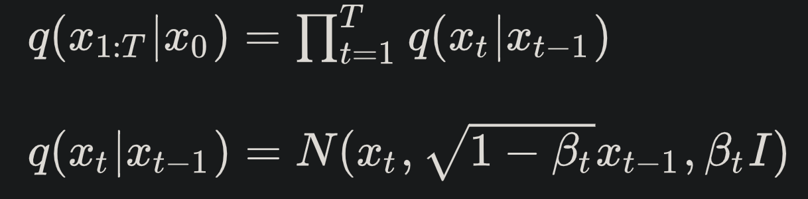
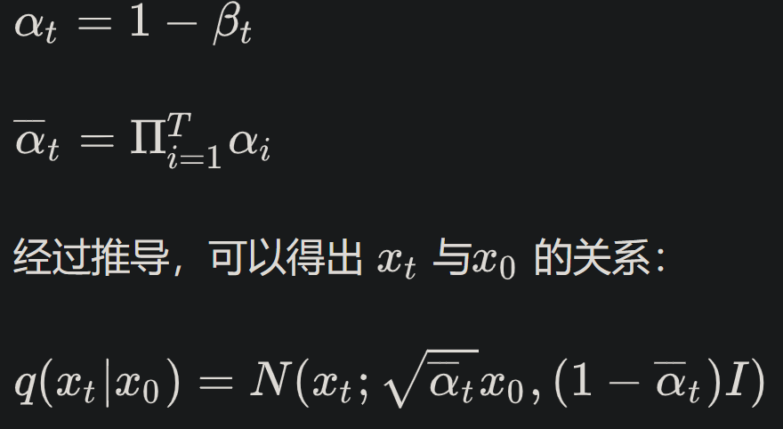

# Diffusion Model (DDPM) 基本原理

https://zhuanlan.zhihu.com/p/525106459（具体原理）

https://zhuanlan.zhihu.com/p/599160988

https://zhuanlan.zhihu.com/p/624221952（过程&结构）

## 前向过程

****

1.    $q(x_1:T|x_0)$（$Forward\ Process$）：表示在**给定 $x_0$** 的情况下，序列 $x_1$ 到 $x_T$ 的**联合分布**（各时刻状态的条件概率连积）。

      -   $x_t$ 是在时刻 $t$ 的状态，而 $T$ 是整个时间序列的长度。

      -   公式的右侧表示这个联合分布可以分解为一系列**条件分布**的乘积：$\prod_{t=1}^{T} q(x_t|x_{t-1})$ ，表示从时刻 1 到 $T$，每一个时刻 $x_t$ 的状态**都只依赖于它的前一个状态 $x_{t-1}$【马尔可夫链】**。

          >   这可以通过条件概率的链式规则来推导，链式规则表明联合概率可以分解为一系列条件概率的乘积：
          >
          >   $ q(x_1, x_2, ..., x_T | x_0) = q(x_1|x_0) \cdot q(x_2|x_1, x_0) \cdot ... \cdot q(x_T|x_{T-1}, ..., x_1, x_0) $
          >
          >   由于马尔科夫性质，每个状态 $x_t$ 只依赖于它的前一个状态 $x_{t-1}$，而与更早的状态无关。这意味着我们可以**简化上述链式规则中的条件概率**，使每个条件概率只依赖于直接前驱状态：
          >
          >   $q(x_t|x_{t-1}, ..., x_1, x_0) = q(x_t|x_{t-1}) $
          >
          >   将这个马尔科夫性质应用于链式规则中的每一项，我们可以得到：
          >
          >   $q(x_1, x_2, ..., x_T | x_0) = q(x_1|x_0) \cdot q(x_2|x_1) \cdot ... \cdot q(x_T|x_{T-1})$
          >
          >   这就是为什么给定 $x_0$ 的情况下，序列 $x_1$ 到 $x_T$ 的联合分布可以表示为一系列条件分布的乘积。在扩散模型中，这个性质是用来定义正向过程（加噪声过程）的，它描述了如何通过逐步添加噪声从初始数据状态 $x_0$ 过渡到一个完全随机的噪声状态 $x_T$。

2.    $q(x_t|x_{t-1})$ ：条件分布的具体形式。
      •	**$N(\cdot)$ 代表正态分布（高斯分布）**。
      •	这里，状态 $x_t$ 的条件分布是**以均值为 $\sqrt{1 - \beta_t x_{t-1}}$** ，**方差为 $\beta_t I$**（其中 <u>$I$ 是单位矩阵，代表多维情况下的方差</u>）的高斯分布。

3.    $\beta_t$（$Variance\ Schedule$）：不同 $t$ 的 **$\beta_t$ 是预先定义好的**，由时间 1∼$T$ 逐渐的递增，可以是 $Linear$，$Cosine$ 等，**满足 $\beta_1$<$\beta_2$<...<$\beta_T$** 。

4.    $x_t$：通过**重参数化采样**得到 $x_t$ 。

      >   重参数技巧在很多工作（Gumbel softmax, VAE）中有所引用。如果我们要从某个分布中随机采样(高斯分布)一个样本，这个过程是无法反传梯度的。而这个通过高斯噪声采样得到 x_t 的过程在 diffusion 中到处都是，因此我们需要通过重参数技巧来使得他可微。最通常的做法是吧随机性通过一个独立的随机变量($ \epsilon$ )引导过去。举个例子，如果要从高斯分布 $z\sim \mathcal{N}$$(z;\mu_\theta,\sigma_\theta^2\mathbf{I})$ 采样一个 $z$ ，我们可以写成:
      >
      >   $z=\mu_\theta+\sigma_\theta\odot\epsilon, \epsilon\sim\mathcal{N}(0,\mathbf{I}).~\tag{2}$
      >
      >   上式的 $z$ 依旧是有随机性的， 且满足均值为$ \mu_\theta $方差为$ \sigma_\theta^2 $的高斯分布。这里的$\mu_\theta$，$\sigma_\theta^2$ 可以是由参数 \theta 的神经网络推断得到的。整个“采样”过程依旧梯度可导，随机性被转嫁到了 $\epsilon$ 上。
      >
      >   *--- https://zhuanlan.zhihu.com/p/525106459*

