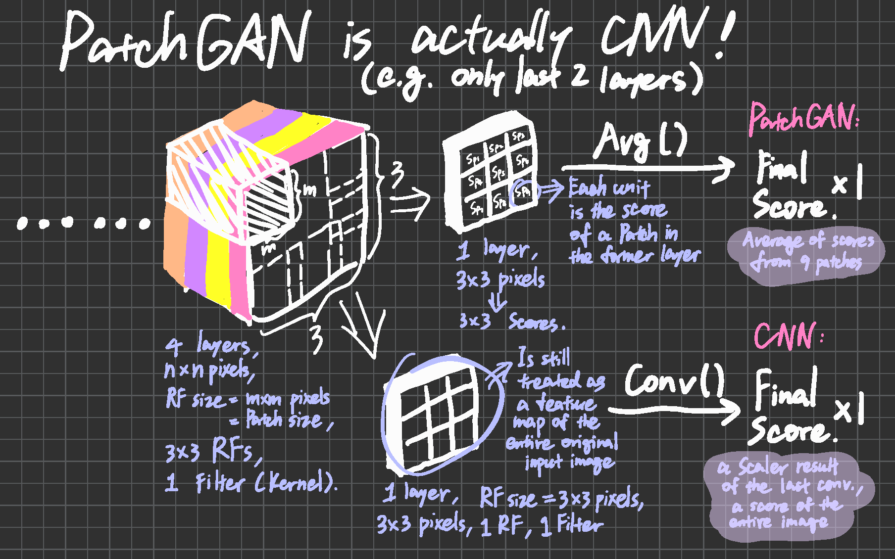

# GAN Structures

****

## `PatchGAN`

***The DISCRIMINATOR uses CNN to get multiple scores (a score map) from patches in original input then average them for the final output to judge whether an image is real or fake at patch-scale.***

