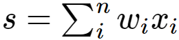
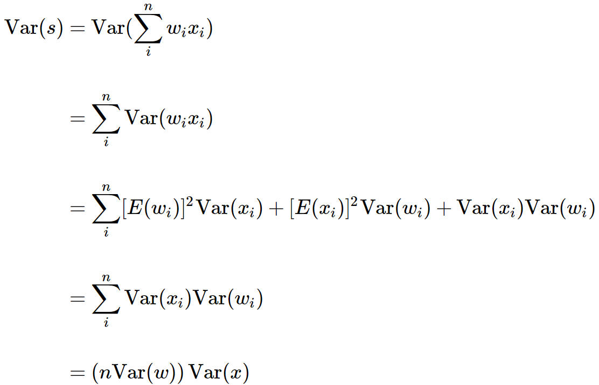
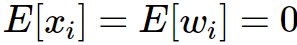
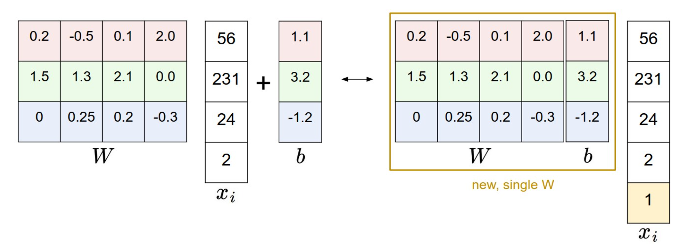
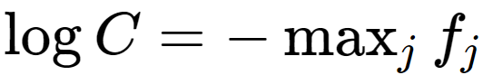

# Coding Tips

****


## Code Reading

### First

先运行 `setup.py` 补充缺失的包

>   `setup.py` 是 Python 包的标准安装脚本，用于安装、分发和安装包的其他操作。要运行 `setup.py`，你需要在其后添加一个命令来指定你想要执行的操作。常见的命令包括：
>
>   -   `install`：安装包。
>   -   `develop`：以开发模式安装包，这样可以在不重新安装的情况下修改代码。
>   -   `sdist`：创建源分发包，通常用于后续的包分发。
>   -   `bdist`：创建二进制分发包。
>
>   例如，如果你想要安装包，可以在终端中运行：
>
>   ```arduino
>   arduinoCopy code
>   python setup.py install
>   ```
>
>   如果你只是想要以开发模式安装，以便你可以更改源代码并立即看到效果（而不需要每次更改后都重新安装），可以运行：
>
>   ```arduino
>   arduinoCopy code
>   python setup.py develop
>   ```
>
>   确保你在含有 `setup.py` 的目录中运行这些命令，或者提供 `setup.py` 的完整路径。
>
>   ***—— Gpt4***

### Second

##### 代码不带数据集

下载数据集——直接把torch代码（带下载&transform为tensors）移**到colab下载完再从drive把整个data文件夹内容移出来放在项目目录下的data文件夹中**

.gz压缩包解压完的一般不是图片格式而是-ubyte格式的tensors，可直接输入DataLoader

导出图片格式参考https://zhuanlan.zhihu.com/p/45216288

##### 代码已带数据集

-   -ubyte格式：应该是tensor，可直接输入DataLoader
-   图片格式：自己制作DataLoader子类对图片做transforms变成tensor

### Third

不要在最大类从头开始读，先找到training loop

### Third

从training loop开始通过跳转找到各个模型类阅读


## Pytorch

-   **`torch.nn`** 内置各种NN模块，可作为完整模型架构或隐藏层，也可自定义**`torch.nn.Module`** 的派生类作为模型类，里面使用内置NN模块建立模型架构（用**`torch.nn.sequence`**）

-   **`torch.nn.Module`** 的可用方法（含必须实现的）见 **[Method of Class "Module"](https://pytorch.org/docs/stable/generated/torch.nn.Module.html#torch.nn.Module)**

-   **`torch.nn`**内置的NN模块（Layers）见 [**Build-in NN Model (Layers Block)**](https://pytorch.org/docs/stable/nn.html)

-   **`torch.nn.ModuleList`** 和 **`torch.nnModuleDict`** 是专用于装模型中所有 **`torch.nn.Module`** 的容器，在 `__init__` 中使用可以把各Module元素的参数作为整个模型的各部分一起初始化

    -   **`torch.nn.ModuleList`** —— 当模型（或模块子类） `forward` 不会有复杂连接，只是单纯顺序前传（常用循环/ 递归直接遍历 `ModuleList` ，模型初始化后 forward 时可不知容器中具体有什么模块）时使用

    -   **`torch.nn.ModuleDict`** —— 当模型有跳跃连接等复杂连接（不能单纯循环/ 递归，需要有中间赋值、计算等，forward 时也需要知道容器中有哪些模块）时使用

    -   ***混合情况（如 Encoder-Decoder 的连续传播中穿插着 Residual）：***
        -   ***法1：把包含复杂链接的最小部分作为模块子类，采用字典，模型整体的模块子类采用列表，调用字典模块***（模型架构不那么清晰但封装得最好）

        -   ***法2：用 `torch.nn.ModuleList` 嵌套 `torch.nn.ModuleDict` ，在顺序遍历到字典时再做复杂连接***（相当于用列表中的字典元素模拟模块子类，模型架构更清晰但封装得没那么好）

-   **`torch.nn.Sequential`** 可以把一系列 **`torch.nn.Module`** 按顺序合并成单个 Module

-   Training框架：

    ```python
    for inputs, targets in dataloader:
        optimizer.zero_grad()  # 清零梯度
        outputs = model(inputs)  # 正向传播
        loss = criterion(outputs, targets)  # 计算损失
        loss.backward()  # 反向传播，计算梯度
        optimizer.step()  # 更新参数
    ```


## Params Initialization

>   We have seen how to construct a Neural Network architecture, and how to preprocess the data. Before we can begin to train the network we have to initialize its parameters.
>
>   **Pitfall: all zero initialization**. Lets start with what we should not do. Note that we do not know what the final value of every weight should be in the trained network, but with proper data normalization it is reasonable to assume that approximately half of the weights will be positive and half of them will be negative. A reasonable-sounding idea then might be to set all the initial weights to zero, which we expect to be the “best guess” in expectation. This turns out to be a mistake, because if every neuron in the network computes the same output, then they will also all compute the same gradients during backpropagation and undergo the exact same parameter updates. In other words, there is no source of asymmetry between neurons if their weights are initialized to be the same.
>
>   **Small random numbers**. Therefore, we still want the weights to be very close to zero, but as we have argued above, not identically zero. As a solution, it is common to initialize the weights of the neurons to small numbers and refer to doing so as *symmetry breaking*. The idea is that the neurons are all random and unique in the beginning, so they will compute distinct updates and integrate themselves as diverse parts of the full network. The implementation for one weight matrix might look like `W = 0.01* np.random.randn(D,H)`, where `randn` samples from a zero mean, unit standard deviation gaussian. With this formulation, every neuron’s weight vector is initialized as a random vector sampled from a multi-dimensional gaussian, so the neurons point in random direction in the input space. It is also possible to use small numbers drawn from a uniform distribution, but this seems to have relatively little impact on the final performance in practice.
>
>   *Warning*: It’s not necessarily the case that smaller numbers will work strictly better. For example, a Neural Network layer that has very small weights will during backpropagation compute very small gradients on its data (since this gradient is proportional to the value of the weights). This could greatly diminish the “gradient signal” flowing backward through a network, and could become a concern for deep networks.
>
>   **Calibrating the variances with 1/sqrt(n)**. One problem with the above suggestion is that the distribution of the outputs from a randomly initialized neuron has a variance that grows with the number of inputs. It turns out that we can normalize the variance of each neuron’s output to 1 by scaling its weight vector by the square root of its *fan-in* (i.e. its number of inputs). ==That is, **the recommended heuristic is to initialize each neuron’s weight vector as: `w = np.random.randn(n) / sqrt(n)`, where `n` is the number of its inputs.**== This ensures that all neurons in the network initially have approximately the same output distribution and empirically improves the rate of convergence.
>
>   The sketch of the derivation is as follows: Consider the inner product 
>
>   
>
>    between the weights $w$ and input $x$, which gives the raw activation of a neuron before the non-linearity. We can examine the variance of $s$:
>
>   
>
>   where in the first 2 steps we have used [properties of variance](http://en.wikipedia.org/wiki/Variance). In third step we assumed zero mean inputs and weights, so 
>
>   
>
>   Note that this is not generally the case: For example ReLU units will have a positive mean. In the last step we assumed that all $w_i$, $x_i$ are identically distributed. From this derivation we can see that if we want $s$ to have the same variance as all of its inputs $x$, then during initialization we should make sure that the variance of every weight $w$ is $1/n$. And since $Var(aX)=a^2Var(X)$ for a random variable $X$ and a scalar $a$, this implies that we should draw from unit gaussian and then scale it by a=$\sqrt{1/n}$, to make its variance $1/n$. This gives the initialization `w = np.random.randn(n) / sqrt(n)`.
>
>   A similar analysis is carried out in [Understanding the difficulty of training deep feedforward neural networks](http://jmlr.org/proceedings/papers/v9/glorot10a/glorot10a.pdf) by $Glorot\ et\ al$. In this paper, the authors end up recommending an initialization of the form $Var(w)=2/(n_{in}+n_{out})$ where $n_{in}$, $n_{out}$ are the number of units in the previous layer and the next layer. This is based on a compromise and an equivalent analysis of the backpropagated gradients. A more recent paper on this topic, [Delving Deep into Rectifiers: Surpassing Human-Level Performance on ImageNet Classification](http://arxiv-web3.library.cornell.edu/abs/1502.01852) by $He\ et\ al$., derives an initialization specifically for ReLU neurons, reaching the conclusion that the variance of neurons in the network should be 2.0/n. This gives the initialization `w = np.random.randn(n) * sqrt(2.0/n)`, and is the current recommendation for use in practice in the specific case of neural networks with ReLU neurons.
>
>   **Sparse initialization**. Another way to address the uncalibrated variances problem is to set all weight matrices to zero, but to break symmetry every neuron is randomly connected (with weights sampled from a small gaussian as above) to a fixed number of neurons below it. A typical number of neurons to connect to may be as small as 10.
>
>   **Initializing the biases**. It is possible and common to initialize the biases to be zero, since the asymmetry breaking is provided by the small random numbers in the weights. For ReLU non-linearities, some people like to use small constant value such as 0.01 for all biases because this ensures that all ReLU units fire in the beginning and therefore obtain and propagate some gradient. However, it is not clear if this provides a consistent improvement (in fact some results seem to indicate that this performs worse) and it is more common to simply use 0 bias initialization.
>
>   **In practice**, the current recommendation is to use ReLU units and use the `w = np.random.randn(n) * sqrt(2.0/n)`, as discussed in [He et al.](http://arxiv-web3.library.cornell.edu/abs/1502.01852).
>
>   **Batch Normalization**. A recently developed technique by $Ioffe$ and $Szegedy$ called [Batch Normalization](http://arxiv.org/abs/1502.03167) alleviates a lot of headaches with properly initializing neural networks by explicitly forcing the activations throughout a network to take on a unit gaussian distribution at the beginning of the training. The core observation is that this is possible because normalization is a simple differentiable operation. In the implementation, applying this technique usually amounts to insert the `BatchNorm `layer immediately after fully connected layers (or convolutional layers, as we’ll soon see), and before non-linearities. We do not expand on this technique here because it is well described in the linked paper, but note that it has become a very common practice to use Batch Normalization in neural networks. In practice networks that use Batch Normalization are significantly more robust to bad initialization. Additionally, batch normalization can be interpreted as doing preprocessing at every layer of the network, but integrated into the network itself in a differentiable manner. Neat!
>
>   --- *cs231n*


## Structure

### 1. Import packages

```python
""" usually these """

# Numerical Operations
import random
import numpy as np
# Reading/Writing/Cleaning Data
import pandas as pd
from PIL import Image
import os
# import wandb as wb
# Pytorch
import torch
import torch.nn as nn
import torch.optim as optim
import torchvision.transforms as transforms
from torch.utils.data import DataLoader
from torchvision import datasets
from torchvision.utils import save_image
# my_utilities
import my_utilities
```


### 2. Set paths & device option

```python
dataset_name = '<dataset_name>/'
task_name = '<task_name>/'
data_dir, checkpoints_dir, results_dir = 'datasets/' + dataset_name, 'checkpoints/' + task_name, 'results/' + task_name

device = my_utilities.register_device()
```

```python
""" my_utilities.register_device"""

def register_device(gpu_no=0):
	if torch.cuda.is_available():
		torch.cuda.set_device(gpu_no)
		return torch.device("cuda")
	else:
		return torch.device("cpu")
```


### 3. Set data preprocessing options

```python
preproc_train = {
	'trans': <'scale & crop'|'crop'|'scale width'|'scale width & crop'>,  
	'scale_size': <scale size>,  # !!! in TEST TIME set to crop_size !!!
	'crop_size': <crop size>,
	'flip': <False|True>  # whether to flip images in augmentation
}

preproc_test = {
	'trans': preproc_train['trans'],
	'scale_size': preproc_train['crop_size'],
	'crop_size': preproc_train['crop_size'],
	'flip': preproc_train['flip']
}
```


### 4. Set model options

```python
model_name = <model name>

hp = {
	# ======= network architecture =======
	'arch': <architecture name>
	'layers': <layer number>, # a layer means a generally repetitive component in the entire model, can contain multiple sublayers in certain architectures
	'in_chan': <number of in_channels>, # usually 3
	'out_chan': <number of out_channels>, # usually 3
	'fil_num': <number of filters_in_the_first_conv_layer>,  # later layers' filters usually decline to 1 in a organized way
	'batch_size': <batch size>,
	'norm_type': <'batch'|'instance'>,
	'dropout': <False|True>,
	'W_init_mean': 0,  # mean of distribution input, that is, the mean of weight values in Gaussian initalization
	'W_init_dev': 0.02,  # deviation of distribution input, that is, the deviation of weight values in Gaussian initalization
	# ============== training ==============
	'epoch_num': <number of epoch>,
	'shuffle_batch': True,
	'loss_mode': <mode of loss function> # a improving method to add on a basic loss function
	'L1_lambda': <scaler of L1 term>,
	'L2_lambda': <scaler of L2 term>,
	'beta1': <momentum1 of Adam>, # usually 0.9
	'beta2': <momentum2 of Adam>,  # usually 0.999
	'epsilon': <to prevent gradient vanishing>, # usually e-8, added along side with sqrt()
	'lr': <initial learning rate (step-size) of Adam> # usually 0.001
}

my_utilities.print_config(device, model_name, {**preproc_train, **hp}) # varies for different model
```


### 5. Create datasets (includes split & transforms)

```python
raw_train_set = my_utilities.read_img(data_dir, 'train')
raw_test_set = my_utilities.read_img(data_dir, 'test')
train_set = my_utilities.Imageset(preproc_train, raw_train_set)
test_set = my_utilities.Imageset(preproc_test, raw_test_set)
```

```python
""" utilities.read_img """

# Image files Reader
def read_img(path: str, mode): # mode = 'train'|'test'
	mode_path = os.path.join(path, mode)
	raw_imageset = sorted([os.path.join(mode_path, x) for x in os.listdir(mode_path) if x.endswith(".<jpg|png>")])
	# (fetch a list of image files in the directory of 'path')
	# print("from " + mode_path + " fetched " + str(len(raw_imageset)) + " data")
	return raw_imageset  # this is a list of raw data in the form of image files
```

```python
""" class Imageset """

# Customized Dataset subclass
class Imageset(Dataset):
	def __init__(self, trans_opt, img_files: list):
		# Initialize with customized transforms & an image-file list
		super().__init__()
		self.trans_opt = trans_opt # <preproc_train|preproc_test>
		self.img_files = img_files # left: ground-truth y / right: x as condition

	def __len__(self):
		return len(self.img_files)

	def preproc(self, img_file): # preprocess a single image file 
		sample = Image.open(img_file).convert('RGB')  # create RGB pillow Image sample from the raw image file
		truth, cond = split_sample(sample)  # split sample to truth & condition
		truth = my_transforms(truth, self.trans_opt)
		cond = my_transforms(cond, self.trans_opt)
		return truth, cond, sample  # return pillow Images

	def __getitem__(self, idx):
		img_file = self.img_files[idx]
		truth, cond, _ = self.preproc(img_file)
		return trans_func.to_tensor(truth), trans_func.to_tensor(cond)  # return torch tensors of a data point (turning pillow Images to torch tensors)

	def check_preproc(self, idx):
		img_file = self.img_files[idx]
		truth, cond, sample = self.preproc(img_file) # pillow Images
		plt.figure(1)
		plt.subplot(121)
		plt.imshow(x)
		plt.subplot(122)
		plt.imshow(truth)
		plt.show()
		plt.imshow(sample)
		plt.show()
```

```python
""" split_sample """

# Image Spliter
def split_sample(img):
	w, h = img.size
	ww = int(w / 2)
	truth = img.crop((0, 0, ww, h))
	cond = img.crop((ww, 0, w, h))
	return truth, cond  # return pillow Images


""" my_transforms """

# Image Transformer
def my_transforms(img, opt):
	"""
	:param img: a pillow Image sample
	:param opt: preproc_train|preproc_test
	:return: a transformed img. ready for input
	"""
	trans, scale_size, crop_size = opt['trans'], opt['scale_size'], opt['crop_size']
	if trans == 'scale & crop':
		img = trans_func.resize(img, [scale_size, scale_size])
	elif 'width' in trans:
		w, h = img.size
		if w == scale_size and h >= crop_size:
			pass
		else:  # w/h = scale_size/h' & remain large enough to crop
			ww, hh = scale_size, int(max(scale_size * h / w, crop_size))
			w, h = ww, hh
			img = trans_func.resize(img, [w, h])

	if 'crop' in trans:
		w, h = img.size
		x = torch.randint(0, w - crop_size + 1, size=(1,)).item()
		y = torch.randint(0, h - crop_size + 1, size=(1,)).item()
		img = trans_func.crop(img, y, x, crop_size, crop_size)

	if opt['flip']:
		img = trans_func.hflip(img)

	return img  # return pillow Image
```


### 6. Load dataset to batches in DataLoader

```python
train_batches = DataLoader(train_set, hp['batch_size'], hp['shuffle_batch'], pin_memory=True)
test_batches = DataLoader(test_set, hp['batch_size'], shuffle=False, pin_memory=True)
```


### 7. Define weight initialization

```python
def weights_init(m):
	if isinstance(m, nn.Conv2d) or isinstance(m, nn.ConvTranspose2d):
		nn.init.normal_(m.weight, mean=hp['W_init_mean'], std=hp['W_init_dev'])
# used in all model architectures afterwards
```


### 8. Define model architecture

#### encoder-decoder (generate a new image)

```python
class MyModel(nn.Module):
	def __init__(self, img_size=256, in_chan=3, out_chan=3, fst_filters=64, norm='batch', dropout=True, verbose=False):
		"""
		:param img_size: width (or height) of input img.
		:param in_chan: number of input channels
		:param out_chan: number of output channels
		:param fst_filters: number of filters in the first conv.
		:param norm: type of conv.'s normalization
		:param dropout: whether to use dropout
		:param verbose: whether to print messages in the process
		"""
		super().__init__()
		self.encoder = nn.ModuleList()  # a list of layers in encoder
		self.decoder = nn.ModuleList()  # a list of layers in decoder

		self.N = img_size
		self.in_chan = in_chan
		self.out_chan = out_chan
		self.fst_filters = fst_filters
		norm_opt = {'batch': nn.BatchNorm2d, 'instance': nn.InstanceNorm2d}
		self.norm = norm_opt[norm]
		self.dropout = dropout
		self.drop_rate = <dropout rate> # usually 0.5
		self.leak_slope = <leak slope of LeakyReLU> # usually 0.2
		self.F, self.S, self.P = <filter_size, padding_width, step_size> # config. of convolution in each layer
		self.ver = verbose

		self.layers_num = 0 # to count the layers of encoder-decoder
		self.check_layers() # calculate layers_num
		self.en_res = [None] * self.layers_num # the list of results of en-layers (now empty), stored for concatenation in U-net's decoding

		self.pile_encoder() # a function to pile each component within a layer into a nn.Sequential then append it to the encoder list, and add the next layer recursively
		self.pile_decoder() # 1. pile each component within a layer into a nn.Sequential then append it to the decoder list, and add the next layer recursively
		self.apply(weights_init) # 2. initialize the weights using predefined function
        # 3. call the forward function in the main training loop

	def forward(self, X):
		if self.ver: print('=====================================================')
		latent = self.en_forward(X, self.layers_num - 1)
		if self.ver: print('-----------------------------------------------------')
		y = self.de_forward(latent, 0)
		return y

	def check_layers(self):
		while self.N != 1:
			self.N = (self.N - self.F + 2 * self.P) / self.S + 1  # simulate the change of img. size
			assert (self.N - int(self.N) == 0)
			self.layers_num = self.layers_num + 1
		if self.ver: print("Layers num. = " + str(self.layers_num))
		if self.ver: print('=====================================================')

	def pile_encoder(self): 
		n = len(self.encoder)
		if n < self.layers_num:
			# set in|out channels
			if n == 0:
				layer_in_chan, layer_out_chan = self.in_chan, self.fst_filter
			elif n < 4:
				layer_in_chan, layer_out_chan = self.fst_filter * (2 ** (n - 1)), self.fst_filter * (2 ** n)
			else:
				layer_in_chan, layer_out_chan = self.fst_filter * 8, self.fst_filter * 8
			# construct layer
			layer = []
			layer += [nn.LeakyReLU(self.leak_slope, inplace=True)] if n != 0 else []
			layer += [
				nn.Conv2d(in_channels=layer_in_chan, out_channels=layer_out_chan, kernel_size=self.F, stride=self.S,
				          padding=self.P)]
			layer += [self.norm(layer_out_chan)] if n != 0 and n != self.layers_num - 1 else []
			# add layer
			self.encoder.append(nn.Sequential(*layer))
			if self.ver: print("En-layer " + str(n) + " added: ", layer_in_chan, "=>",
			                   layer_out_chan)  # layer_no is the index in encoder[]
			# add another
			self.pile_encoder()

		return  # if len(self.encoder)==self.layers_num then the encoder is already intact

	def pile_decoder(self):  
		n = len(self.decoder)
		if n < self.layers_num:
			# set in|out channels
			if n == 0:
				layer_in_chan, layer_out_chan = 2 * self.fst_filter, self.out_chan
			elif n < 4:
				layer_in_chan, layer_out_chan = 2 * (self.fst_filter * (2 ** n)), self.fst_filter * (2 ** (n - 1))
			elif n == self.layers_num - 1:
				layer_in_chan, layer_out_chan = self.fst_filter * 8, self.fst_filter * 8
			else:
				layer_in_chan, layer_out_chan = 2 * (self.fst_filter * 8), self.fst_filter * 8
			# construct layer
			layer = []
			layer += [nn.ReLU(inplace=True)]
			layer += [nn.ConvTranspose2d(in_channels=layer_in_chan, out_channels=layer_out_chan, kernel_size=self.F,
			                             stride=self.S, padding=self.P)]
			layer += [self.norm(layer_out_chan)] if n != 0 else []
			layer += [nn.Dropout(self.drop_rate)] if n != 0 and self.dropout == True else []
			layer += [nn.Tanh()] if n == 0 else []
			# add layer
			self.decoder.append(nn.Sequential(*layer))
			if self.ver: print("De-layer " + str(n) + " added: ", layer_in_chan, "=>", layer_out_chan)
			# add another
			self.pile_decoder()

		return  # if len(self.decoder)==self.layers_num then the reversed decoder is already intact

	def en_forward(self, X, i):
        """
        :param X: current input (output of the last layer)
        :param i: current calculated layer number
        """
		self.en_res[i] = self.encoder[i](X) if i == 0 else self.encoder[i](self.en_forward(X, i - 1))
		if self.ver: print("En-layer " + str(i) + " done: ", self.en_res[i].size())
		return self.en_res[i]

	def de_forward(self, X, i): # reversed to the decoder list
        """
        :param X: current input (output of the last layer)
        :param i: current calculated layer number
        """
		res = self.decoder[i](X) if i == self.layers_num - 1 else self.decoder[i](self.de_forward(X, i + 1))
		# if i != 0: res = torch.cat([res, self.en_res[i - 1]], dim=1) # concatenation in U-net
		if self.ver: print("De-layer " + str(i) + " done: ", res.size())
		return res
```

#### usual cnn (output a score)

```python
class MyModel(nn.Module):
	def __init__(self, img_size=256, in_chan=3 + 3, out_chan=1, fst_filters=64, norm='batch', verbose=False):
		"""
		:param img_size: width (or height) of input img.
		:param in_chan: number of input channels (concatenate input with condition image on the dim. of channel)
		:param out_chan: number of output channel(s) (output a single value)
		:param fst_filters: number of filters in the first conv.
		:param norm: type of conv.'s normalization
		:param verbose: whether to print messages in the process
		"""
		super().__init__()
		self.cnn = nn.ModuleList()
		self.N = img_size
		self.in_chan = in_chan
		self.out_chan = out_chan
		self.fst_filter = fst_filters
		norm_opt = {'batch': nn.BatchNorm2d, 'instance': nn.InstanceNorm2d}
		self.norm = norm_opt[norm]
		self.F, self.S, self.P = <filter_size, step_size, padding_width>
		self.leak_slope = <leak slope of LeakyReLU> # usually 0.2
		self.layers_num = <number of layers>
		self.ver = verbose

		self.pile_cnn() 
		self.apply(weights_init)

	def forward(self, X):
		if self.ver: print('=====================================================')
		patch_scores = self.conv_forward(X, self.layers_num - 1)
		# (NO SIGMOID BECAUSE LOSS_FUNC WILL INCLUDE THAT)
		return patch_scores

	def pile_cnn(self):
		n = len(self.cnn)
		if n < self.layers_num:
			# set in|out channels
			layer_in_chan = self.in_chan if n == 0 else self.fst_filter * (2 ** (n - 1))
			layer_out_chan = self.fst_filter * (2 ** n) if n != 4 else self.out_chan
			# construct layer
			layer = []
			layer += [nn.Conv2d(layer_in_chan, layer_out_chan, self.F, self.S, self.P)]
			layer += [self.norm(layer_out_chan)] if n != 0 and n != 4 else []
			layer += [nn.LeakyReLU(0.2, inplace=True)] if n != 4 else []
			# add layer
			self.cnn.append(nn.Sequential(*layer))
			if self.ver: print("C-layer " + str(n) + " added: ", layer_in_chan, "=>", layer_out_chan)
			# add another
			self.pile_cnn()

		return  # if len(self.cnn)==self.layers_num then the patchGAN is already intact

	def conv_forward(self, X, i):
		res = self.cnn[i](X) if i == 0 else self.cnn[i](self.conv_forward(X, i - 1))
		if self.ver: print("C-layer " + str(i) + " done: ", res.size())
		return res
```


### 9. Define loss function

```python
def loss_opt(mode): # mode to apply improved loss functions
	loss_opt = {<some loss functions including improved ones>}
	return loss_opt[mode]
```


### 10. Define training loop

#### encoder-decoder (generate a new image)

```python
def train_model(model:MyModel, batch, loss_mode, L1_lambda, optimizer, device, verbose=False):
	"""
	:param model: model instance of MyModel class
	:param batch: return of DataLoader -- tensor(<a tuple of ground-truths>,<a tuple of conditions>)
	:param loss_mode: loss function's mode
	:param L1_lambda: the scalar for L1 term
	:param optimizer: optimizer function
	:param device: device
	:param verbose: whether to print messages in the process
	:return: the loss of the generated fake img.
	"""
	# Prepare Batches
	cond_batch = batch[1].to(device)  # a batch of conditions
	truth_batch = batch[0].to(device)  # a batch of ground-truths
	# ... (other calculation on initial batch)
	# Set Loss_func
	train_loss = loss_opt(loss_mode)
	reg_loss = nn.L1Loss().to(device)

	# Forward pass
	model.zero_grad()
	fake_batch = MyModel(cond_batch)  # generate a batch of fake imgs.
	if verbose: print("Fake imgs. generation done.")
	cat_cond_fake = torch.cat((cond_batch, fake_batch), dim=1).to(device)
	scores_fake = MyCnn(cat_cond_fake)  # input condition & fake img. to usual cnn and get scores
	scores_true = torch.ones(scores_fake.size()).to(device)
	if verbose: print("Learn scores of fake imgs. done.")
	loss = train_loss(scores_fake, scores_real) if loss_mode != 'W-GAN-GP' else -scores_fake.mean() # this is average loss of the input batch!!
	L1 = reg_loss(fake_batch, real_batch)
	loss = loss + L1_lambda * L1
	if verbose: print("Got loss of fake_imgs.: ", loss)
	loss.backward() 
	optimizer.step()
	return loss.data.item()
```

#### usual cnn (output a score)

```python
# a training loop using one shuffled batch
def train_model(model: MyModel, batch, loss_mode, optimizer, device, verbose=False):
	"""
	:param model: model instance of MyModel class
	:param batch: return of DataLoader -- tensor(<a tuple of ground-truths>,<a tuple of conditions>)
	:param loss_mode: loss function's mode
	:param optimizer: optimizer function
	:param device: device
	:param verbose: whether to print messages in the process
	:return: a single loss value (usually the sum of the entire batch)
	"""
	# Prepare Batches
	cond_batch = batch[1].to(device)  # a batch of conditions
	truth_batch = batch[0].to(device)  # a batch of ground-truths
	# ... (other calculation on initial batch)

	# Set Loss_func
	loss = loss_opt(loss_mode)

	# Forward pass
	learnt_scores = model(<input_batch>)
	if verbose: print("Learn scores of real imgs. done.")
	real_scores = torch.ones(learnt_scores.size()).to(device)  # a tensor of '1's
	loss = loss(learnt_scores, real_scores) if loss_mode != 'W-GAN-GP' else -learnt_scores.mean() # this is average loss of the input batch!!
    # do the same with scoring of other image classes to classify 
	if verbose: print("Got loss of real_img scores: ", loss) # usually only print out the loss of the model after an epoch of trainings
	optimizer.zero_grad()
	loss.backward()
	optimizer.step()
	return loss.data.item()
```


### 11. Complete training process 

```python
# Create model instance
model = MyModel(preproc_train[<preprocess option>],
	hp['in_chan'] + hp['out_chan'], 1,
	hp['D_fil_num'], hp['norm_type'], True
).to(device)
optimizer = optim.Adam(model.parameters(), lr=hp['lr'], betas=(hp['beta1'], hp['beta2'])) # or any other optimizer
```

```python
# save initial generated img.
batch = next(iter(train_batches))
my_utilities.save_gen_chk_point(model, batch, results_dir, 'train/', 0, device)
```

```python
""" my_utilities.save_gen_chk_point """

# save generated batch regularly
def save_gen_chk_point(model, batch, save_dir, mode, idx, device): # mode = <train|test>
	cond_batch = batch[1].to(device)
	real_batch = batch[0].to(device)
	gen_batch = model(cond_batch)
	save_image(torch.cat((cond_batch, gen_batch, real_batch), dim=3), save_dir + mode + "result" + str(idx) + ".png")
```

#### without cross-validation

```python
# set epoch_num
e_num = hp['epoch_num']

# train loop
e_loss = [] # losses of each epoch
min_loss = None # save the minimum loss (after each epoch) 
for e in range(e_num):  # iter. epochs
	# set mode to train
	model.train()
	b_loss, b, tol_loss = [], 0, 0 # b_loss: losses (average) of each batch
	for batch in train_batches:  # iter. batches
		b += 1
		train_loss = train_model(model, batch, hp['loss_mode'], optimizer, device)
		b_loss.append(train_loss) # collect batch-loss to batch-losses list
         tol_loss += train_loss
    batch_num = b
    
    # validation
    val_losses = 0
    b = 0
	model.eval()
    with torch.no_grad():
        for batch in val_batches:
            b += 1
            val_loss = model(batch)
            val_losses += val_loss
	if min_loss is None or val_losses / b < min_loss: 
         # update minimum loss
         min_loss = val_losses / b
         # save model when it reaches lower loss
         my_utilities.save_model_chk_point(
			checkpoints_dir, e + 1,
			model, min_loss,
			optimizer
		)   
	print("epoch ", e + 1, "/", e_num, " => train loss: ", tol_loss/batch_num, " val loss: ", val_loss) # usually only print the loss when every epoch ends        
	if e % (e_num // 10) == 0 or e + 1 == e_num:
		# save current model's result every 10 epochs
		idx = e // (e_num // 10)
		my_utilities.save_gen_chk_point(model, next(iter(train_batches)), results_dir, 'train/', idx, device)

print("Train-loop done.")
```

```python
""" my_utilities.save_gen_chk_point """

def save_model_chk_point(save_dir, e, model, loss, optimizer):
	torch.save({
		'epoch': e,
		'model_state': model.state_dict(),
		'optimizer_state': optimizer.state_dict(),
		'loss': loss,
	}, save_dir + "epoch" + str(e) + ".pth")
```

#### k-fold cross validation

https://blog.csdn.net/WHYbeHERE/article/details/108192957


### 12. Test model

```python
# Load Last Model checkpoint
checkpoint = torch.load(checkpoints_dir + "epoch" + str(e_num) + ".pth")
model.load_state_dict(checkpoint['model_state'])

# set mode
model.eval()

with torch.no_grad():
	b = 0
	for batch in test_batches:
		b += 1
		cond_batch = batch[1].to(device)
		real_batch = batch[0].to(device)
		gen_batch = model(cond_batch)
		save_image(torch.cat((cond_batch, gen_batch, real_batch), dim=3),
		           results_dir + 'test/' + "result" + str(b) + ".png")
```


## For Convenience

-   把偏差 $b$ 看作属性值为常数1的一项的权重，合并到权重矩阵的最右一列，并且给输入向量（属性值向量）多增加恒为一的一元

    
    
    ```python
    # append the bias dimension of ones (i.e. bias trick) so that our model only has to worry about optimizing a single weight matrix W.
    X_train = np.hstack([X_train, np.ones((X_train.shape[0], 1))])
    X_val = np.hstack([X_val, np.ones((X_val.shape[0], 1))])
    X_test = np.hstack([X_test, np.ones((X_test.shape[0], 1))])
    ```
    
    

## For Precision (Numerical  Problem)

### Normalization Trick

Dividing large numbers can be numerically unstable, so it is important to use a normalization trick. 

>   Notice that if we multiply the top and bottom of the fraction by a constant C and push it into the sum, we get the following (mathematically equivalent) expression:
>
>   
>
>   We are free to choose the value of C. This will not change any of the results, but we can use this value to improve the numerical stability of the computation. A common choice for C is to set 
>
>   
>
>   This simply states that we should shift the values inside the vector f so that the highest value is zero. In code:
>
>   ```python
>   f = np.array([123, 456, 789]) # example with 3 classes and each having large scores
>   p = np.exp(f) / np.sum(np.exp(f)) # Bad: Numeric problem, potential blowup
>   
>   # instead: first shift the values of f so that the highest number is 0:
>   f -= np.max(f) # f becomes [-666, -333, 0]
>   p = np.exp(f) / np.sum(np.exp(f)) # safe to do, gives the correct answer
>   ```

### Log-Exponential Trick

```python
# Replace
x = pow(y, z)
# With
x = torch.exp(z * math.log(y))
```


## To Debug

-   用较小的值（≈ 0）或别的特殊值初始化模型参数使得结果易于人为计算出，以检查模型的编程是否正确


## To be Faster

-   ```python
    ___ for _ in _ if __ is not x  # ❌
    ```

    ```python
    ___ for _ in _
    __ [x] = __  # ✔️
    ```

-   