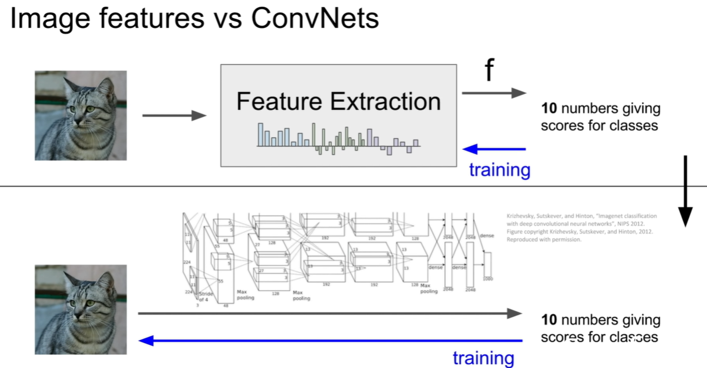
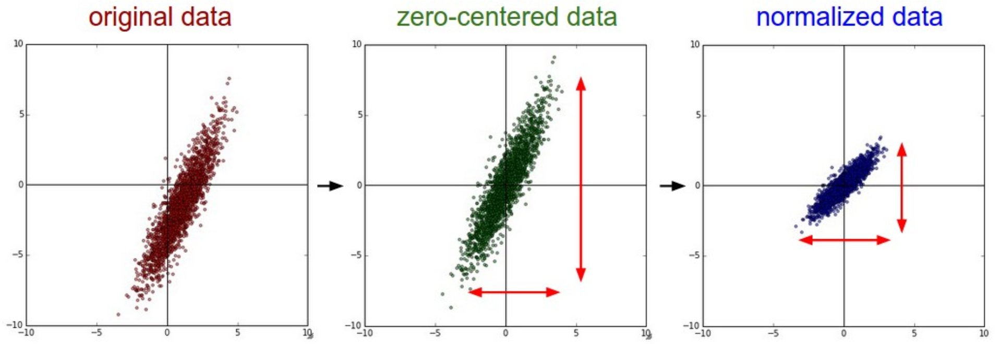
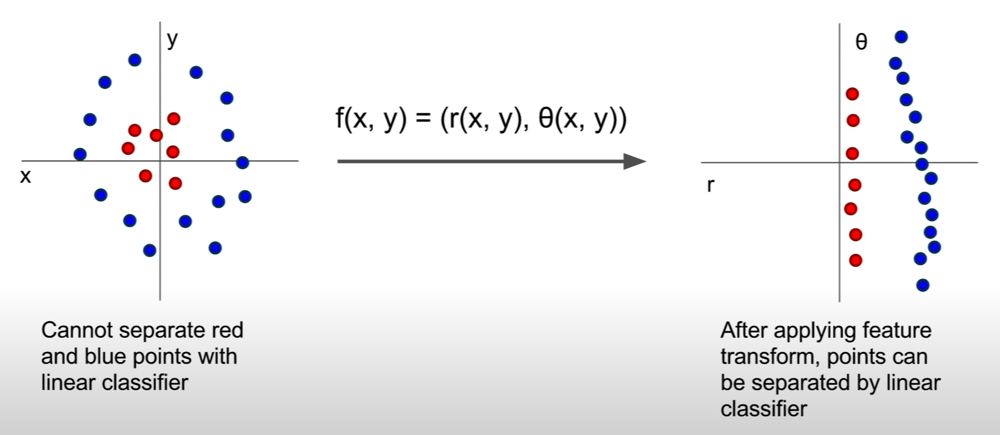
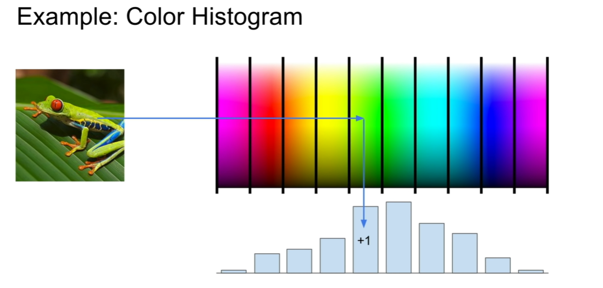
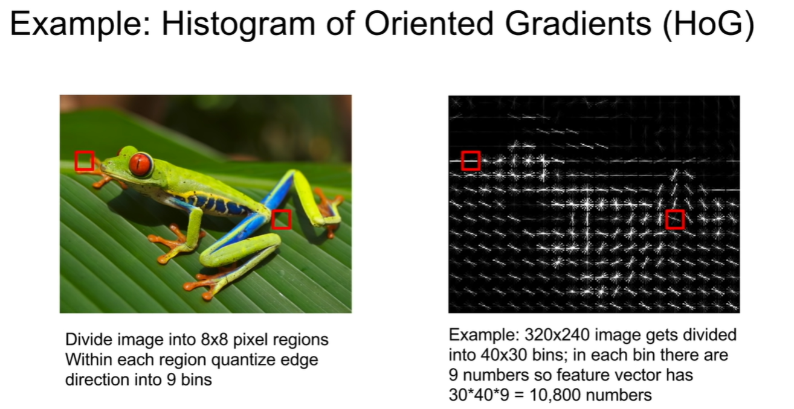
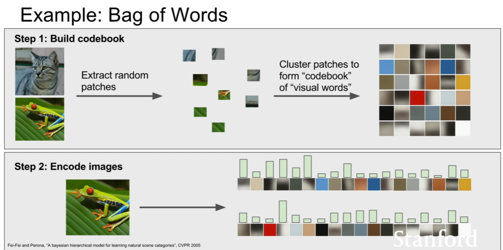

# Data Processing

****


## Outliers & Noise

离群值是正确测量数据中的非一般数据，噪声是未正确测量的数据

>   -   **Outliers**: Imagine you're measuring the height of people in a town, and you find one person who is 8 feet tall. That person would be an outlier.
>   -   **Noise**: Now, let's say your measuring tape has some random errors, showing heights that are plus or minus 2 inches off. That's noise.
>
>   *--- GPT4*


## Basics Loading Formats

### Image

-   以图片本身为sample，用数字编码命名图片作为label

-   在输入模型前需要设置 Spatial Transformer Layer 学习如何将图片大小和方向统一（see **<u>Spatial Transformer Layer</u>**）

-   看作 3 维矩阵（RGB Channels、长度、宽度）输入CNN，输入全连接网络前拉直（flatten）成一维向量（具体见卷积神经网络 goodnotes）

    

### Audio

看作向量，将音频段划分成有重叠的帧窗口，在每个帧窗口上计算处特征值（如MFCC）作为向量的一个元。

以下是计算MFCC（Mel-Frequency Cepstral Coefficients）的具体步骤：

1.  **预加重（Pre-emphasis）**：对原始音频信号应用预加重滤波器，它会增加信号的高频部分的幅度，以补偿人耳对高频声音的敏感性较低的问题。这通常通过将信号通过一个差分滤波器来实现。
2.  **帧分割（Frame Stripping）**：由于语音信号是非平稳的，我们通常假设在短的时间帧内，语音信号是平稳的。因此，我们将整个音频信号分割成20-30ms的帧，每个帧之间有一定的重叠，通常是10-15ms。
3.  **窗函数（Windowing）**：在每个帧上应用窗函数（如汉明窗或汉宁窗），以最小化帧边缘的信号不连续性。这是为了防止在做傅立叶变换时，由于边缘不连续造成的频谱泄漏。
4.  **快速傅里叶变换（FFT, Fast Fourier Transform）**：对窗口化的帧进行快速傅里叶变换，得到每个帧的频谱，然后计算功率谱。
5.  **Mel滤波器组（Mel Filter Bank）**：应用Mel滤波器组到功率谱上。Mel滤波器组是一组在Mel频率上均匀分布的三角滤波器，它模拟了人类听觉系统对不同频率的不同感知能力。然后，对每个滤波器的输出进行求和，得到Mel频率上的功率谱。
6.  **对数取值（Logarithm）**：对Mel功率谱取对数，模拟人耳对声强的感知也是对数的。
7.  **离散余弦变换（DCT, Discrete Cosine Transform）**：对对数Mel功率谱进行离散余弦变换，得到Mel-Frequency Cepstral Coefficients。这个步骤将频谱的高度相关性降低。

在整个过程中，我们可以根据具体的应用需求，选择提取不同数量的MFCCs。

可能并不适合以单个帧窗口为样本，于是可以用前后的多个帧窗口辅助对单个帧窗口的预测，称为**“污染”（Contamination）**。


## Centering & Scaling for Feature Values

***中心化 + 比例缩放 => 标准化***

>   **Normalization** is a general term that refers to the process of transforming data **into a standard or common scale**. It's often used to describe various techniques that make data more comparable and interpretable by algorithms.
>
>   --- *GPT4*
>
>   **Normalization** refers to normalizing the data dimensions so that they are of approximately the same scale. There are two common ways of achieving this normalization. One is to divide each dimension by its standard deviation, once it has been zero-centered: (`X /= np.std(X, axis = 0)`). Another form of this preprocessing normalizes each dimension so that the min and max along the dimension is -1 and 1 respectively. It only makes sense to apply this preprocessing if you have a reason to believe that different input features have different scales (or units), but they should be of approximately equal importance to the learning algorithm. In case of images, the relative scales of pixels are already approximately equal (and in range from 0 to 255), so it is not strictly necessary to perform this additional preprocessing step.
>
>   --- *cs231n*

我的理解：把没有统一变动范围的各值，映射到一个度量范围一定的标尺的刻度上，具体度量范围？-> 不同标准化方法有不同的范围，范围的具体值要适应具体值集，因此由该值集本身的数字特征导出（区别于 $Softmax$ ！！）



### Centering (Subtraction) 目的

>   **Mean subtraction** is the most common form of preprocessing. It involves subtracting the mean across every individual *feature* in the data, and has the geometric interpretation of centering the cloud of data around the origin along every dimension. In numpy, this operation would be implemented as: `X -= np.mean(X, axis = 0)`. **With images specifically, for convenience it can be common to <u>subtract a single value from all pixels</u> (e.g. `X -= np.mean(X)`), or to <u>do so separately across the three color channels</u>.**

1.  **Interpretability**: By centering the data, you shift the origin to the mean of the data. This can make the interpretation of coefficients in linear models more straightforward, as they now represent deviations from the mean rather than from 0.
2.  **Numerical Stability**: Centering can improve the numerical stability of some algorithms, particularly those that involve matrix inversion. When features have very large values, the computations can become numerically unstable, leading to inaccurate results. Centering helps to mitigate this issue.
3.  **Removing Multicollinearity**: In multiple regression, if you include interaction terms or polynomial terms, centering can help to reduce multicollinearity, making the estimates more stable and interpretable.
4.  **Normalization Requirement**: Some machine learning algorithms, like Principal Component Analysis (PCA) and algorithms that use gradient descent, require the data to be centered to work properly. In PCA, centering ensures that the first principal component describes the direction of maximum variance. Without centering, the first component might instead correspond more closely to the mean of the data.
5.  **Improving Convergence**: For optimization algorithms like gradient descent, centering can make the optimization landscape more symmetrical. This can lead to faster convergence to the minimum.
6.  **Scale Invariance**: Centering can be a part of standardization (subtracting the mean and dividing by the standard deviation), which makes the algorithm scale-invariant. This means that multiplying a feature by a constant will not change the algorithm's behavior.
7.  **Visual Understanding**: Centering can also make visualizations more interpretable, as the data is represented relative to its mean, which might be more intuitive, especially when comparing different datasets or features.

### Scaling 目的

1.  **Equal Influence**: Features with large magnitudes can disproportionately influence the model. Scaling ensures that all features have an equal chance to contribute.
2.  **Algorithm Convergence**: Gradient-based optimization algorithms often converge faster when the features are on a similar scale.
3.  **Distance-Based Models**: For models that rely on distances between data points (e.g., k-NN, SVM with RBF kernel), scaling is crucial as it ensures that all features contribute equally to the distance computation.
4.  **Preprocessing for Regularization**: Regularization techniques apply penalties to the coefficients of the model. If the features are on different scales, the penalties will affect them differently.

### 常用 Normalization

以下 $X_i$ 的含义取决于具体应用目的：

-   若是需要在同一数据点的不同属性值间比较，则标准化方向为数据点向量内（$X_i$ 为同一数据点不同属性的值，即整个数据集的矩阵中 $axis = 1$）

-   若是宏观比较不同数据点（从模型整体的角度加工数据时），则标准化方向为各数据点之间（$X_i$ 为某种属性对于不同数据点的值，即整个数据集的矩阵中 $axis=0$）

    >   $exp:$  In the case of images, this corresponds to computing a ***mean image*** <u>across the training images</u> and subtracting it from every image to get images...

### *Z-score Normalization (Standardization; MOST COMMON NORMALIZATION)*

-   Centering Method: Subtracting the mean ($μ$) of the feature (zero-centered)

-   Scaling Method: Dividing by the standard deviation ($\sigma$)

-   Result: The mean of the scaled feature is 0.

-   Formula:
    $$
    X_i'=\frac{X_i-\mu}{\sigma}
    $$

### *Min-Max Normalization*

-   Centering Method: Subtracting the $\min$ value of the feature.

-   Scaling Method: Dividing by the <u>range</u>

-   Result: The minimum value of the scaled feature is 0, and the data is scaled to a specific range, usually [0, 1].

-   Formula:
    $$
    X_i'=\frac{X_i-\min}{\max-\min}
    $$

-   

### *Robust Normalization*

-   Centering Method: Subtracting the $median$ of the feature.

-   Scaling Method: Dividing by the $IQR$

-   Result: The $median$ of the scaled feature is 0, making it robust to outliers.

-   Formula: 
    $$
    X_i'=\frac{X_i-medium}{IQR}
    $$

### *Mean Normalization*

-   Centering Method: Subtracting the mean ($μ$) of the feature, similar to standardization

-   Scaling Method: Dividing by the range instead of the standard deviation in standardization

-   Result: The mean of the scaled feature is 0, and the data is scaled to a range of [-1, 1].

-   Formula: 
    $$
    X_i'=\frac{X_i-\mu}{\max-\min}
    $$

-   

### *Unit Vector Normalization*

-   Centering Method: None

-   Scaling Method: Dividing by a specific $norm$ ($||X_i||$) of the vector

-   Result: This specific $norm$ of the vector is 1.

-   Formula:
    $$
    X_i'=\frac{X_i}{||\vec X||}
    $$


## PCA & Whitening Image Data

**PCA and Whitening** is another form of preprocessing. In this process, the data is first **zero-centered** as described above. Then, we can compute the covariance matrix that tells us about the correlation structure in the data:

```python
# Assume input data matrix X of size [N x D]
X -= np.mean(X, axis = 0) # zero-center the data (important)
cov = np.dot(X.T, X) / X.shape[0] # get the data covariance matrix
```

The (i,j) element of the data covariance matrix contains the *covariance* between i-th and j-th dimension of the data. In particular, the diagonal of this matrix contains the variances. Furthermore, the covariance matrix is symmetric and [positive semi-definite](http://en.wikipedia.org/wiki/Positive-definite_matrix#Negative-definite.2C_semidefinite_and_indefinite_matrices). We can compute the SVD factorization of the data covariance matrix:

```python
U,S,V = np.linalg.svd(cov)
```

where the columns of `U` are the eigenvectors and `S` is a 1-D array of the singular values. To decorrelate the data, we project the original (but zero-centered) data into the eigenbasis:

```python
Xrot = np.dot(X, U) # decorrelate the data
```

Notice that the columns of `U` are a set of orthonormal vectors (norm of 1, and orthogonal to each other), so they can be regarded as basis vectors. The projection therefore corresponds to a rotation of the data in `X` so that the new axes are the eigenvectors. If we were to compute the covariance matrix of `Xrot`, we would see that it is now diagonal. A nice property of `np.linalg.svd` is that in its returned value `U`, the eigenvector columns are sorted by their eigenvalues. We can use this to reduce the dimensionality of the data by only using the top few eigenvectors, and discarding the dimensions along which the data has no variance. This is also sometimes referred to as [Principal Component Analysis (PCA)](http://en.wikipedia.org/wiki/Principal_component_analysis) dimensionality reduction:

```python
Xrot_reduced = np.dot(X, U[:,:100]) # Xrot_reduced becomes [N x 100]
```

After this operation, we would have reduced the original dataset of size [N x D] to one of size [N x 100], keeping the 100 dimensions of the data that contain the most variance. It is very often the case that you can get very good performance by training linear classifiers or neural networks on the PCA-reduced datasets, obtaining savings in both space and time.

The last transformation you may see in practice is **whitening**. The whitening operation takes the data in the eigenbasis and divides every dimension by the eigenvalue to normalize the scale. The geometric interpretation of this transformation is that if the input data is a multivariable gaussian, then the whitened data will be a gaussian with zero mean and identity covariance matrix. This step would take the form:

```python
# whiten the data:
# divide by the eigenvalues (which are square roots of the singular values)
Xwhite = Xrot / np.sqrt(S + 1e-5)
```

*Warning: Exaggerating noise.* Note that we’re adding 1e-5 (or a small constant) to prevent division by zero. One weakness of this transformation is that it can greatly exaggerate the noise in the data, since it stretches all dimensions (including the irrelevant dimensions of tiny variance that are mostly noise) to be of equal size in the input. This can in practice be mitigated by stronger smoothing (i.e. increasing 1e-5 to be a larger number).


PCA / Whitening. **Left**: Original toy, 2-dimensional input data. **Middle**: After performing PCA. The data is centered at zero and then rotated into the eigenbasis of the data covariance matrix. This decorrelates the data (the covariance matrix becomes diagonal). **Right**: Each dimension is additionally scaled by the eigenvalues, transforming the data covariance matrix into the identity matrix. Geometrically, this corresponds to stretching and squeezing the data into an isotropic gaussian blob.

We can also try to visualize these transformations with CIFAR-10 images. The training set of CIFAR-10 is of size 50,000 x 3072, where every image is stretched out into a 3072-dimensional row vector. We can then compute the [3072 x 3072] covariance matrix and compute its SVD decomposition (which can be relatively expensive). What do the computed eigenvectors look like visually? An image might help:


## Kernel Trick/ Kernelize

用核函数实现不可分训练集的高维线性可分：

>   只要一个**对称函数**对应的**核矩阵半正定**，该**对称函数**<u>就能作为**核函数**使用</u>，因为该**半正定矩阵**总能找到一个与之对应的**映射**使得样本点集能从原始空间<u>映射到更高维空间使得其线性可分</u>，即任何**核函数**都隐式定义了一个称为RKHS（$Reproducing Kernel Hilbert Space$）的特征空间。
>
>   ==***文本数据通常用线性核，情况不明时可先尝试高斯核。***==
>
>   *（参考《机器学习》支持向量机）*

核函数的解：

表示定理（见《机器学习》p137）是核方法的一个重要理论支持，它告诉我们，在一定的条件下，学习算法的解可以表示为所有训练样本的线性组合。这一点在支持向量机等基于核方法的算法中尤为重要，因为在这些算法中，只有支持向量（即在决定决策边界的样本）的系数不为零，其他样本的系数都为零，所以学习的模型实际上是由支持向量线性组合而成的。这就是为什么这些算法被称为"支持向量"机的原因。

换句话说，表示定理实际上告诉我们，在高维特征空间中找到的解，可以用原始空间中的数据通过核函数计算得到，从而避免了显式地在高维空间中进行计算，大大降低了计算复杂度。

线性判别分析（LDA）是一种常用的线性分类方法。它的基本思想是找到一个线性的投影方向，使得同类数据的投影点尽可能地接近，而不同类数据的投影点尽可能地远离。当数据是线性可分的时候，LDA可以很好地工作。但是，当数据是线性不可分的时候，LDA就会遇到困难。

这个时候，就可以引入核化的思想，通过引入核函数将原始的输入空间映射到一个新的特征空间中，然后在新的特征空间中应用LDA。这就是所谓的核线性判别分析（Kernel Linear Discriminant Analysis，简称KLDA）。


## Feature Engineering

*参考《机器学习》决策树*

**指标：**

***好的分类指标应该在分类后显著提高数据集有序性***

-   信息增益（分类前后**信息熵**之差，分类后用的是加权信息熵）
-   增益率（分类前后按特征可取值数量进行惩罚的信息增益率）
-   基尼指数（**基尼值**为数据集中任意两样本类别不一致的概率，其相反数即数据集纯度；基尼指数为以一个特征\<属性>划分数据集后数据集的加权基尼值）


## Smoothing

### Problem with Zero Probabilities:

Imagine you are building a Naïve Bayes classifier to classify text documents into different categories. You calculate probabilities based on the frequency of words in your training data. If a particular word appears in one category but not in another, the probability of that word given the second category would be zero.

Now, if you multiply this zero probability with any other probability, the result will still be zero. This can lead to a situation where a single zero probability completely nullifies all other information, leading to incorrect classifications.

### Laplacian Correction Solution:

Laplacian correction is a way to handle this problem by adding a small positive value to the probability calculations. The idea is to assume that every possible outcome has been seen at least once, even if it hasn't appeared in the training data.

The formula for Laplacian correction in the context of Naïve Bayes for a given category *c* and word *w* is:
$$
P(w∣c)=count\ of\ w\ in\ c\ +1/ total\ count\ of\ words\ in\ c+V
$$
Here:

-   $count\ of\ w\ in\ c$ is the number of times word *w* appears in category *c*.
-   *V* is the number of unique words in the vocabulary.
-   The "+1" in the numerator and "+V" in the denominator are the Laplacian corrections.

### Benefits:

1.  **Avoids Zero Probabilities**: By adding 1 to the numerator, you ensure that no probability is zero, even if a word has not been seen in a particular category.
2.  **Stabilizes Estimates**: In cases where the data is sparse, Laplacian correction helps in providing a more stable estimate of probabilities.
3.  **Simple and Effective**: It's a simple technique that often works well in practice, especially for text classification tasks.

In summary, Laplacian correction is a smoothing technique that helps in handling zero probabilities, making models like Naïve Bayes more robust and effective, particularly when dealing with sparse data.


## Data Augmentation

**Data Augmentation（数据增强）**是一种在训练深度学习模型时常用的技术，**通过创建修改版的现有数据来增加训练集的大小**。这种技术可以帮助<u>提高模型的泛化能力，防止过拟合</u>。

### IMAGE AUGMENTATION

在图像分类任务中，数据增强可能包括：

1.  图像翻转：水平翻转或垂直翻转图像。
2.  图像旋转：按一定角度旋转图像。
3.  缩放：增大或缩小图像的尺寸。
4.  裁剪：对图像进行随机裁剪。
5.  亮度、对比度、饱和度和色调调整：改变图像的这些属性。
6.  随机噪声：向图像添加随机噪声。

都可用 `torchvison.transforms` 实现（见 <u>**`torchvison.transforms`**</u>）

### TEXT AUGMENTATION

在自然语言处理（NLP）中，数据增强可能包括：

1.  同义词替换：将句子中的某些单词替换为其同义词。
2.  随机插入：在句子中随机插入一些新的单词。
3.  随机交换：随机交换句子中的两个单词。
4.  随机删除：随机删除句子中的一些单词。

总的来说，数据增强是一种有效的方式，可以通过**创建更多的训练样本**，使模型能够从更多的角度学习数据的特性。


## Feature Extractor (<u>Initial</u> Layers in the Model)

To speedu

>   *A Feature Extractor is a part of a neural network that is responsible for **extracting <u>relevant</u> features （只提取与任务有关的特征） from the raw input data**. This is typically the **initial layers** of a deep learning model, such as <u>Convolutional Neural Networks (CNNs)</u>, where raw pixel values are transformed into a higher-level representation that captures the essential characteristics of the data.*
>
>   *An Extractor operate on a single image and return a feature vector for that image or the concatenation of many feature vectors for a single image (when the extractor is a combination of many types of feature extractions).*  
>
>   *Feature extraction is crucial for tasks like image classification, object detection, etc., where the model needs to understand the underlying patterns and structures in the data.*

### CNN

see [Model](D:\CAMPUS\AI\MachineLearning\ML_MDnotes\Model.md)

### Other Feature Representation for Images

Can use **Feature Extractor** (need to be trained before the net training session) to implement

-   ### Coordinate Transforming

    

-   **Color Histogram:**

    

    强调图片整体包含的颜色（不是拆分颜色通道！！）

-   **HoG:**

    

-   **Bag of Words:**

    

    


## Processing Layers <u>within</u> the Model

### Spatial Transformer Layer ( for images)

***使得输入CNN的图片数据等大同向**（CNN不能兼容不等大同向的数据）*

让模型自主学习如何对输入的图片（此处用向量 $\vec x$ 表示）进行如下线性变换：
$$
\vec x' = A\cdot\vec x+\vec b
$$
其中，$A$ 是一个表示线性变换的方阵，**需要学习的参数个数即共 $n×n+n=(n+1)n$ 个**。

该种 Layer <u>**加入总模型中一起进行 GD 优化（直接视为模型训练的一部分）**，且可插入模型任意所需位置</u>，是与神经网络层完全独立的前置 Layer。

>    *It allows the network to learn how to actively spatially transform feature maps in a way that enhances the geometric invariance of the model. This can be useful for tasks where the input data might be misaligned or in different orientations.*
>
>   *The Spatial Transformer Layer consists of three main components:*
>
>   -   ***Localization Network**: Learns the parameters of the spatial transformation.*
>   -   ***Grid Generator**: Generates a grid of coordinates that correspond to the input data.*
>   -   ***Sampler**: Applies the transformation to the input data based on the parameters learned by the localization network.*

### Feature Normalization Layer

用于增加模型泛化性能（平滑化 Loss 曲面不必要的、阻碍优化的隆起高地，因为 normalization 把属性值都归一化了，变小了）

#### Batch Normalization

`torch.nn.BatchNorm2d`是PyTorch中的二维批量归一化（Batch Normalization）层。这个层的主要作用是对每个mini-batch的输入数据进行归一化处理，以加速深度网络模型的训练并且提高模型的泛化能力。

通常被用在卷积神经网络（CNN）和全连接网络（FCN）的训练中。

**作用**：

1.  **深度神经网络训练**：在深度神经网络中，每一层的输入数据分布都会因为上一层参数的更新而改变，这种现象被称为“内部协变量转移”（Internal Covariate Shift）。这会导致网络需要更长的时间去适应这种变化，从而减慢训练速度。通过使用批量归一化，可以将每一层的输入数据强制转化为均值为0，方差为1的标准正态分布，减少内部协变量转移的影响，加快训练速度。
2.  **解决梯度消失和梯度爆炸问题**：在深度神经网络中，当数据的分布不均匀时，容易导致梯度消失和梯度爆炸的问题。通过批量归一化，可以调整数据的分布，缓解这一问题。
3.  **减少过拟合**：批量归一化在一定程度上具有正则化的效果，可以减少模型的过拟合现象。这是因为在训练过程中，每个mini-batch的数据都有自己的均值和方差，这增加了模型的噪声，相当于添加了一种形式的正则化。
4.  **允许使用更高的学习率**：批量归一化有助于网络的收敛，并且允许我们使用更大的学习率，这可以进一步加快训练速度。

可以插入到网络的任何部分，但**通常放在非线性变换（如ReLU激活函数）之前**。

具体参数含义如下：

1.  `num_features`：输入数据的通道数量。对于二维卷积层的输出数据，这通常就是卷积层的输出通道数。
2.  `eps`：这是一个用于保证数值稳定性的小常数，防止分母为零。默认值是1e-05。
3.  `momentum`：这是用于计算运行中的平均值和方差的动量。默认值是0.1。
4.  `affine`：布尔值，当设为True时，会为此层添加可学习的仿射变换参数。这意味着此层将有可学习的缩放参数（weight）和偏移参数（bias）。默认值是True。
5.  `track_running_stats`：当设为True时，该层将会保持运行中的平均值和方差的统计数据，用于在测试阶段进行批量归一化。当False时，只在每个mini-batch上计算统计数据，这在样本量较少的情况下可能会导致不准确。默认值是True。

例：

```python
pythonCopy codem = nn.BatchNorm2d(100)
input = torch.randn(20, 100, 35, 45)
output = m(input)
```

在这个例子中，`nn.BatchNorm2d(100)`定义了一个BatchNorm2d层，输入数据的通道数（num_features）是100。然后，它将对一个形状为[20, 100, 35, 45]的输入数据进行批量归一化处理。


## Coding Implementation

****

### `torchvision.transforms`

-   *用来做<u>图像数据增强</u>等**人工图像预处理**的库*
-   **不能做 SPL！！SPL 属于一种要自己搭建的模型内部的自主学习网络层* 
-   ==与 Transformer 模型无关！！！！！==

`torchvison.transforms` 包含了一些图像预处理操作，**这些操作可以使用`torchvison.transforms.Compose` 连在一起进行串行操作**（类似 `.nn.Sequential`用来串接网络层；`.nn.Sequential` 也能脚本化图像预处理操作，见 [Transforms Scripting](https://pytorch.org/vision/stable/transforms.html#transforms-scriptability)）。

**`torchvison.transforms`** 包含的主要操作：

```py
__all__ = ["Compose", "ToTensor", "ToPILImage", "Normalize", "Resize", "Scale", "CenterCrop", "Pad",
           "Lambda", "RandomApply", "RandomChoice", "RandomOrder", "RandomCrop", "RandomHorizontalFlip", 
           "RandomVerticalFlip", "RandomResizedCrop", "RandomSizedCrop", "FiveCrop", "TenCrop", "LinearTransformation",           
           "ColorJitter", "RandomRotation", "RandomAffine", "Grayscale", "RandomGrayscale"]
```

-   `.Compose()`：用来排列集成所有的transforms操作。
-   `.ToTensor()`：把图片数据转换成张量并转化范围在[0,1]区间内。
-   `.Normalize(mean, std)`：归一化。
-   `.Resize(size)`：输入的PIL图像调整为指定的大小，参数可以为int或int元组。
-   `.CenterCrop(size)`：将给定的PIL Image进行中心切割，得到指定size的tuple。
-   `.RandomCrop(size, padding=0)`：随机中心点切割。
-   `.RandomHorizontalFlip(size, interpolation=2)`：将给定的PIL Image随机切割，再resize。
-   `.RandomHorizontalFlip()`：随机水平翻转给定的PIL Image。
-   `.RandomVerticalFlip()`：随机垂直翻转给定的PIL Image。
-   `.ToPILImage()`：将 Tensor 或 `numpy.ndarray` 转换为PIL Image。
-   `.FiveCrop(size)`：将给定的PIL图像裁剪成4个角落区域和中心区域。
-   `.Pad(padding, fill=0, padding_mode=‘constant’)`：对PIL边缘进行填充。
-   `.RandomAffine(degrees, translate=None, scale=None)`：保持中心不变的图片进行随机仿射变化。
-   `.RandomApply(transforms, p=0.5)`：随机选取变换。

自定义集成 transforms 的框架：

```python
My_Transforms = transforms.Compose([
    transforms.Resize((size, size)),  # simply resizing the image to manually fixed size
    # You may add some transforms here.
    transforms.ToTensor()  # simply transforming into Tensor (usually MUST be the last one of the transforms!!)
])
```

关于 `torchvision.transforms.functional` （transforms **函数**）：

`torchvision.transforms.functional` 模块是一组函数，它们对图像进行低级变换。**这些函数与`torchvision.transforms`模块中的类相对应，但以函数形式提供**。

例如，我们可以使用 `torchvision.transforms.Resize` 类来创建一个调整图像大小的变换对象，然后我们可以将图像传递给这个对象以调整其大小。另一方面，我们可以直接使用 `torchvision.transforms.functional.resize` 函数来调整图像的大小。

这个模块通常在你需要对图像**执行更灵活或更具体的变换**时使用。

****
