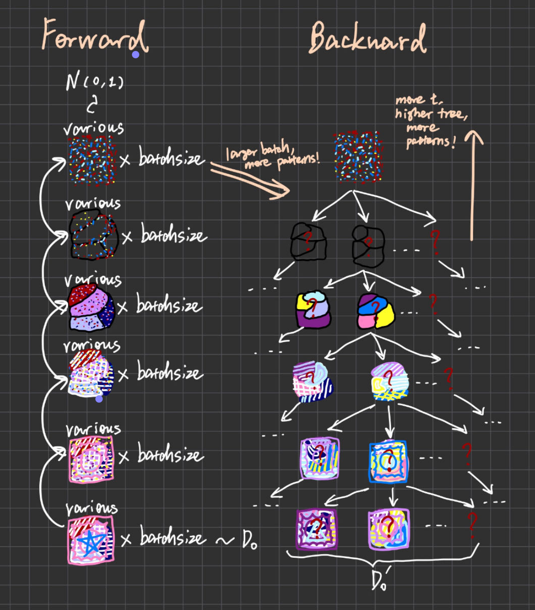

# 一些关于模型细节和图像效果间联系的思考

****

## General

-   **element-wise add: **拼接单图特征空间，输出图像的整体变化范围更大
-   **channel-wise concatenate: **拼接单图特征通道（通常是网络中间层的操作，如 U-net ，各通道已不再表示颜色，而是类似图层的特征层；或者是除了颜色以外的功能层，比如透明度、对比度等），输出图像能具有的 pattern （点、网格、色块等）更丰富，或图像属性（透明度、对比度等）更多变
-   **patch-wise concatenate: **扩大单图图像大小，或将局部特征拼成整体图像
-   **batch-wise enlarge: **通过 normalization 后可扩大模型学习图像特征的空间，让模型对输入图像的所处分布有更多了解

## Diffusion

-   **输入的batch中各样本间特征越多样，输出的中间Interpolation就越清晰越多样**

    输入相当于告诉模型这个真实的分布中存在的特征模式，输入的batch特征越多变模型对真实分布的探索就越广，认为可选的特征模式就越多，能生成的特征模式的选择就更多

    （待实验：小 batch 和大 batch ）

-   **输入的时间步范围越大，最终加噪结果就越接近纯噪声，输出的中间Interpolation就越清晰越多样**

    每个时间步的加噪相当于在图层树上从原始叶子层（目标分布）往上添加一层（最高层只有树根），高层子根越高，反向过程能在叶子层生出的新叶子就更多

    （论文已实验：小 t 范围和大 t 范围）

    