# DDPM 理论概述

https://zhouyifan.net/2023/07/07/20230330-diffusion-model/（直观思路）

https://zhuanlan.zhihu.com/p/525106459 https://lilianweng.github.io/posts/2021-07-11-diffusion-models/#forward-diffusion-process（原理）

https://zhuanlan.zhihu.com/p/545910038（模型前身：郎之万动力学）

https://zhuanlan.zhihu.com/p/624221952（过程&架构代码）

<u>***省略的计算过程见GoodNotes笔记***</u>

## 前向过程 —— 扩散

****

-   ==**模型假设：**扩散过程是一个**马尔可夫链过程**，最终扩散得到的是**服从正态分布**的纯噪声，正态分布的参数由 $\beta_t$ 的事先定好的**递增**调度决定。== 

    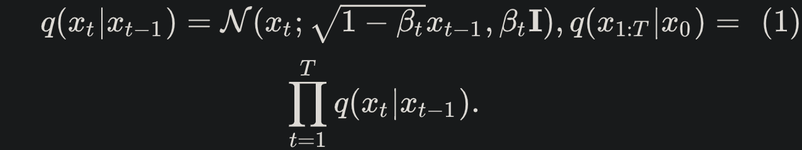

    $q(x_{1:T}|x_0)$（$Forward\ Process$）：表示在给定 $x_0$ 的情况下，序列 $x_1$ 到 $x_T$ 的联合分布（各时刻状态的条件概率连积）。

    -   $x_t$ 是在时刻 $t$ 的状态，而 $T$ 是整个时间序列的长度。

    -   等式右侧表示这个联合分布可以分解为一系列条件分布的乘积：$\prod_{t=1}^{T} q(x_t|x_{t-1})$ ，表示从时刻 1 到 $T$，每一个时刻 $x_t$ 的状态**都只依赖于它的前一个状态 $x_{t-1}$**。

        >   这可以通过条件概率的链式规则来推导，链式规则表明联合概率可以分解为一系列条件概率的乘积：
        >
        >   $ q(x_1, x_2, ..., x_T | x_0) = q(x_1|x_0) \cdot q(x_2|x_1, x_0) \cdot ... \cdot q(x_T|x_{T-1}, ..., x_1, x_0) $
        >
        >   根据马尔科夫性质，每个状态 $x_t$ 只依赖于它的前一个状态 $x_{t-1}$，而与更早的状态无关。
        >
        >   ==（这是马尔科夫链定义中的场景假设）== 
        >
        >   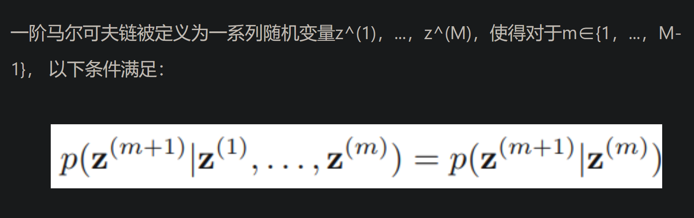
        >
        >   这意味着我们可以**简化上述条件概率**，使每个条件概率的计算**只依赖于直接前驱状态**：
        >
        >   $q(x_1, x_2, ..., x_T | x_0) = q(x_1|x_0) \cdot q(x_2|x_1) \cdot ... \cdot q(x_T|x_{T-1})$
        >
        >   这就是为什么给定 $x_0$ 的情况下，序列 $x_1$ 到 $x_T$ 的联合分布可以表示为一系列条件分布的乘积。在扩散模型中，这个性质是用来定义正向过程（加噪声过程）的，它描述了如何通过逐步添加噪声从初始数据状态 $x_0$ 过渡到一个完全随机的噪声状态 $x_T$。

    -   $q(x_t|x_{t-1})$ ：条件分布的具体形式——是以均值为 $\sqrt{1 - \beta_t x_{t-1}}$ ，方差**为 $\beta_t I$（其中 **<u>$I$ 是单位矩阵，代表多维情况下的方差</u>）的高斯分布 $\mathcal{N}$ 。

    -   $\beta_t$（$Variance\ Schedule$）：不同 $t$ 的 **$\beta_t$ 是预先定义好的**，由时间 1∼$T$ 逐渐的递增，可以是 $Linear$，$Cosine$ 等，**满足 $\beta_1$<$\beta_2$<...<$\beta_T$** ；可理解为**扩散率**，同时也是条件概率（高斯分布）的**方差**。

-   ==**推进过程**：通过**重参数化采样**得到 $x_t$ 。==

    >   重参数技巧在很多工作（Gumbel softmax, VAE）中有所引用。如果我们要从某个分布中随机采样(高斯分布)一个样本，这个过程是无法反传梯度的。而这个通过高斯噪声采样得到 x_t 的过程在 diffusion 中到处都是，因此我们需要通过重参数技巧来使得他可微。最通常的做法是把随机性通过一个独立的随机变量($ \epsilon$ )引导过去。举个例子，如果要从高斯分布 $z\sim \mathcal{N}$$(z;\mu_\theta,\sigma_\theta^2\mathbf{I})$ 采样一个 $z$ ，我们可以写成:
    >
    >   $z=\mu_\theta+\sigma_\theta\odot\epsilon, \epsilon\sim\mathcal{N}(0,\mathbf{I}).~\tag{2}$
    >
    >   上式的 $z$ 依旧是有随机性的， 且满足均值为$ \mu_\theta $方差为$ \sigma_\theta^2 $的高斯分布。这里的$\mu_\theta$，$\sigma_\theta^2$ 可以是由参数 \theta 的神经网络推断得到的。整个“采样”过程依旧梯度可导，随机性被转嫁到了 $\epsilon$ 上。
    >
    >   *--- https://zhuanlan.zhihu.com/p/525106459*

-   ==**计算反向过程所需的** $q(x_t|x_0)$ ，服从正态分布的条件概率**用正态分布的概率密度表示**==：

    由于**不关心各状态的取值分布内特定状态值**下的条件概率，而是**只关心各状态出现的概率**，因此直接将 $q$ 理解为 —— 在某转移状态（给定 $x_0$ 转移至 $x_t$）的取值分布内取一微元它出现的概率，即概率密度，以此代表其所属状态在状态转移链中出现的概率

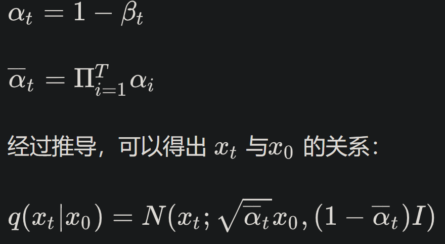

**图解：**

## 反向过程 —— 去噪

****

-   ==**模型假设【理论依据：当扩散率 $\beta_t$ 很小时，去噪过程和扩散过程的概率分布形式相同】：**去噪过程是另一个**马尔可夫链过程**，最终去噪能得到 $x_0$ 所在的概率分布，进而从中任意抽样生成任意新（假）图片，过程中依次学习每个 $x_t$ 所在的概率分布。==

    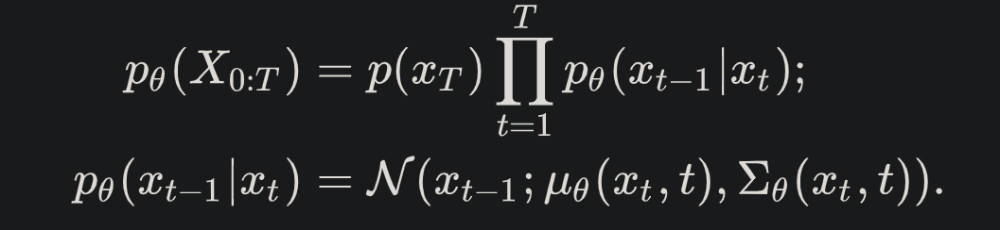

    $p_\theta(x_{0:T})$ （$Backward\ Process$）：对 $p(x_{0:T})$ 的估计，表示序列 $x_0$ 到 $x_T$ 的联合分布（各时刻状态的独立概率分布连积，但这样的先验概率无法求得，实际上是通过 $p(x_T)$ 和 $p_\theta(x_{t-1}|x_t)$ 求，其中 **$p(x_T)$ 是扩散过程的结果——一个标准正态分布 $\mathcal{N}(x_T;0,I)$** ）。

    -   $x_t$ 是在时刻 $t$ 的状态，而 $T$ 是整个时间序列的长度。

    -   等式右侧的 $\prod_{t=1}^{T} p_\theta(x_{t-1}|x_t)$ 的推导和扩散过程同理，**利用了马尔科夫链定义里的假设**，表示从时刻 $T-1$ 到 $0$，每一个时刻 $x_{t-1}$ 的状态**都只依赖于它的后一个状态 $x_t$** （扩散过程的倒推过程）。

    -   $p_\theta(x_{t-1}|x_t)$ ：对 $q(x_{t-1}|x_t,x_0)$ 的建模，待学习。条件分布的具体形式——是以均值为 $\mu_\theta(x_t,t)$ （ $\theta$ 待学习） ，协方差矩阵为 $\sum_\theta(x_t,t)$ （ $\theta$ 待学习；论文里是直接用了扩散过程中人定的 $\beta_t$ 近似因为实验结果差别不大且算力更小）（其中 <u>$I$ 是单位矩阵，代表多维情况下的方差</u>）的高斯分布 $N$ 。经推导（过程见GoodNotes笔记），==$q(x_{t-1}|x_t,x_0)=\mathcal{N}(x_{t-1};\tilde\mu_t(x_t,x_0),\tilde\beta_tI)$，其中均是确定量，求解时有用==。

    -   $\theta$ ： $\epsilon_\theta$ 中的待学习参数。【个人理解】模型认为，所有 $x_t$ 都来自一个描述原 $x_0$ 某种确定特征模式的概率分布 $D_t$。在此前提下，逆向过程中将扩散过程每一步及其之前加入的所有随机噪声的等效单一噪声 $\overline{\epsilon^{(t)}}$ （加入后得到 $x_t$），可视作一个确定的函数模式 $\epsilon_\theta=f_\theta(x_t,t)$ 在输入自变量 $(x_t,t)$ 时的因变量 $\epsilon_{\theta}$ 来预测，目标即为，使各 $\epsilon_\theta(x_t,t)$ 与各 $\overline{\epsilon^{(t)}}$ 等效（目标函数见*<u>训练</u>*），这里的“等效”并非简单的“ $\epsilon_\theta(x_t,t)=\overline{\epsilon^{(t)}}$ ”式的一一对等，而是指**各自导出的 $\widetilde{D_t}=D_t$**（具体见GoodNotes笔记），进而，**各 $p(x_t)=D_t$ 即可被视为含参数 $\theta$ 的确定概率分布 $p_\theta(x_t)$**。

-   ==**推进过程**：依然是通过**重参数化采样**得到 $x_{t-1}$ ，用于下一个 $\epsilon_\theta $ 的学习。==

**图解：**

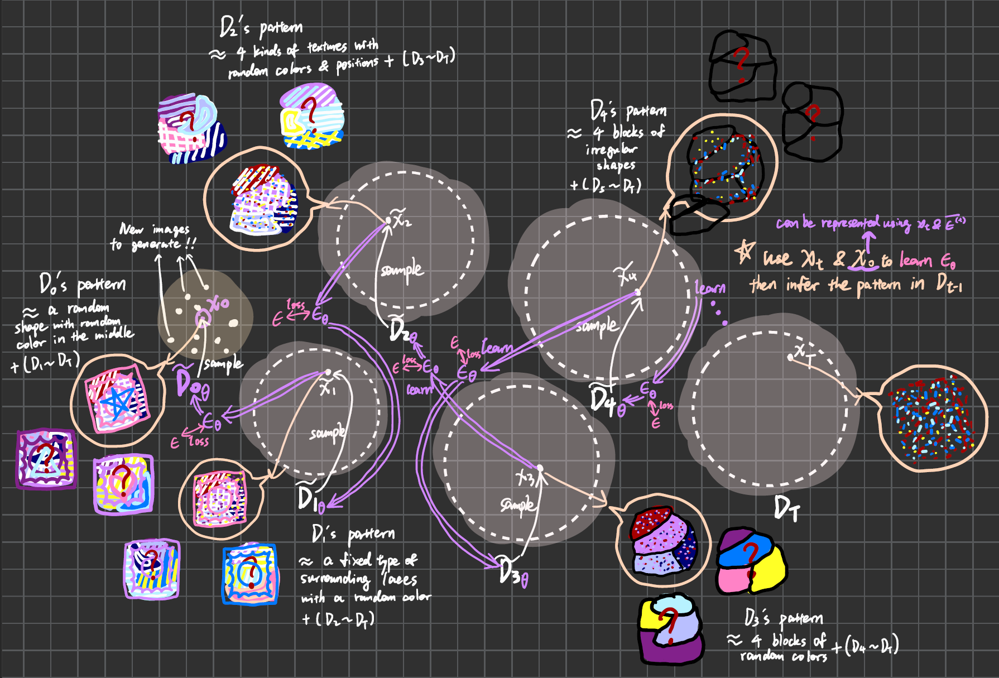

## 训练

****

⭐ **概述**

-   $p_\theta(x_0)$ 是对真实概率的函数建模（马尔可夫过程中一个含参数 $\theta$ 的概率）；
-   利用先前引入的简单高斯分布 $q$ （即模型假设，分布形式中参数均是确定量，是模型假设前提下的“真实值”），可表示出 $\frac{{p_\theta}(x_{0:T})}{q(x_{1:T}|x_0)}$ ，训练时用来接近 $p_\theta(x_0)$ （“接近”见下文<u>变分下界</u>），由于 $\frac{{p_\theta}(x_{0:T})}{q(x_{1:T}|x_0)}$ <u>可拆解成明确的KL散度公式</u>（“拆解”见下文<u>方差缩减</u>），**每一项KL中有确定的 $q$ 供 $p_\theta$ 接近**，因此可以分项（每项是一个时间步）优化，进而更准确地学习 $\theta$；
-   模型假设下“真实”概率是高斯分布 $q$，而现实世界真实概率是 $p$，一般取 $p(x_0)$=1，其中 $x_0$ 是在 $D_0$ 中的任意抽样，$p$ 供 $p_\theta$ 评估损失值（交叉熵）。

### 确定目标

**直接目标自然就是让 $\epsilon_\theta(x_t,t)$ 接近 $\overline{\epsilon^{(t)}}$。**

以下是数学上从分布函数到 $\epsilon$ 随机因子的更严谨导出。

#### 直观联系

逆向地想，当各 $\epsilon_\theta(x_t,t)$ 与各 $\overline{\epsilon^{(t)}}$ 等效，即各自导出的 $\widetilde{D_t}=D_t$（具体见GoodNotes笔记），进而，**各 $q(x_t)=D_t$ 即被视为含参数 $\theta$ 的确定概率分布 $p_\theta(x_t)$，最终落到 $p_\theta(x_0)$**。

>   ***导出过程***
>
>   学得 $\theta$ 便学得了 $\epsilon_\theta$，进而可用 $\epsilon_\theta$ 代替 $\overline{\epsilon^{(t)}}$ 计算出 $q(x_{t-1}|x_t,x_0)$ 的模型推测值 $p_\theta(x_{t-1}|x_t,x_0)$ （计算过程见GoodNotes笔记），进而据马尔可夫性质有 $p_\theta(x_{t-1}|x_t)=p_\theta(x_{t-1}|x_t,x_0)$ ，从而可求出 $p_\theta(x_{0:T})$。
>
>   理论上原有——
>   $$
>   D_0=q(x_0)=\frac{q(x_{0:T})}{q(x_{1:T}|x_0)}\ .
>   $$
>   其中，$q(x_{1:T}|x_0)$ 是在模型假设下经正向过程可以准确求得的，而 $q(x_{0:T})$ 则被模型推测为 $p_\theta(x_{0:T})$ （带学得的 $）\theta$，于是可得——
>   $$
>   q(x_0)\approx p_\theta(x_0):=\frac{{p_\theta}(x_{0:T})}{q(x_{1:T}|x_0)}\ .
>   $$
>   因此要求得 $p_\theta(x_0)$，即求 $\frac{{p_\theta}(x_{0:T})}{q(x_{1:T}|x_0)}$。

#### 理论公式（目标函数）

$$
\mathbb{E}[-\log{p_\theta(x_0)}] \leq \\\mathcal{L}:=\mathbb{E}_{q(x_0)}[-\log{\frac{p_\theta(x_{0:T})}{q(x_{1:T}|x_0)}}] = \mathbb{E}_{q(x_0)}[-\log{p(x_T)}-\sum_{t\ge1}\log{\frac{p_\theta(x_{t-1}|x_{t})}{q(x_{t}|x_{t-1})}}]\ .
$$

>   ***导出过程***
>
>   1.  写出直接目标的 $p_\theta(x_0)$ 的交叉熵（用带 $\theta$ 参数的学得概率估计现实世界真实概率，产生的损失）：
>       $$
>       \begin{align}
>       &H(p,q=p_{\theta})=\sum[-p(x_0)\cdot\log{p_{\theta}(x_0)}]
>       =\sum[-\log{p_{\theta}(x_0)}]\ ,
>       \\\\&在p_\theta中取期望得，
>       \\&\mathcal{L}=\mathbb{E}[-\log{p_{\theta}(x_0)}]\ .
>       \end{align}
>       $$
>
>   2.  根据 $Jensen$ 不等式可得实际优化的目标函数 --- **变分下界**
>
>       >   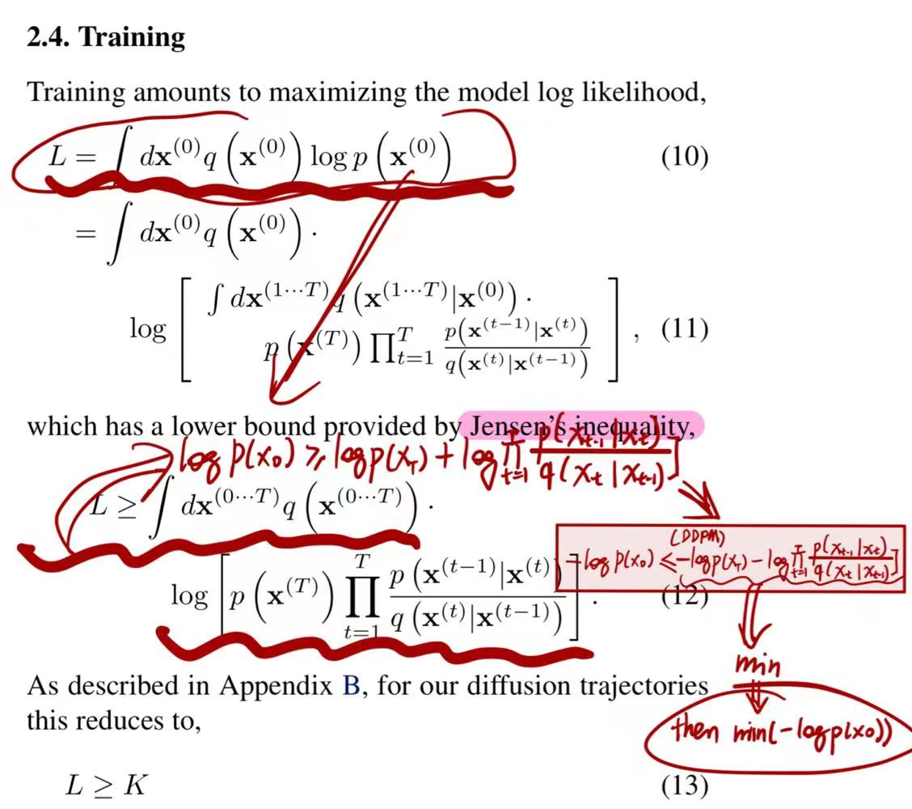
>       >
>       >   *--- Deep Unsupervised Learning using Nonequilibrium Thermodynamics - 18 Nov 2015* 
>
>        具体推导：
>       $$
>       \begin{align}
>       \mathcal{L} &= \mathbb{E}_{q(x_0)}[-\log p_{\theta}(x_0)]
>       \\
>       &= -\mathbb{E}_{q(x_0)} \log \left( p_{\theta}(x_0) \cdot \int p_{\theta}(x_{1:T}) dx_{1:T} \right)
>       \\
>       &= -\mathbb{E}_{q(x_0)} \log \left( \int p_{\theta}(x_{0:T}) dx_{1:T} \right)
>       \\
>       &= -\mathbb{E}_{q(x_0)} \log \left( \int q(x_{1:T} | x_0) \frac{p_{\theta}(x_{0:T})}{q(x_{1:T} | x_0)} dx_{1:T} \right)
>       \\
>       &= -\mathbb{E}_{q(x_0)} \log \left( \mathbb{E}_{q(x_{1:T} | x_0)} \left[ \frac{p_{\theta}(x_{0:T})}{q(x_{1:T} | x_0)} \right] \right)
>       \\
>       &\leq -\mathbb{E}_{q(x_{0:T})}\log \frac{p_{\theta}(x_{0:T})}{q(x_{1:T} | x_0)} \quad \text{(Jensen's inequality)}
>       \\
>       &= \mathbb{E}_{q(x_0:T)} \log \frac{q(x_{1:T} | x_0)}{p_{\theta}(x_{0:T})} = \mathcal{L}_{VLB}\ . \quad \text{(Variational Lower Bound)}
>       \end{align}
>       $$
>       **通过最小化变分下界 $\mathcal{L}_{VLB}$ （借助了简单的高斯分布 $q$ ）可以最小化原始交叉熵损失。**

### **用方差缩减优化的目标函数**

将累积的概率估计损失（$\mathcal{L}_0$）通过条件概率拆分成每一时间步，分步做优化，**因为分步方差更小，相比累积成时间链后再整体优化更容易获得较低损失值，以此减小累积损失**。

#### 拆解 $\mathcal{L}$ 的直观理解

去噪过程本身就是逐步进行的，去噪结果的损失自然就是各步损失的累积结果，又由于是马尔科夫链，各步之间没有任何联系，因此应该是以各步损失直接相加的形式累积成最终损失。此外，由于是拆解成**KL散度**和交叉熵，拆分后各项均有**解析解（即闭式解）**。

>   ***KL散度***
>   $$
>   D_{KL}(P||Q) = \sum_xP(x)\log\frac{P(x)}{Q(x)}
>   $$
>   *衡量近似分布与被接近分布相比损失的信息量（熵），用于评价近似概率 $Q(x)$ 与被接近概率 $P(X)$ 的接近程度，作为损失值即**评价学得概率与真实概率的接近程度**。*

>   ***闭式解（Closed-Form Solution）**是一个数学表达式，可以通过代数运算明确给出的精确解决方案，不需要通过数值方法进行迭代求解。这种解通常是一个代数表达式，包括常数、变量、已知函数（如指数函数、对数函数、三角函数等）的有限组合。*

#### 拆解  $\mathcal{L}$ 的公式

（具体过程见GoodNotes笔记）
$$
\begin{align}
\mathcal{L}=&\ \mathbb{E}_{q} \left[ D_{KL} \left( q(x_T | x_0) \parallel p_{\theta}(x_T) \right) \right]\\ 
&+\sum_{t=2}^{T} D_{KL} \left( q(x_{t-1} | x_t, x_0) \parallel p_{\theta}(x_{t-1} | x_t) \right) \\
&-\log p_{\theta}(x_0 | x_1)\ .\\\\
其中&，\\
D_{KL} &\left( q(x_T | x_0) \parallel p_{\theta}(x_T) \right)=\mathcal{L}_T\ ,\\
D_{KL} &\left( q(x_{t-1} | x_t, x_0) \parallel p_{\theta}(x_{t-1} | x_t) \right)=\mathcal{L}_t\qquad(1 \leq t \leq T-1)\ ,\\
-\log &\ p_{\theta}(x_0 | x_1)=\mathcal{L}_0\ ,\\
即，&\mathcal{L}=\ \mathcal{L}_T + \mathcal{L}_{T-1} + \mathcal{L}_{T-2}\  + ...+\ \mathcal{L}_1+\mathcal{L}_0\ .
\end{align}
$$

###  **求解**

-   $q$ 为前向过程，均是确定值，而 $x_T\sim\mathcal{N}(x_T;0,I)$，于是 $\mathcal{L}_T$ 为常量，作为一个超参数的设置——**设置 $p_\theta$ 与纯噪声的接近程度**，在优化时不考虑；

-   衡量 $p_\theta(x_{t-1}|x_t)$ 与 $q(x_{t-1}|x_t,x_0)$ 相比的损失的 $\mathcal{L}_t$  ，求解方法如下：

    >   ​		多元高斯分布（也称为多变量正态分布）的KL散度有一个**闭式解**。
    >
    >   ​		假设我们有两个多元高斯分布 $P$ 和 $Q$ ，多元高斯分布之间的KL散度  $D_{KL}(P \| Q)$ 可以通过以下公式计算：
    >   $$
    >   D_{KL}(P \| Q) = \frac{1}{2} \left( \log \frac{|\Sigma_Q|}{|\Sigma_P|} - k + \text{tr}(\Sigma_Q^{-1}\Sigma_P) + (\mu_Q - \mu_P)^\top \Sigma_Q^{-1} (\mu_Q - \mu_P) \right)
    >   $$
    >   在这个公式中：
    >
    >   -   $\sum_P$ 和 $\sum_Q$ 是两个多元高斯分布的协方差矩阵；
    >   -   $\mu_P$ 和 $\mu_Q$ 是它们的均值向量；
    >   -   $|\sum_P|$ 和 $|\sum_Q|$ 表示协方差矩阵的行列式；
    >   -   $\mathcal{k}$ 是变量的维度。
    >   -   $\text{tr}$ 表示矩阵的迹（即矩阵对角线元素的和）。
    >   -   $\sum_Q^{-1}$ 是协方差矩阵 $\sum_Q$ 的逆矩阵。
    >   -   $(\mu_Q-\mu_P)^T$ 是均值差向量的转置。
    >
    >   这个公式提供了直接计算两个多元高斯分布之间KL散度的方法，**不需要进行复杂的积分或数值近似**。

    最终可得，
    $$
    \mathcal{L}_t = \mathbb{E}_q \left[ \frac{1}{2\sigma_t^2}||\tilde\mu_t(x_t, x_0) - \mu_{\theta}(x_t, t) \|^2 \right] + C,
    $$
    其中，论文中设 $\sum_\theta=\sigma_t^2$ ，使之不用被训练，否则会导致训练不稳定（取 $\sigma_t^2=\beta_t$ 或 $\sigma_t^2=\tilde\beta_t$ ，两者实验结果相近），$C$ 是与参数 $\theta$ 无关的确定量，在优化时不考虑。（ $||\cdot||_2$ 表示 $\mathcal{L_2}$ 范数）

    将 $x_t$ 在正向过程中的重参数化表示 $x_t(x_0,\epsilon)$（具体见GoodNotes笔记）代入 $\tilde\mu_t$ 后，可按 $\tilde\mu_t$ 的形式对待学习的 $\mu_\theta(x_t,t)$ 建模为 
    $$
    \mu_\theta(x_t,t)=\frac{1}{\sqrt{\alpha_t}}(x_t-\frac{\beta_t\epsilon_\theta(x_t,t)}{\sqrt1-\overline\alpha_t})
    $$
    代入 $\tilde\mu_t$ 和 $\tilde\mu_t$ 即可化简得，
    $$
    \mathcal{L}_t = \mathbb{E}_{x_0,\epsilon}[\frac{\beta_t^2}{2\sigma^2_t\alpha_t(1-\overline\alpha_t)}||\epsilon-\epsilon_\theta(\sqrt{\overline\alpha_t}x_0+\sqrt{1-\overline\alpha_t}\epsilon,t)||^2],\quad \epsilon\sim\mathcal{N}(0,I)
    $$
    论文中实验证明，**参数化 $\mu_\theta$ 至 $\epsilon_\theta$ 供模型学习的效果优于直接学习 $\mu_\theta$** ，理论支撑是 $Langevin\ Dynamics$。  

-   $\mathcal{L}_0$ 的单独处理：

    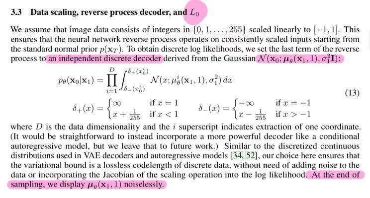

### 训练时简化目标函数

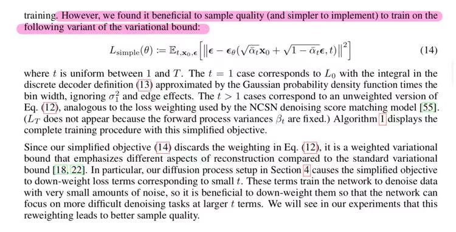

至此可知，扩散模型最终的优化目标是 $\epsilon$ 的结论，无论从直观理解上还是理论推导上都是合理的。

## 模型架构

****

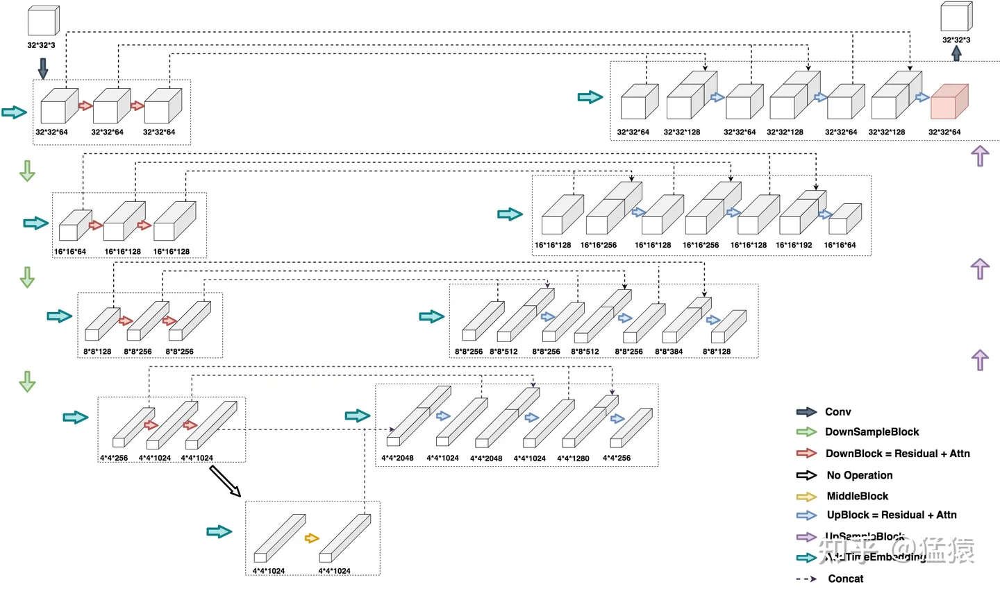

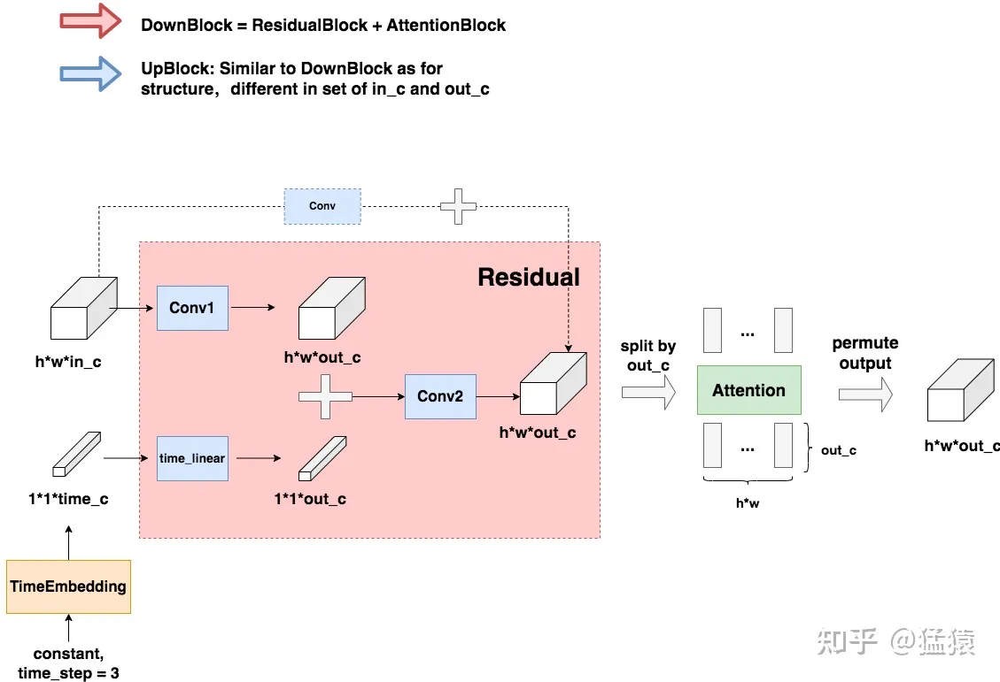

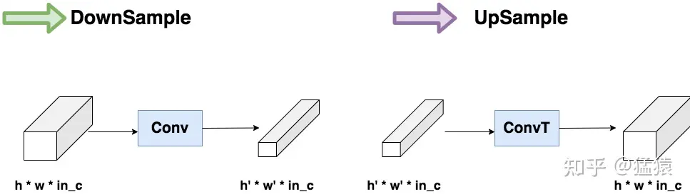

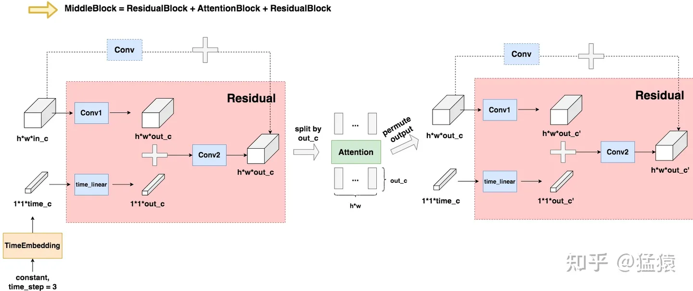

https://zhuanlan.zhihu.com/p/637815071

## 人脸插值测试

****

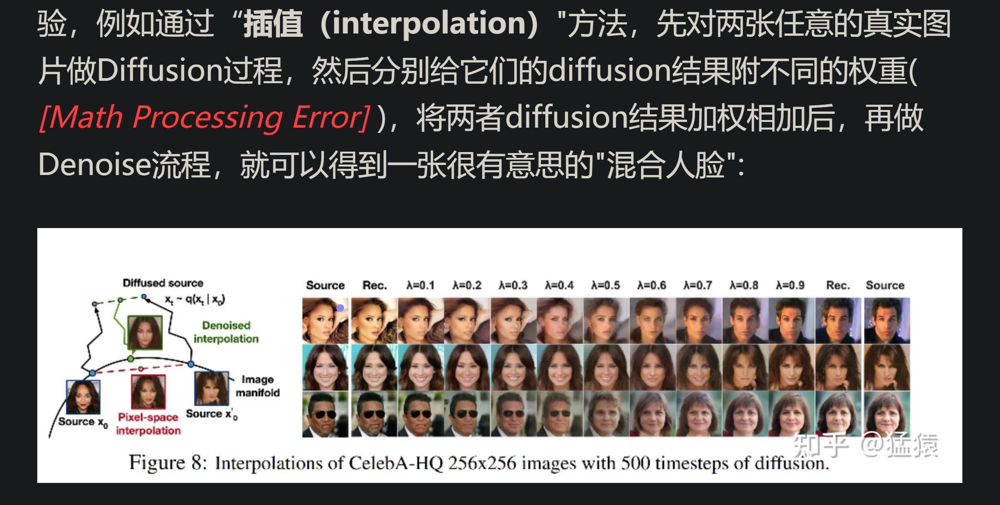

**t 的范围越大，插值生成的人脸类型更丰富** 
