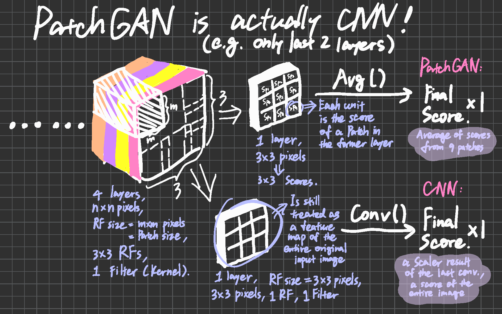

# GAN

****

***DIFFERENT REALIZATIONS OF GENERATOR (usually an encoder-decoder) & DISCRIMINATOR***

## `PatchGAN`

***Used for: ==Discriminator==*** 

***Uses CNN to get multiple scores (a score map) from patches in the original input and average them for the final output to judge whether an image is real or fake at the patch scale.***

