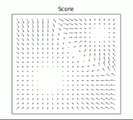

# Generative Models

****

## Common basics

### Assumptions

-   多元特征样本则对训练集每类样本都分别设为一个**高斯分布**（可共用方差并共同计算似然函数），无论是否是二元分类
-   单元特征样本（即二元分布）则直接对所有训练集设为一整个**伯努利分布**

## Likelihood-based

***直接一一拟合数据分布在训练集范围内上的各数据点***

**优化对象：概率分布本身**

 

**作用：输入图片输出同一张图片** 

-   VAE
-   normalizing flow models（流模型）
-   ...

**缺点：网络结构设计无法完美拟合真实分布，但又只能根据假设学习图片，导致网络性能有明确上限（如 VAE 一直假设图片服从高斯分布，并且不再优化分布，但图片的分布往往不是完美的高斯分布）** 

## Implicit

***间接拟合训练集所在分布***

**作用：输入图片，设法判断该图片是否在目标分布内**

**优化对象：概率分布本身**

 

-   GAN

    -   Pix2Pix

    -   Cycle
    -   ...

**缺点：需要对抗学习，难训练，容易崩**

## Diffusion（Score-based）

***直接拟合分布函数中的参数***

**优化对象：对数概率的梯度（即 Score ），指向是概率分布中数据密度高的地方（以训练集为参考），于是给定任意初始分布的采样，只要沿着正确的梯度（根据当前位置得出该处正确梯度，待优化）前进，就可以更新成目标分布中的采样**  

**迭代前进公式【郎之万动力学】：**
$$
X_{next}=X+\varepsilon\cdot▽_x\log p(x)+\sqrt{2\varepsilon}\cdot noise
$$

-   $\varepsilon$ -- 步长
-   $▽_x\log p(x)$ -- 前进方向（确定性采样方向，即 **Score**）
-   $[X+\varepsilon\cdot▽_x\log p(x)]$ -- $X_{next}$ 所在分布的期望
-   $\sqrt{2\varepsilon}$ -- $X_{next}$ 所在分布的方差
-   $[\sqrt{2\varepsilon}\cdot noise]$ -- 扰动噪声项（非确定性采样，可丰富采样结果的多样性）

>   “概率分布中数据密度高的地方”“目标分布” => $X_0$ 所在分布
>
>   “任意初始分布” => $X_T$ 所在的高斯分布
>
>   “沿着正确的梯度前进” => $Sampling$ 过程

**问题：要优化 Score ，但是数据密度低的地方 Score 估计不准，并且这些地方占比大，导致前进方向脱轨，目标分布采样不准** 

**解决：给目标分布进行多次加噪，噪声从强到弱（强噪声使得更大区域的梯度变显著易估计，弱噪声使得各处梯度更贴合原目标分布），使得目标分布分次膨胀，每膨胀一次，就有一部分原先密度低的地方变得更密集，梯度更显著，此时再实时学习这里的梯度就会更准确；最终当噪声强度降到 0 ，而膨胀范围覆盖整个目标分布，即目标分布扩散成纯高斯噪声时，就能学习完原目标分布内各处的梯度** 

**实操（DDPM）：给目标分布进行多次加噪，每次输入某时间步 $t$ 和目标分布中个数据点 $X_0$ ，通过递推式用单个噪声 $\varepsilon$ 一步到位扩散至第 $t$ 次加噪结果 $X_t$ ，然后输入 $X_t$ 和 $t$ 到估计网络，学得噪声 $\varepsilon$ 进而计算 $X_t$ 处梯度（ Score ）；在 0 到某个很大的 T 的范围内进行大量 $t$ 的抽样来重复上述过程即可完成各处梯度的学习**   

**梯度公式推导：** 

根据噪声调度假设，

即 $X_t = \sqrt{\bar\alpha_t}\cdot X_0+\sqrt{1-\bar\alpha_t}\cdot\bar\varepsilon^{(t)}$ ，

进而分布函数： 

对 $X_t$ 求导得 ，刚好和 $\bar\varepsilon^{(t)}$ 差一个系数 $-\frac{1}{\sqrt{1-\bar\alpha}}$ ：
$$
Score(X_t)=-\frac{1}{\sqrt{1-\bar\alpha_t}}\cdot\varepsilon^{(t)}=-\frac{1}{\sqrt{1-\bar\alpha_t}}\cdot Unet(X_t,t)
$$
因此可以通过估计 $\bar\varepsilon^{(t)}$ 来得到梯度的估计 

***=> 一切对对数概率梯度 $Score(anything)$ 的操作和表示都相当于是对噪声 $\varepsilon_\theta(anything)$ 的操作和表示*** 

**总结：加噪过程是用来膨胀分布助力 Score 的估计的，去噪过程就是沿着估计好的 Score 回到目标分布**

**作用：输入图片，输出同分布内的新图片 **

**改进：对网络结构除了输入输出大小一致的要求外没有其他假设；没用对抗训练**

-   DDPM，DDIM，Improved DDPM
-   CLIP
-   ...

### SDE 理解& ODE 理解

https://www.bilibili.com/video/BV19M411z7hS/?spm_id_from=333.337.search-card.all.click&vd_source=7b4f090919224d0ed58239b52592268a

