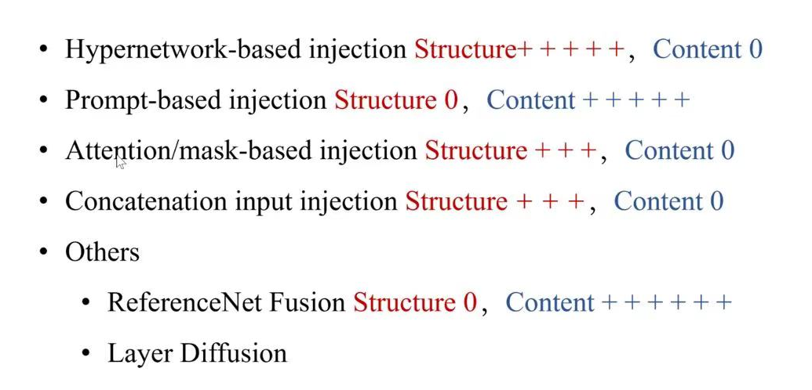

# Conditioning (Supervising)

## As Loss Target

只通过网络输出和标签值之间的损失函数来约束模型的优化（施加模型条件）

**微调（Fine-tune）：**在预训练模型的基础上**对生成（采样）结果添加带条件的损失值再继续训练**，不用重新训练预测噪声的模型（参考<u>DiffusionCLIP</u>）

## As Input

把条件连同输入一起 *feed forward*

***必须重新训练Unet，条件和样本的成对数据***

### Concatenation & Addition

#### Same dim.  =>  layer concatenation

如果条件和训练数据形状相同（如都是图片），可以直接在输入训练数据时把条件拼接在数据的通道维度上一并输入（参考Pix2Pix的Discriminator）

#### Different dim.  =>  encode (project) -> tensor addition 

如果条件和训练数据形状不同（如图片和时间步向量），则需要将时间步向量编码（可用Transformer）成和图片一样的形状，再直接张量相加到图片上一并输入（参考DDPM把时间步输入Unet、<u>Classifier-free</u>把类别标签输入Unet）

### Scale & Bias  (Adaptive Normalization)

**用法：**
$$
X = C_s\cdot [Instance|Batch|Group|Layer]Norm+C_b
$$
其中 $C_s = Linear(cond_1)$ ， $C_b=Linear(cond2)$ 。

-   **若只有一个条件但不知道设为 scalar 还是 bias，则可以两个都设，让模型自己学习（参考Semantic Diffusion Guidance的CLIP的AdaBN时间步嵌入）** 

-   ***若有两个条件，就把不同条件的影响解耦到输入数据的不同方面（比率&偏差），方便调试模型，具体哪个做 scalar 哪个做 bias 可以轮流尝试效果（参考Classifier Diffusion Guidance的DDPM的Unet的残差块的AdaGN时间步和类别标签嵌入）****

    **方式一：**分别以scalar和bias的形式把两个条件张量在同一层嵌入数据（一般在Normalization后）

    >   例：
    >   $$
    >   AdaGN(h,y)=y_s\cdot GroupNorm(h)+y_b
    >   $$
    >   $y=[y_s,y_b]$， $y_s$ 是时间步嵌入张量， $y_b$ 是类别标签嵌入张量， $h$ 是前一层卷积层的结果

    **方式二：**在不同层以scalar（或bias）的形式把多个条件张量（两个以上）依次嵌入数据（在Normalization后）

### Through a new module

-   <u>IP-adapter</u>（image condition）
-   <u>ControlNet</u>（spatial/ structural control）

## As Guidance

***指扩散模型中通过调整预测噪声来引导分布变化的梯度；无须重新训练Unet*** 

另外训练一个分类器（一般分类器或CLIP），用**分类结果的损失值对输入的梯度**带权重地调整Unet预测的噪声，从而**改变采样结果的分布**

1.  <u>Classifier Guidance</u>（使用一般分类器，只支持标签条件）
2.  <u>Semantic Guidance</u>（使用CLIP，支持文本条件、图像条件）
3.  <u>Classifier-free Guidance</u>（不使用分类器，支持文本条件、标签条件的嵌入）