# Stable Diffusion 中的 Unet 架构

****

## 基础块

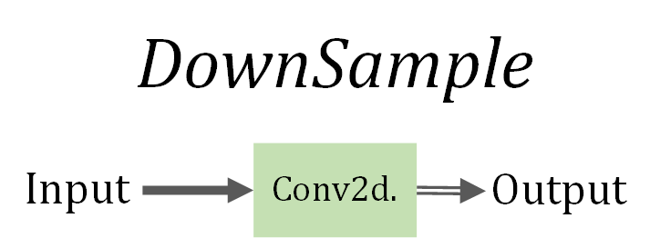

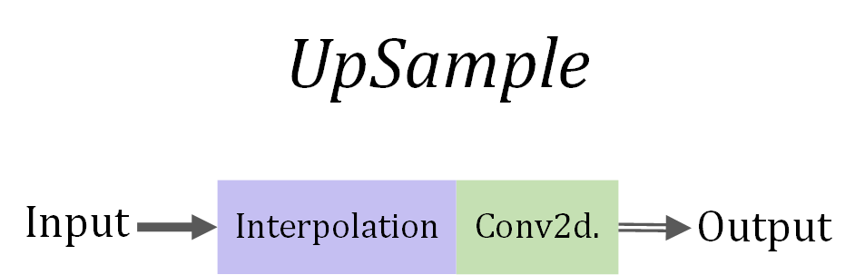

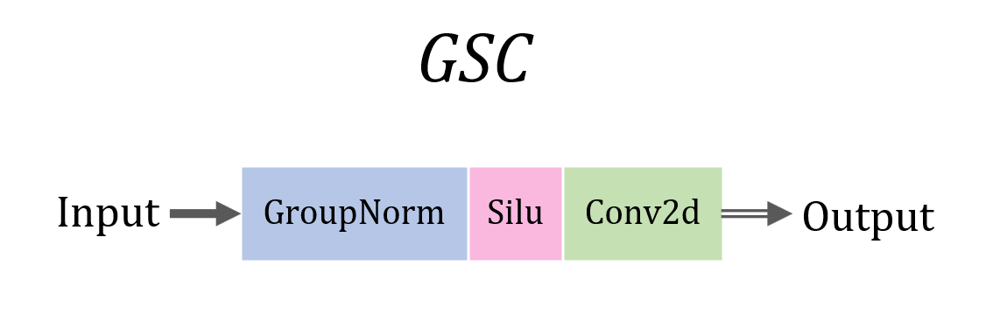

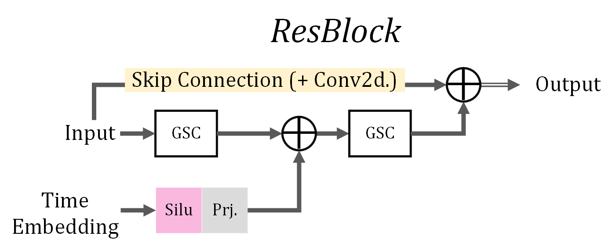

## 组合块

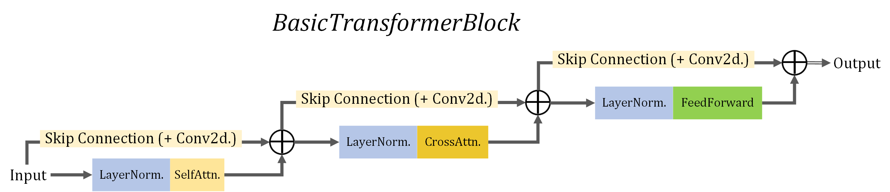

<u>***BasicTransformerBlock 即 Basic ViT Block***</u> 

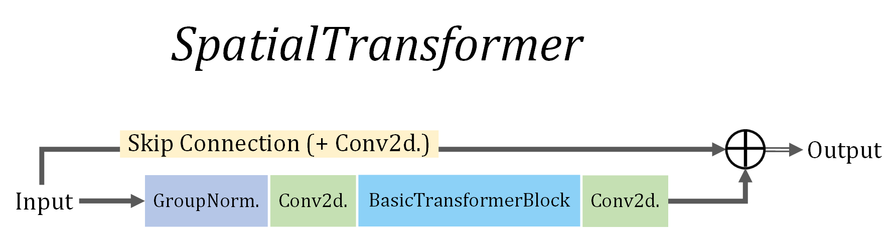

<u>***BasicTransformerBlock 可叠加多次***</u> 

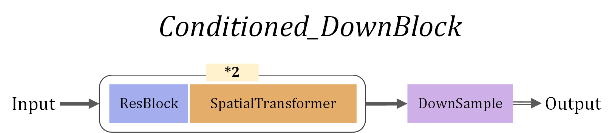

<u>***也可以用简单的 Attention 而不用 Spatial Transformer***</u>  

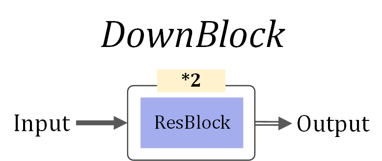

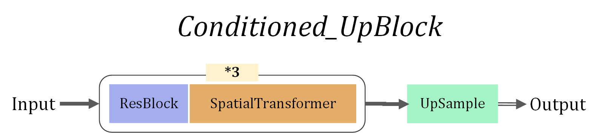

## 整体架构

代码路径：**`LDM/ldm/modules/diffusionmodules/openaimodel.py`** 

代码概述见：[S:\CAMPUS\AI\MyProject\DiffusionPainter\LDM\scripts\README.md](S:\CAMPUS\AI\MyProject\DiffusionPainter\LDM\scripts\README.md) 

代码解读见：[https://nn.labml.ai/diffusion/stable_diffusion/model/unet_attention.html ](https://nn.labml.ai/diffusion/stable_diffusion/model/unet_attention.html) 

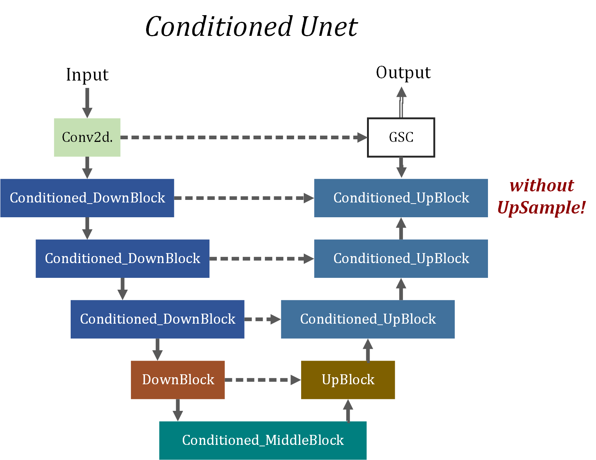

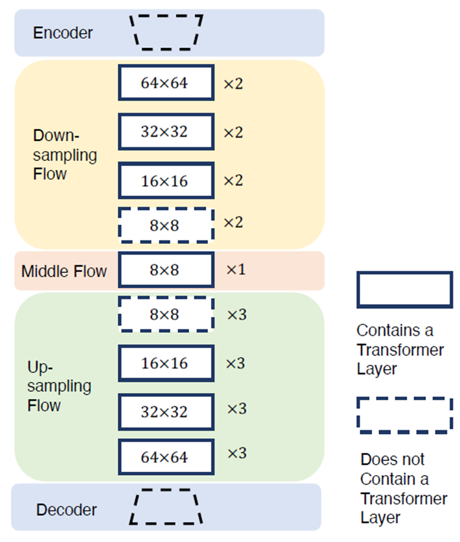

>   **the U-Net has three main stages: down-stage, mid-stage, and up-stage.** 
>
>   -   The down-stage reduces the resolution of activations, 
>   -   while the up-stage increases it. 
>
>   Both stages contain multiple resolutions, in each of which the activations share the same resolution. Furthermore, <u>each resolution includes several modules, including **ResModule** (convolutional ResNet structures), **ViT Module**, and **Downsampler/Upsampler** (simple convolutional layers)</u>.  
>
>   *--- 《Not All Diffusion Model Activations Have Been Evaluated as Discriminative Features》*