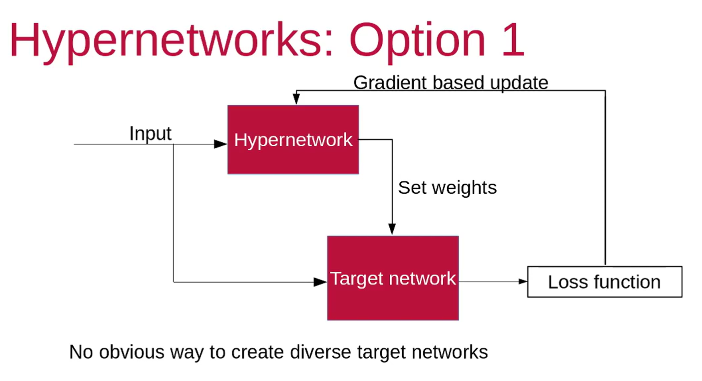
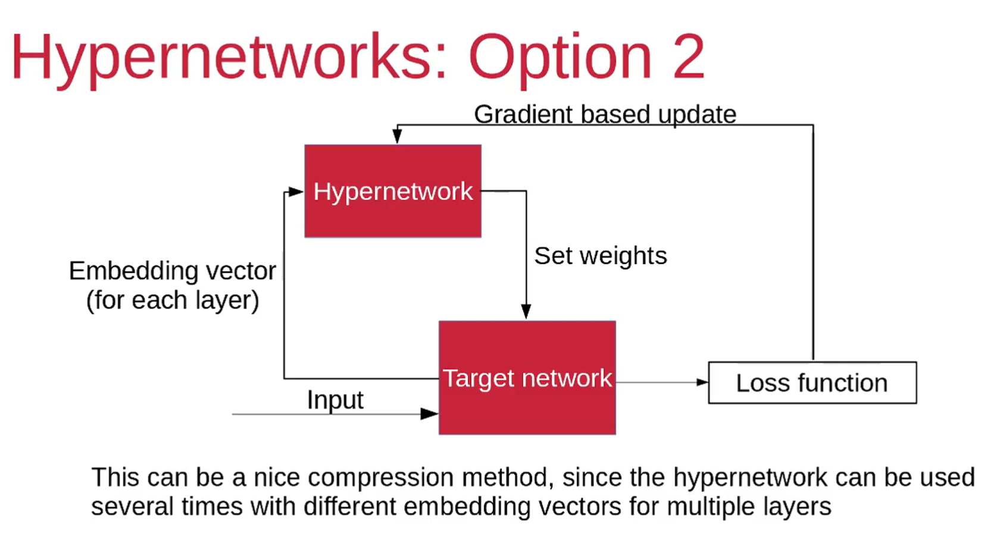
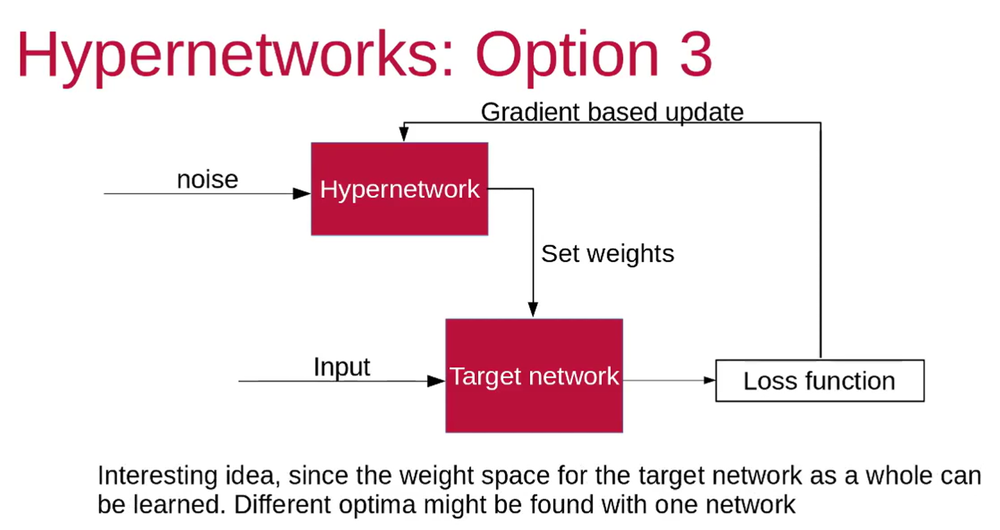
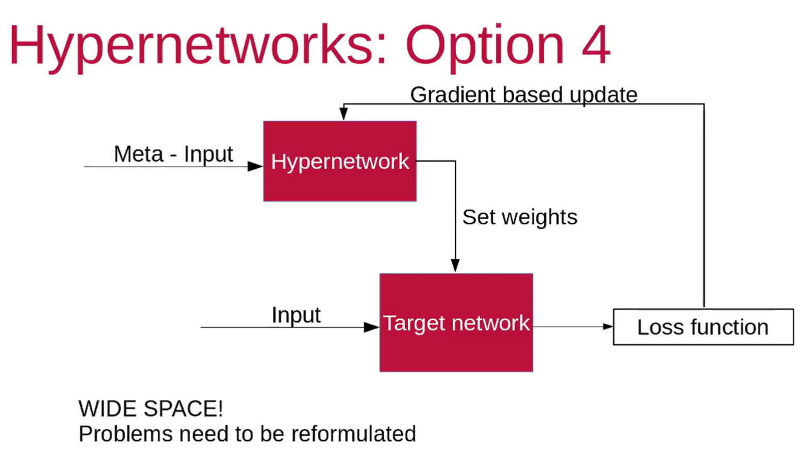
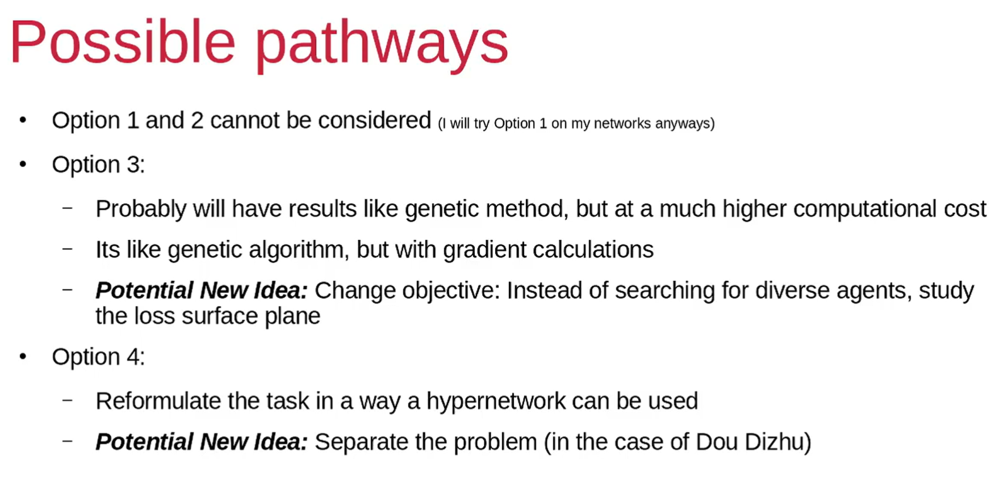
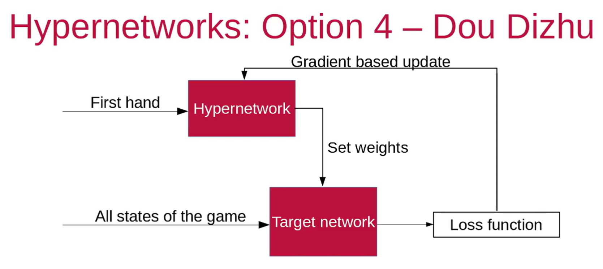

# Hypernetwork

## Type 1

***Abstract but not so good at diversity***

## Type 2

***Hypernetwork is bound to current target network thus also not good for diversity***

## Type 3

***Random vector input leads to good diversity***

## Type 4

## Summary

