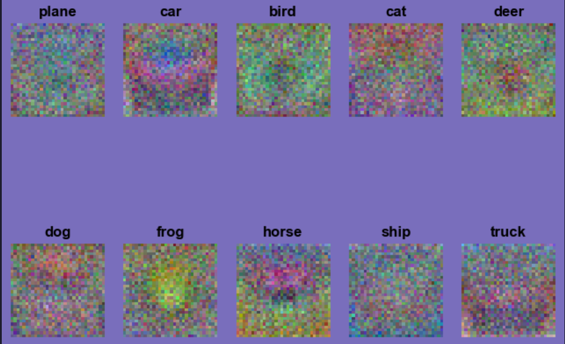
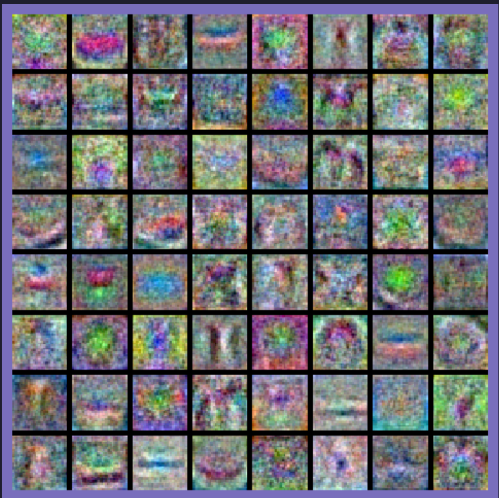

# Image Evaluation & Visualization

****

## Evaluation

### FID

**captures diversity (distribution's similarity)**

越小越好

>   FID（Fréchet Inception Distance）分数的计算过程主要包括以下几个步骤：
>
>   1.  从真实数据分布和生成模型中分别抽取一组样本。
>   2.  使用预训练的Inception网络从这些样本中提取特征向量。
>   3.  计算两个分布的均值向量和协方差矩阵。
>   4.  计算两个分布之间的Fréchet距离。
>   5.  得到FID分数。
>       具体来说，对于步骤1，可以从真实数据分布和生成模型中分别抽取一组大小相同的样本，通常建议抽取的样本数应该在5000到50000之间。对于步骤2，可以使用预训练的Inception网络从样本中提取特征向量，通常选择Inception-v3网络的倒数第二层特征作为特征向量。
>
>   --- 原文链接：https://blog.csdn.net/aaatomaaa/article/details/129744348

### sFID

**better spatial relationship**

### IS 

**captures fidelity of a single image**

越大越好

### Precision、Inception Score

**captures fidelity**

### Recall

**captures diversity**

## Visualization

-   **Noisy patterns** can be an indicator of a network that hasn’t been trained for long enough, or possibly a very low regularization strength that may have led to overfitting. (left: noisy; right: smooth)

    
    
                                  
    
    
    
    

