# Loss Function 

****


## Interpretation of Loss Func.

***to evaluate OUR INSATISFACTORY OF MODEL!!!! (the disability of generalization)***


## Standard Form

$$
Loss\ =\ Training\ Loss\ +\ \lambda\cdot Regularization\ Loss
$$

-   Training Loss => Empirical Risk
-   Regularization Loss => Structural Risk 
-   $\lambda$ => Trade-off Control


## About Backprop.

### How to Calculate???

画这样的变量流程图（circuit graph）可以帮助计算梯度

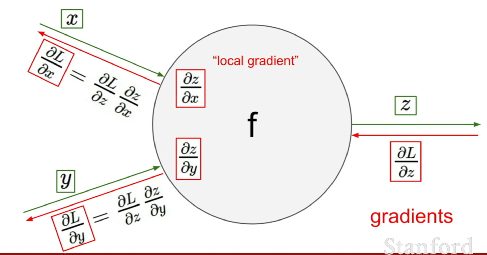

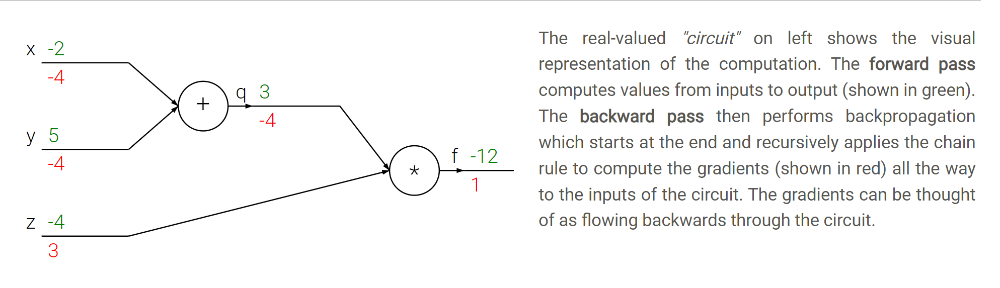

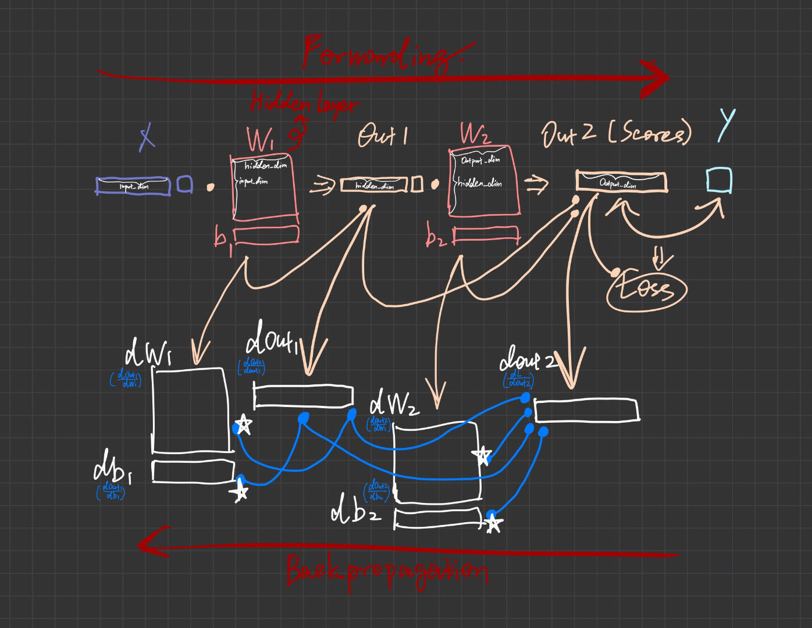

*(a 2-layer process with 1 sample)*

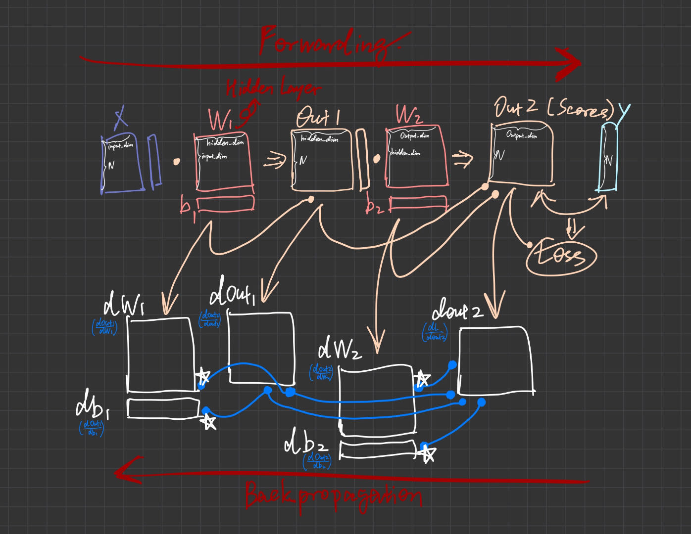

*(a 2-layer process with a batch of N samples \<$X$ has N rows>)*

***前向传播时计算结点值并存储、返回（用于反向传播时求局部偏导），反向传播时据链式法则求各局部偏导并与上游传来的外层导数相乘：***

-   **首先用最终输出计算 $Loss$，并计算 $Loss$ 对最终输出矩阵的导数 $doutn$，一起返回** （该步打包在实现 $Loss$ 的函数内）
-   **将 $dout_n$ 传到关于第 $n$ 层的反向传播函数内，其中计算 $dout_n$ 对 $W_{n}$ 和 $b_{n}$ 的偏导，以及对 $dout_{n-1}$ 的偏导，一起返回** 
-   **将 $dout_{n-1}$ 传到关于第 $n-1$ 层的反向传播函数内**，以此类推，直到 $n=1$（$dout_0$ 就是总输入 $X$，无需计算，可用`_`接受返回值）

>   *Every gate in a circuit diagram gets some inputs and can right away compute two things: 1. **its output value** and 2. **the local gradient of its output with respect to its inputs**.*
>
>   *Notice that the gates can do this **completely independently** without being aware of any of the details of the full circuit that they are embedded in.*
>
>   *Once the forward pass is over, during backpropagation the gate will eventually learn about the gradient of its output value on the final output of the entire circuit.* 

>   *Chain rule says that the gate should take that gradient and **multiply** it into **every gradient it normally computes for all of its inputs**.*

<u>Types of $f$ (Gate/ Node) in Backprop view</u>: 

-   **ADD GATE** --- gradient distributer
-   **MAX GATE** --- gradient router
-   **MUL GATE** --- gradient switcher

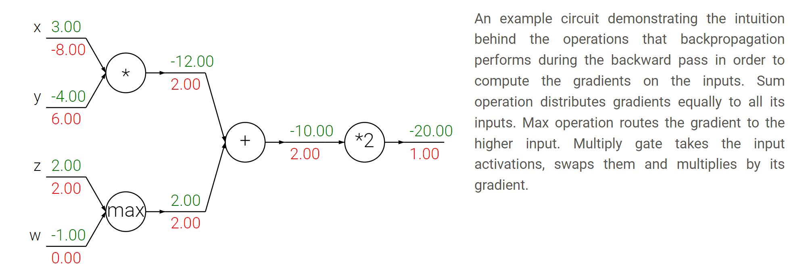

>   *⚠️ **Unintuitive effects and their consequences.** Notice that if one of the inputs to the multiply gate is very small and the other is very big, then the multiply gate will do something slightly unintuitive: it will assign a relatively huge gradient to the small input and a tiny gradient to the large input. <u>Note that in linear classifiers where the weights are dot producted $w^Tx_i$ (multiplied) with the inputs, this implies that the scale of the data has an effect on the magnitude of the gradient for the weights.</u> For example, if you multiplied all input data examples $x_i$ by 1000 during preprocessing, then the gradient on the weights will be 1000 times larger, and you’d have to lower the learning rate by that factor to compensate. This is why preprocessing matters a lot, sometimes in subtle ways! And having intuitive understanding for how the gradients flow can help you debug some of these cases.*

### Coding

coding exp:

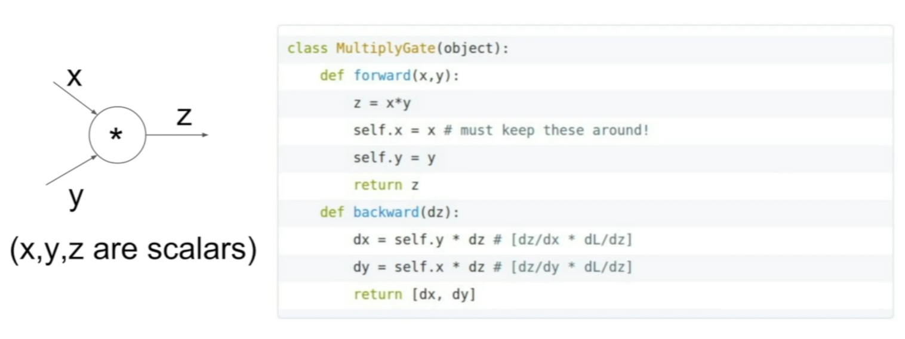

梯度传播的结点可以是自己以任意粒度集成的结点（即“门”），即神经网络的layer中的神经元（neuron）以及激活函数

>   ***Which parts of the forward function we think of as gates, is <u>a matter of convenience</u>. It helps to be aware of which parts of the expression have <u>easy local gradients</u>, so that they can be chained together <u>with the least amount of code and effort</u>.***

>   *It turns out that the derivative of the **sigmoid function**（包含多个原子的门） with respect to its input simplifies if you perform the derivation (after a fun tricky part where we add and subtract a 1 in the numerator):*
>
>   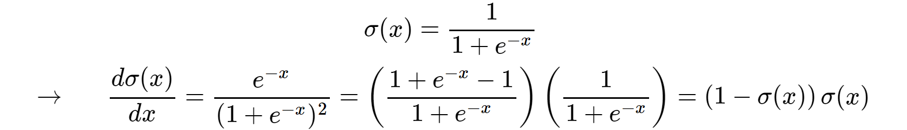
>
>   *As we see, the gradient turns out to simplify and becomes surprisingly simple.*
>
>   *Therefore, in any real practical application it would be very useful to group these operations into a single gate. Lets see the backprop for this neuron in code:*
>
>   ```python
>   w = [2,-3,-3] # assume some random weights and data
>   x = [-1, -2]
>   
>   # forward pass
>   dot = w[0]*x[0] + w[1]*x[1] + w[2]
>   f = 1.0 / (1 + math.exp(-dot)) # sigmoid function
>   
>   # backward pass through the neuron (backpropagation)
>   ddot = (1 - f) * f # gradient on dot variable, using the sigmoid gradient derivation
>   dx = [w[0] * ddot, w[1] * ddot] # backprop into x
>   dw = [x[0] * ddot, x[1] * ddot, 1.0 * ddot] # backprop into w
>   # we're done! we have the gradients on the inputs to the circuit
>   ```
>
>   *✨ **Implementation Tips: ***
>
>   -   ***Staged backpropagation** （适度增加中间量分步计算）. As shown in the code above, in practice it is always **helpful to break down the forward pass into stages that are easily backproped through**. For example here we created an intermediate variable `dot` which holds the output of the dot product between `w` and `x`. During backward pass we then successively compute (in reverse order) the corresponding variables (e.g. `ddot`, and ultimately `dw, dx`) that hold the gradients of those variables.*
>   -   ***Cache forward pass variables**（在前向步进时顺便计算并保存反向传播要用到的量）. To compute the backward pass it is very helpful to have some of the variables that were used in the forward pass. In practice you want to structure your code so that you cache these variables, and so that they are available during backpropagation. If this is too difficult, it is possible (but wasteful) to recompute them.*


## About Gradients

### Interpretation 

==How much a $Param$ effects the Output==

>   *The derivative on each variable tells you the **sensitivity of the whole expression on its value**.*

### How to Calculate???

There are two ways to compute the gradient: A slow, approximate but easy way (**numerical gradient**), and a fast, exact but more error-prone way that requires calculus (**analytic gradient**). 

#### Numerical

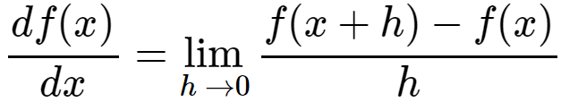

The formula given above allows us to compute the gradient numerically. Here is a generic function that takes a function `f`, a vector `x` to evaluate the gradient on, and returns the gradient of `f` at `x`:

```python
def eval_numerical_gradient(f, x):
  """
  a naive implementation of numerical gradient of f at x
  - f should be a function that takes a single argument
  - x is the point (numpy array) to evaluate the gradient at
  """

  fx = f(x) # evaluate function value at original point
  grad = np.zeros(x.shape)
  h = 0.00001

  # iterate over all indexes in x
  it = np.nditer(x, flags=['multi_index'], op_flags=['readwrite'])
  while not it.finished:

    # evaluate function at x+h
    ix = it.multi_index
    old_value = x[ix]
    x[ix] = old_value + h # increment by h
    fxh = f(x) # evalute f(x + h)
    x[ix] = old_value # restore to previous value (very important!)

    # compute the partial derivative
    grad[ix] = (fxh - fx) / h # the slope
    it.iternext() # step to next dimension

  return grad
```

Following the gradient formula we gave above, the code above **iterates over all dimensions one by one**, **makes a small change `h` along that dimension** and **calculates the partial derivative of the loss function** along that dimension by seeing how much the function changed. The variable `grad` holds the full gradient in the end.

⚠️ Note that in the mathematical formulation the gradient is defined in the limit as **h** goes towards zero, but **in practice it is often sufficient to use a very small value** (such as 1e-5 as seen in the example). **Ideally, you want to use the smallest step size that does not lead to numerical issues.** Additionally, in practice it often works better to compute the numeric gradient using the **centered difference formula**: 

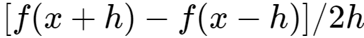

See [wiki](http://en.wikipedia.org/wiki/Numerical_differentiation) for details.

#### Analytical

直接根据求导公式手动实现求导列式计算

#### In Practice

***用数值法验证解析法的代码是否正确，最终在反向传播法中使用解析法求局部偏导***


## MSE Loss

它通常用于**回归问题**。在回归问题中，我们试图预测一个连续的数值，比如预测房价、股票价格等。MSE会计算模型预测值与真实值之间的平均平方差，衡量预测值与真实值之间的偏差。MSE的值越小，说明模型的预测效果越好。

```python
Loss = torch.nn.MSELoss()
```


## Cross Entropy Loss

它通常用于分类问题。在分类问题中，我们试图预测一个离散的类别标签，如图像分类、文本分类等。交叉熵损失衡量的是模型预测的概率分布与真实的概率分布之间的距离，是衡量模型预测概率与真实情况一致性的一个度量。交叉熵损失值越小，说明模型的预测效果越好。

在多分类问题中，我们常常使用**softmax**函数将网络的输出**转换为概率分布**。这个预估的概率分布Q与数据的真实分布P（通常是one-hot编码，只有真实类别的位置为1，其余为0）之间的差异，就可以用交叉熵损失来度量：
$$
L = - Σ P(x) log Q(x)
$$
其中，∑表示对所有可能的事件求和，p(x)是真实分布下事件x发生的概率，q(x)是预测分布下事件x发生的概率。

```python
Loss = torch.nn.CrossEntropy()  # 已经包含Softmax（自动将一层Softmax加到模型输出后）！！！！！！！
```

这就是交叉熵损失。你可以看到，它在形式上就是P和Q的交叉熵。如果网络的预测很准确（也就是说，Q接近于P），那么交叉熵损失就会很小。反之，如果网络的预测偏离了真实情况（也就是说，Q远离了P），那么交叉熵损失就会变大。

在多分类问题中，目标类别通常是用"one-hot"编码来表示的，即在真实类别对应的位置上为1，其他位置为0。这样的编码方式，我们称为P。

下面用一个形象的例子来解释这个公式。

假设你在进行一个图片分类任务，每张图片都应被分为猫、狗、或鸟其中的一种。对于一张特定的图片，它真实的标签可能是"猫"，那么真实分布P就是 [1, 0, 0]。也就是说，这张图片是猫的概率是1，是狗或鸟的概率都是0。

然后，你的模型可能预测这张图片为猫、狗、鸟的概率分别是0.7、0.2、0.1，那么你的预测分布Q就是 [0.7, 0.2, 0.1]。

那么，对于这张图片，交叉熵就是：`Cross-Entropy = - (1 * log(0.7) + 0 * log(0.2) + 0 * log(0.1))`。可以看到，如果你的预测分布完全正确，那么交叉熵就为0，因为`-log(1) = 0`；但如果你的预测分布完全错误，比如你预测这张图片是猫的概率为0，那么交叉熵就会变为无穷大，因为`-log(0)`为无穷大。


## Use Maximum Likelihood instead

**似然函数（Likelihood）**在机器学习中的含义：建立的模型（所假设的分布）能生成（generate，即sample\<`v.`>，抽样出）训练集的可能性（likelihood），即训练集属于该假设的分布的可能性、训练集真实所属分布与该假设的分布的相似度**（事实上似然函数取对数后的相反数就是 Cross Entropy！！！）**。

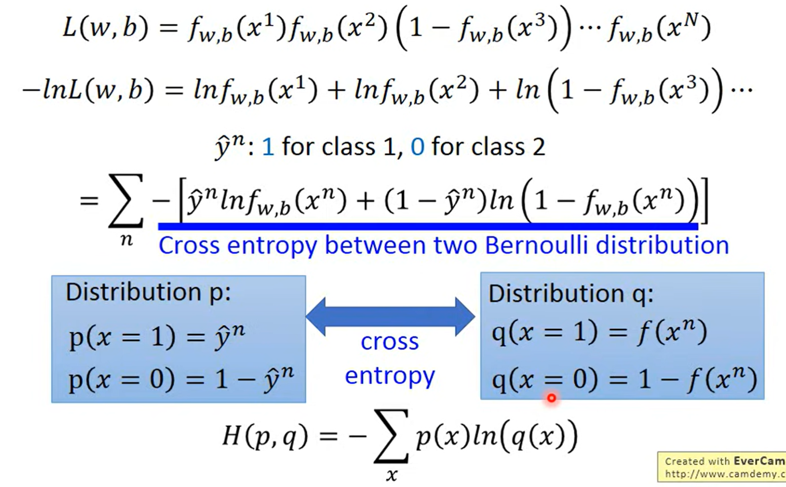

对分类问题采用概率模型，便可以使用连续的**似然函数**的值作为模型评估对象，通过优化预估分布函数和其参数的估计公式（关于训练集的统计量）来使似然函数最大即可实现对模型本身的优化。


## Hinge Loss

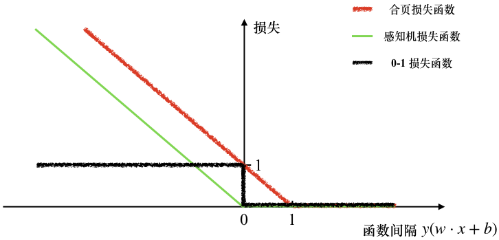

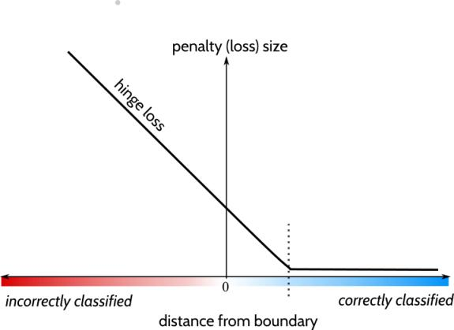

### 对于二元分类

**合页损失函数（Hinge Loss）**的定义如下：
$$
对于单个训练样本点：\quad
loss=max(0,1−(y′∗y))
$$
其中“$y'$”表示<u>当前学得的</u>**分类器模型的输出**：
$$
y′=b+w1\cdot x1+w2\cdot x2+…wn\cdot xn
$$
“$y$”表示**真标签（ground truth label）**，<u>值为 -1 或 +1</u>；

$y′∗y$ 表示**函数间隔**，它与该训练样本点和**决策边界（$W\cdot x+b=0$，即划分超平面）**间的**实际距离**线性相关（推导见《机器学习》P122侧栏笔记）；

==**优化目标：**找到$W$，使得<u>各训练样本点均不仅被正确划分，且离决策边界有一定距离，即**函数间隔**均大于1</u>**== 

$1−(y′∗y)$ 中的 $1$ 为**距离因子**，非0即可，与实际的最优距离无关，学得的 $W$ 和 $b$ 会随之按比例变化。它造成的决策边界两侧的距离即**安全间隔**。

>   **支持向量法在使用 Hinge Loss 的基础上还要求<u>安全间隔最大化</u>：** 
>
>   *<u>软间隔（Soft Margin）</u>* --- 允许少数训练样本点在**安全间隔（Safe Margin）** 内部，优化时除了最大化安全间隔还需要最小化这样的样本数（借助人为设置的超参数系数 $C$，见《机器学习》P130）
>
>   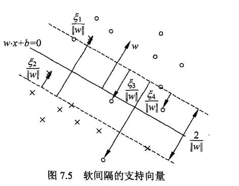
>
>   *<u>硬间隔（Hard Margin）</u>* --- 要求所有训练样本点均在**安全间隔（Safe Margin）** 外侧
>
>   **安全间隔**正则项的具体公式见 **<u>To Prevent Overfitting: L2 Regularization Term</u>**。
>
>   **安全间隔**的**最大化**也可理解为对<u>已经分类正确且一定程度远离边界</u>的结果的**附加惩罚**，需要充分正确（和决策边界<u>拉开**尽量大**的距离</u>）才是成功分类（对未见数据达到最大包容度） 。这就是 **L2 正则化防止过拟合**的本质。
>
>   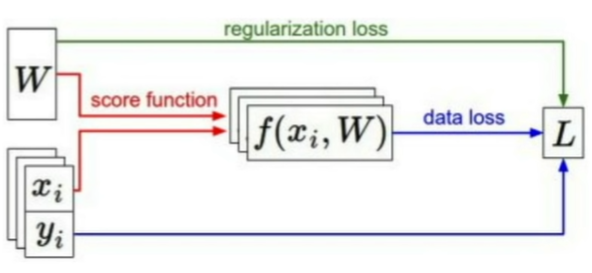
>
>   **支持向量法**对Loss的处理（SVM_Loss）可以推广到别的模型！！

### 对于多元分类

>   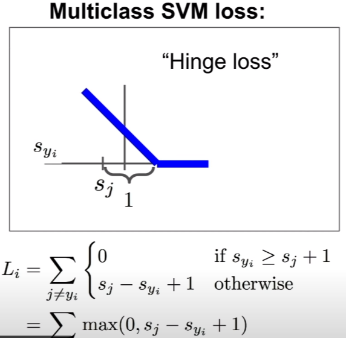
>
>   ('$S_j$' is the score of class_j for sample_i; '$S_{yi}$' is the score of the ground truth label_y of sample_i from the current classifier)
>
>   **Margin:** $S_{yi}-S_j$
>
>   $S_{yi}$ need to be higher than $S_j$ by some safety margin. Simply  ≥ is not enough.

### 平方合页损失

将函数间隔值平方代入线性合页损失函数。

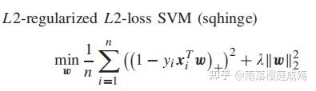

与常规合页损失函数相比，平方合页损失函数对离群值的惩罚更严厉（Very very bad => Squared bad），而对小损失值（函数间隔小于1）的惩罚减小（平方比原值更小）。


## To Prevent Overfitting: L2 Regularization Term

L2正则化是一种常用的防止过拟合的技术，也被称为权重衰减。它的基本思想是通过在损失函数中添加一个额外的项来惩罚大的权重值，从而**防止模型过于复杂**。

这种<u>**额外的项用来描述模型复杂度**</u>，是模型权重的平方和的一部分，因此称为"L2"正则化。

**正则项本质上是支持向量机的最大化间隔法产生的，其表示的其实是划分超平面两侧安全间隔的总大小（待最大化）。**

>   支持向量机最大化间隔法要求模型能满足 —— 使训练集和划分超平面间满足<u>软间隔</u>或<u>硬间隔</u>关系，即优化目标包含两部分：
>
>   -   要求一 => “找到最大安全间隔”
>   -   要求二 => “安全间隔使得训练样本点均在（硬）/ 基本在（软）其外侧” 
>
>   要求一要最大化**安全间隔**项，可等价转化为最小化一项含 $||W||$ 因子的 $L2$ 正则项（原本 $||W||$ 在分母）。要求二对应：训练样本点的**函数间隔（即点到划分超平面的距离）**均/ 基本大于等于安全间隔的一半（即单侧支持向量到划分超平面的距离）。再使用**拉格朗日乘子法**，即可将两个要求合并为一条待最小化的式子（原问题的对偶问题），包含 $L2$ 正则项以及含所有点函数间隔之和的一项。
>
>   ***参考《机器学习》p122（侧栏笔记有推导）,123,133*** 

具体来说，如果没有正则化，我们的目标可能只是最小化损失函数（例如，均方误差）：

$$
L = Σ(y - f(x))^2
$$
在这里，y是真实的目标值，f(x)是模型的预测值。

当我们加入L2正则化时，我们的目标变为最小化损失函数和正则化项之和：

$$
L = \lambdaΣ(y - f(x))^2 + (1-λ)||W||^2,\ \lambda\in(0,1)\\
或\\
L = Σ(y - f(x))^2 + λ||W||^2,\ \lambda\in(0,1)
$$
在这里，$W$ 代表模型的权重矩阵，<u>$λ$ 是一个超参数，**或者用交叉验证法估计**，控制**正则化的强度（regularization strength）**，即**经验误差和网络复杂度的平衡因子**</u>。请注意，<u>**正则化项 $||W||^2$ 是所有权重平方的和（矩阵所对应划分超平面到空间原点的欧氏距离，即矩阵的 L2 范数）**</u>。

通过这种方式，$L2$ 正则化鼓励模型使用较小的权重（变为更简单的模型）。这通常会导致模型的复杂度降低，使得模型对于训练数据的小的变化不那么敏感，从而**提高了模型的泛化能力**。