# Model 

***万物皆å¯å­¦ä¹ ï¼ï¼ˆæ•°æ®å¤„ç†å‡½æ•°ã€è·ç¦»åº¦é‡å‡½æ•°ã€æŸå¤±å‡½æ•°ã€æ¨¡å‹æœ¬èº« ......）***


## Quick Understanding of Deep Learning

-   Trainer: Us

-   Student: Machine (Computer)

-   **Plan before training (Need to be appropriate for the applicaion and easy to learn):** 

    a Function with Parameters to be Learnt & some Hyper-parameters (MANUALLY PROVIDED) => $Building\ the\ Model$

-   **Data for learning:** 

    a Training Set => $Train\ Time$

-   **Notes summarizing the learning:** 

    the Function with learned Parameters => $Learnt\ Model$

    ==To come up with the right Function is the key stage of Deep Learning!!!==

-   **Data for checking learning effect (Homework):**  

    a Validation Set => $Validation\ Time$

-   **Errors Recording:**

    Loss Function => *We tell our machine how bad the model is with this (Usually include <u>penalty \<Regularization Loss></u> in case of over-fitting T-T; Encourage simpler model so it needs to overcome the Regularization to attain more complex model, which will be more robust than complex ones without penalty)* 

-   **Consolidate the knowledge:** 

    the Training-Validation Loop => $Optimization$  

-   **==Data for the FINAL EXAM:==** 

    ==a Testing Set unseen through any stages before => $Test\ Time$==


## Quick Understanding of Neural Networks

**Basic Form of a $N+1$ Layers NN Model:** 

-   ==A **`Layer`**==   

    -   **`Affine Net`** â¡ï¸

        >   ### Affine Transformation in Neural Networks
        >
        >   1.  **Linear Transformation**: This involves multiplying the input by a weight matrix. If you have an input vector $X$ and a weight matrix $W$, the linear transformation is $Xâ‹…W$.
        >
        >       ***=> scale the vectors***
        >
        >   2.  **Translation (Bias Addition)**: After the linear transformation, a bias vector is added to the result. If the bias vector is $b$, the full affine transformation is $Xâ‹…W+b$.
        >
        >       ***=> offset the vectors***
        >
        >   Affine Layers are usually **FC** Layers.

    -   *(OPTIONAL)* **`Batch Normalization`** or **`Layer Normalization`** â¡ï¸

    -   **`Non-Linear Activation Func`** (Like a firing rate of impulses carried away from cell body; most similar one to the actual brain is the **`ReLU`**, which is most commonly used) **=> works on non-linear features, bend the vectors (for larger distances and better classification)**â¡ï¸

    -   *(OPTIONAL)* **`Dropout`** â¡ï¸

-   **Stack " a `Layer`" $N$ times until it's a complex enough non-linear function (but need to trade-off with difficulty in tackling overfitting)** â¡ï¸

-   The **`Final Layer`**
    -   **`Affine Net`**â¡ï¸
    -   (OPTIONAL, <u>NEEDED IN CLASSIFICATION</u>) **`Softmax`**


🔼***W 列数是输入维度，W 行数是输出维度（ç¥ç»å…ƒä¸ªæ•°ï¼‰*** 


## Quick understanding of Neurons and Layers

**“ç¥ç»å…ƒâ€ = æƒé‡çŸ©é˜µ&å移é‡ï¼ˆ`nn.Linear`，æƒé‡æ•°ä¹˜ç‰¹å¾å€¼=>å‘é‡ä¼¸ç¼©ï¼Œå移é‡åŠ å‡ç‰¹å¾å€¼=>å‘é‡å¹³ç§»ï¼‰ + 激活函数（é线性函数，改å˜ç‰¹å¾å€¼é—´çº¿æ€§å…³ç³»=>å‘é‡å¼¯æ›²ï¼‰**

æ¯ä¸ªç¥ç»å…ƒè´Ÿè´£æ¥æ”¶ $X$ 输入的所有特å¾å€¼ $x_i$ 并处ç†æˆå•ä¸ªç‰¹å¾å€¼è¾“出。

éšè—层ç¥ç»å…ƒä¸ªæ•°å°±æ˜¯éšè—层整体输出的维度数，所以æ¯ä¸ªéšè—层都是一个改å˜åŸå§‹è¾“å…¥ $X$ 的维度的机会，å³èƒ½å¤Ÿå¯¹ $X$ åšä»¿å°„å˜æ¢ï¼ŒæŠŠå¯èƒ½åœ¨åŸæ¥ç»´åº¦ä¸Šä¸å…¶ä»–样本线性ä¸å¯åˆ†çš„ $X$ å˜æ¢åˆ°ä¸å…¶ä»–样本线性å¯åˆ†çš„维度上。

**具体å®ç°ä¸­ï¼Œå¯ä»¥æŠŠå·ç§¯æ ¸ï¼ˆæƒé‡çŸ©é˜µï¼‰çš„个数看作ç¥ç»å…ƒä¸ªæ•°ï¼Œå·ç§¯å±‚输出的特å¾å›¾çš„通é“æ•°å³è¯¥å±‚çš„ç¥ç»å…ƒä¸ªæ•°ã€‚**

### 1 neuron per layer

åªèƒ½å¤„ç†è¿™ç§åˆ†ç±»ï¼š

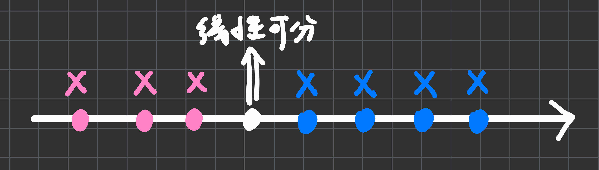

é‡åˆ°è¿™ç§åˆ†ç±»é¡»å˜æ¢åˆ°äºŒç»´ï¼š

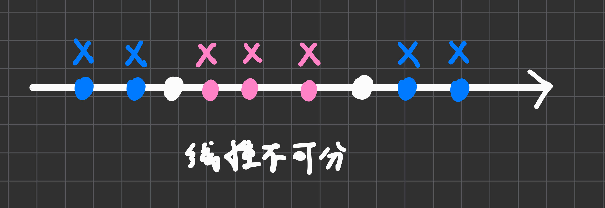

å˜æ¢å：

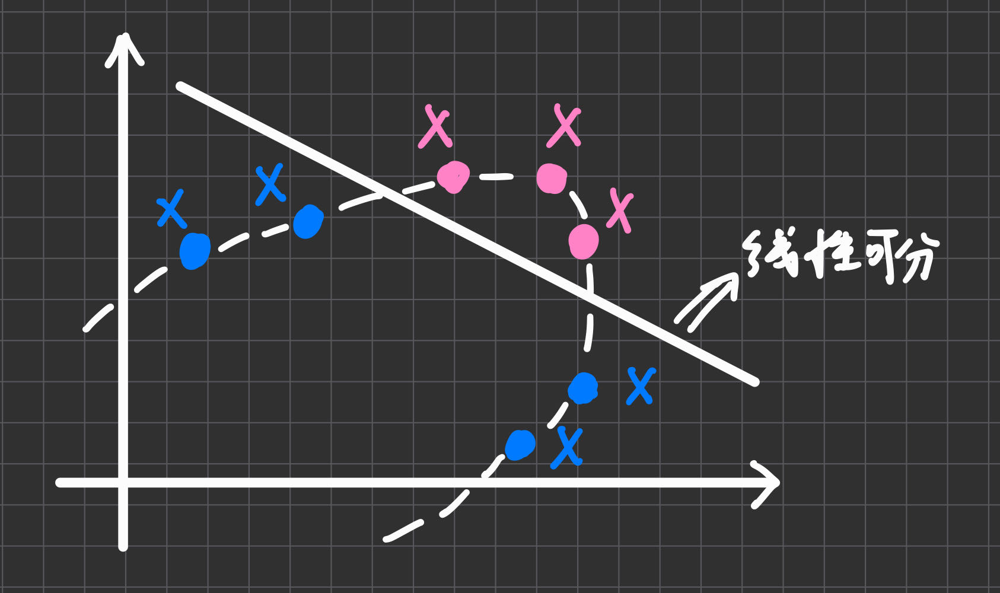

### 2 neurons per layer

åªèƒ½å¤„ç†è¿™ç§åˆ†ç±»ï¼š

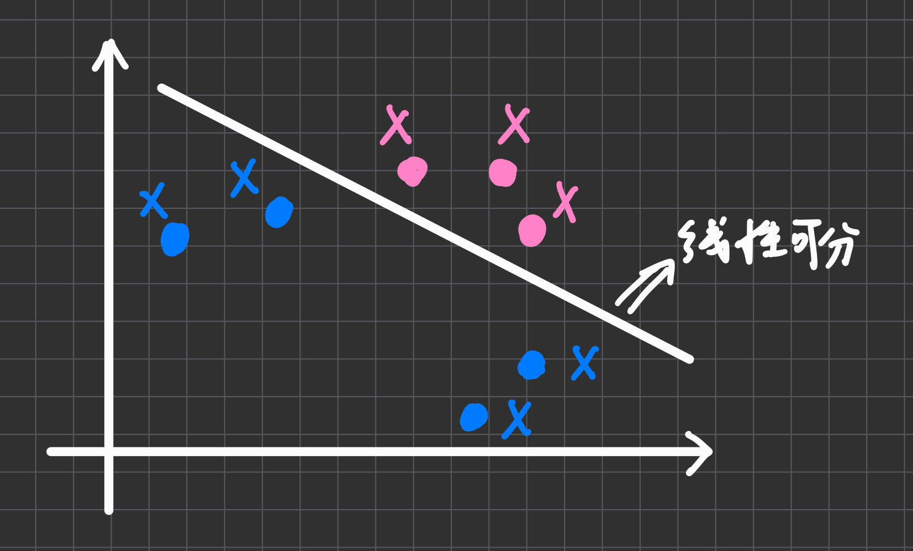

é‡åˆ°è¿™ç§åˆ†ç±»é¡»å˜æ¢åˆ°ä¸‰ç»´ï¼š
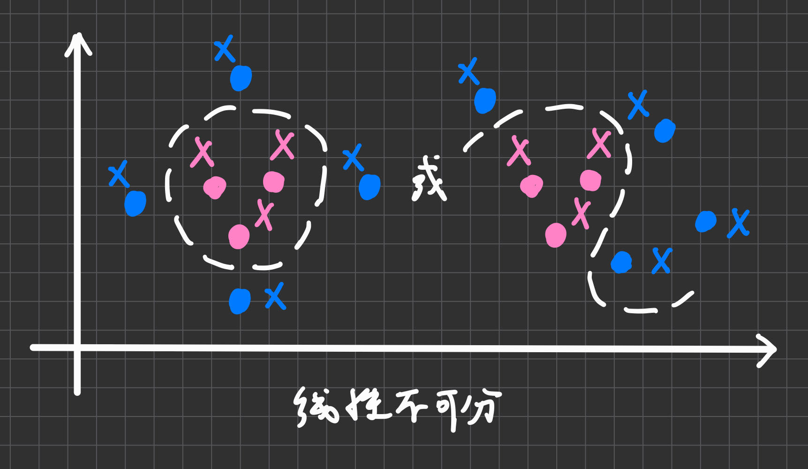

å˜æ¢å：

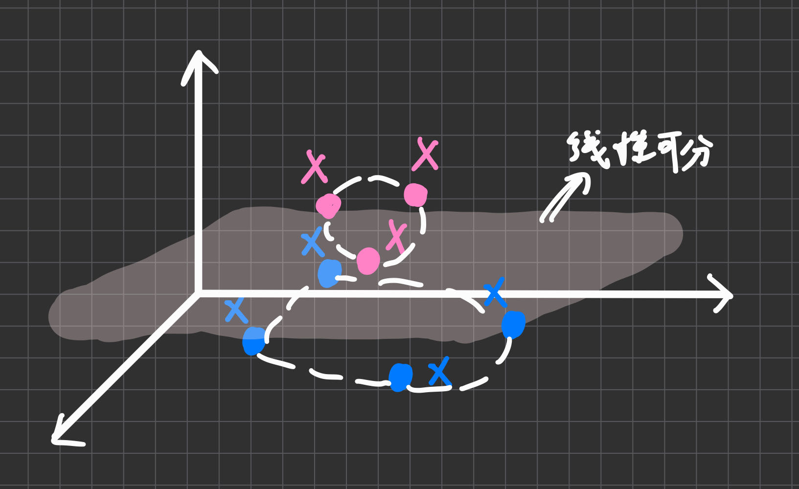

更高维情况åŒç†ã€‚

### More layers

å³ä¾¿æœ‰äº†å˜æ¢åˆ°é«˜ç»´çš„网络层，也ä¸ä¸€å®šèƒ½æˆåŠŸåˆ†ç±»ï¼Œå› ä¸ºæœ‰çš„超平é¢åˆ†ç•Œåœ¨å…¶æ‰€åœ¨é«˜ç»´ç©ºé—´å†…也很难被找到，因此需è¦å¢åŠ ç½‘络层进一步在åŒç»´ç©ºé—´å†…å˜æ¢æˆ–å˜æ¢åˆ°æ›´é«˜ç»´ç©ºé—´ï¼Œä»¥æ­¤æ›´å¥½æ‹‰å¼€è¢«åˆ†ç±»çš„两类数æ®ç‚¹ï¼ˆå‘é‡ï¼‰ä¹‹é—´çš„è·ç¦»ã€‚

此外，分层学习å¯ä»¥ç‹¬ç«‹è®¾è®¡ä¸åŒå±‚çš„ä¸åŒæ¶æ„以学习ä¸åŒç‰¹å¾ï¼ŒåŒæ—¶è¶Šæ·±çš„层å¯ä»¥å­¦ä¹ åˆ°è¶Šéš¾å­¦ä¹ ï¼ˆè¶ŠæŠ½è±¡ï¼‰çš„特å¾ï¼Œä»¥æ高学习能力ä¸è®­ç»ƒæ•ˆç‡ã€‚

ä»åå·®ã€æ–¹å·®è§’度看，就是通过å¢åŠ ç½‘络层拉开数æ®ç‚¹é—´è·ï¼Œæ¥æ‰©å¤§ä¸­é—´å¯å¯»æ‰¾çœŸå®è¶…å¹³é¢åˆ†ç•Œçš„空间，å³æ‰©å¤§å¯¹çœŸå®è¶…å¹³é¢åˆ†ç•Œçš„覆盖，以é™ä½ä¼˜åŒ–结æœä¸çœŸå®è¶…å¹³é¢åˆ†ç•Œé—´çš„方差ã€é™ä½å¯»æ‰¾åˆ°çœŸå®è¶…å¹³é¢çš„难度。

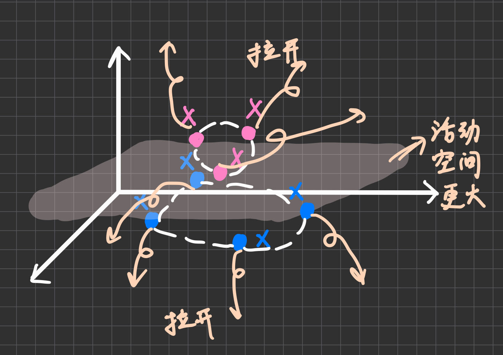

解决深层网络å差的问题（网络退化）åŠæ¢¯åº¦æ¶ˆå¤±é—®é¢˜ä½¿ç”¨ ResNetï¼Œè¯¦è§ **<u>Evaluation (of Generalization --- the closeness to ground-truth) & Solutions</u>**


## Activation Function

1.  **Sigmoid**:

    -   **Function**: 
        $$
        f(x)=\frac{1}{1+e^{-\beta x}}
        $$
        
    -   **Gradient**: 
        $$
        f'(x)=\beta f(x)(1-f(x))
        $$
    
    -   **Problematic Region**: The gradient becomes close to zero for very large negative or positive values of $x$. In these regions, the sigmoid function saturates, meaning that it becomes very flat. This leads to vanishing gradients during backpropagation, which can slow down or halt training.
    
2.  **ReLU (Rectified Linear Unit)**:

    -   **Function**:
        $$
        f(x)=max(0,x)
        $$
        
    -   **Gradient**: 
        $$
        f'(x)=\{^{1\quad if\ x>0}_{0\quad if\ x\le0}
        $$
    
    -   **Problematic Region**: The gradient is exactly zero for negative inputs. This can lead to "dead neurons" where once a neuron gets a negative input, it always outputs zero, and its weights never get updated. This is known as the dying ReLU problem.
    
3.   **[SoftMax](https://blog.csdn.net/bitcarmanlee/article/details/82320853)**

     -   **Function:**
         $$
         f(x_j) = \frac{e^{x_j}}{\sum^{n}_{i=1} e^{x_i}}
         $$

     -   **Gradient: ** $EntropyLoss = -\ln y_j$
         $$
         EntropyLoss'(x) = y_i-1
         $$

4.   **Leaky ReLU**:

     -   **Function**: 
         $$
         f(x)=\{^{x\quad if\ x>0}_{\alpha x\quad if\ x\le0}
         $$
         
     -   **Gradient**: 
         $$
         f'(x)=\{^{1\quad if\ x>0}_{\alpha\quad if\ x\le0}
         $$
         
     -   **Problematic Region**: Leaky ReLU attempts to fix the dying ReLU problem by having a small positive gradient for negative inputs. This means that the gradient is never exactly zero, but if $\alpha$ is very small, the gradient can still be close to zero for negative inputs, potentially slowing down training.


***COMPARISON***:

-   **Sigmoid** has vanishing gradient problems for very large negative or positive inputs.
-   **ReLU** has zero gradient for negative inputs, leading to the dying ReLU problem.
-   **Leaky ReLU** attempts to mitigate the dying ReLU problem but can still have near-zero gradients for negative inputs if $α$ is very small.

5.   **Swish**（ReLU的替代）:

     -   **Function**:
         $$
         Swish(x)=x\cdot Sigmoid(x)
         $$


     -   **éå•è°ƒæ€§**：Swish是一个平滑的ã€éå•è°ƒçš„函数。这ä¸ä¼ ç»Ÿçš„ReLU函数（线性且å•è°ƒï¼‰å½¢æˆå¯¹æ¯”。


     -   **有界的负值**：ä¸ReLUä¸åŒï¼ŒSwish函数在负值时ä¸æ˜¯å®Œå…¨ä¸ºé›¶ï¼Œå®ƒå…许负值通过，这å¯èƒ½æœ‰åŠ©äºä¿æŒç¥ç»ç½‘络中更多的信æ¯æµã€‚


     -   **自适应**：通过引入 $\beta$ å‚数，Swish函数å¯ä»¥åœ¨è®­ç»ƒè¿‡ç¨‹ä¸­è‡ªé€‚应地调整其形状，这在æŸäº›æƒ…况下å¯èƒ½æœ‰åŠ©äºæå‡æ¨¡å‹æ€§èƒ½ã€‚


     -   和ReLU相比的优势：
    
         -   **性能æå‡**：在一系列的基准测试和任务中，Swish函数展示了ä¸ReLU相比在深度网络中的性能æå‡ï¼Œå°¤å…¶æ˜¯åœ¨æ·±åº¦è¾ƒå¤§çš„网络结æ„中。
             -   **平滑梯度**：Swish函数由äºå…¶å¹³æ»‘性质，å¯ä»¥æ供更稳定的梯度æµï¼Œæœ‰åˆ©äºæ·±åº¦å­¦ä¹ æ¨¡å‹çš„训练。
             -   **çµæ´»æ€§**：Swish函数通过å‚æ•° $\beta$ æ供了é¢å¤–çš„çµæ´»æ€§ï¼Œè¿™ä¸€å‚æ•°å¯ä»¥æ ¹æ®ä»»åŠ¡éœ€æ±‚进行调整或通过学习得到。

6.   The **Hyperbolic Tangent (tanh)** is an activation function used in neural networks, including RNNs. It's defined as:

$$
tanh(x) = \frac{e^x-e^{-x}}{e^x+e^{-x}}
$$
-   The function maps any real-valued number to the range −1,1−1,1. Here's what it looks like:

-   Graph of tanh(x)Graph of tanh(x)

-   The tanh function is zero-centered, meaning that negative inputs will be mapped strongly negative and zero inputs will be near zero in the output. This makes it easier for the model to learn from the backpropagated error and can result in faster training.

-   Here are some properties of the tanh activation function:
    1.  **Non-linear**: This allows the model to learn from the error and make adjustments, which is essential for learning complex patterns.
    2.  **Output range**: The output values are bound within the range −1−1 and 11, providing normalized outputs.
    3.  **Zero-centered**: This helps mitigate issues related to the gradients and speeds up the training process.

***COMPARISON:***

### ReLU (Rectified Linear Unit)

1.  **Computational Efficiency**: ReLU is computationally cheaper to calculate than tanh because it doesn't involve any exponential operations. This makes it faster to train large networks.
2.  **Sparsity**: ReLU activation leads to sparsity. When the output is zero, it's essentially ignoring that neuron, leading to a sparse representation. Sparsity is beneficial because it makes the network easier to optimize.
3.  **Non-vanishing Gradients**: ReLU doesn't suffer from the vanishing gradient problem for positive values, which makes it suitable for deep networks.

### tanh (Hyperbolic Tangent)

1.  **Zero-Centered**: Unlike ReLU, tanh is zero-centered, making it easier for the model to learn in some cases.
2.  **Output Range**: The output range of tanh is [−1,1][−1,1], which can be more desirable than [0,âˆ)[0,âˆ) for ReLU in certain applications like RNNs.
3.  **Vanishing Gradients**: tanh can suffer from vanishing gradients for very large or very small input values, which can slow down learning.

### Context-Specific Usage

-   **RNNs**: tanh is often used because the zero-centered nature of the function can be beneficial for maintaining the state over time steps.
-   **CNNs and Fully-Connected Networks**: ReLU is often preferred due to its computational efficiency and because CNNs often deal with larger and deeper architectures where vanishing gradients are less of a concern.


## Embedding Layers

***目的：通过é标签的形å¼è¾“å…¥æ¡ä»¶ï¼›æŠŠä¸åŒæ¡ä»¶çš„å½±å“解耦到输入数æ®çš„ä¸åŒæ–¹é¢ï¼ˆæ¯”ç‡&å差），方便调试模å‹***

**æ–¹å¼ä¸€ï¼š**分别以scalarå’Œbiasçš„å½¢å¼æŠŠä¸¤ä¸ªæ¡ä»¶å¼ é‡åœ¨åŒä¸€å±‚嵌入数æ®ï¼ˆä¸€èˆ¬åœ¨Normalizationå）

>   例：
>   $$
>   AdaGN(h,y)=y_s\cdot GroupNorm(h)+y_b
>   $$
>   $y=[y_s,y_b]$， $y_s$ 是时间步嵌入张é‡ï¼Œ $y_b$ 是类别标签嵌入张é‡ï¼Œ $h$ 是å‰ä¸€å±‚å·ç§¯å±‚的结æœ

**æ–¹å¼äºŒï¼š**在ä¸åŒå±‚以scalar（或bias）的形å¼æŠŠå¤šä¸ªæ¡ä»¶å¼ é‡ï¼ˆä¸¤ä¸ªä»¥ä¸Šï¼‰ä¾æ¬¡åµŒå…¥æ•°æ®ï¼ˆä¸€èˆ¬åœ¨Normalizationå）


## Hyper-Parameters

### Common Ones

-   **Batch Size**

    >   *It is usually based on memory constraints (if any), or set to some value, e.g. 32, 64 or 128. We **use powers of 2 in practice** because many vectorized operation implementations work faster when their inputs are sized in powers of 2.*

-   **(Initial) Learning Rate (set in Optimizer)** 

    >   ***Effect of step size**. Choosing the step size (also called the learning rate) will become one of the most important (and most headache-inducing) hyperparameter settings in training a neural network. In our blindfolded hill-descent analogy, <u>we feel the hill below our feet sloping in some direction, but the step length we should take is uncertain</u>. If we shuffle our feet carefully we can expect to make consistent but very small progress (this corresponds to having a small step size). Conversely, we can choose to make a large, confident step in an attempt to descend faster, but this may not pay off. At some point taking a bigger step gives a higher loss as we “overstepâ€.*

-   **Momentum (set in Optimizer)**

-   **Dropout (set in NN Module)**

-   **Weight-decay (set in Optimizer)**

-   **Leak slope  (set in NN Module)**

### How to Tune

#### General

Initialize a set of HP -> Train on training set with this set of HP -> Get the best learned Params set (the Model) of this set of HP -> Predict with validation set -> Get an Acc -> ... (<u>**CROSS -VALIDATION**</u> LOOP UNTIL THE ACC IS SATISFYING ENOUGH)

#### K-Fold Cross validation（结åˆSGDå¯åœ¨å¤§æ•°æ®é›†ä¸‹ä½¿ç”¨ï¼‰

用äºè°ƒèŠ‚**超å‚æ•°**的验è¯æ–¹æ³•ï¼Œä¸æ˜¯æ­£å¼è®­ç»ƒï¼ˆæ˜¯â€œè€ƒå‰æ¨¡æ‹Ÿè€ƒâ€ï¼‰ï¼š

1.  例如共有N组hp，对应N个想验è¯çš„模å‹

2.  ==对äºæ¯ä¸€ä¸ªæ¨¡å‹ï¼ˆæ¯ä¸€ç»„hp）== 

    1.  shuffle整个训练集

    2.  åˆ’åˆ†æˆ K 等份（最å一份å¯ä¸è¶³ä¸€ç­‰ä»½ï¼‰

    3.  进行 K 场模拟训练，æ¯è½®è®­ç»ƒï¼š

        1.  在 **K-1/K** 的训练集上以 m 个数æ®ç‚¹ä¸ºä¸€ä¸ªbatch训练 n 个epoch
        2.  在剩下 **1/K** 的训练集上验è¯ï¼ˆä¹Ÿåˆ’分等大的batch）

        æ€»å…±ç›¸å½“äº **K\*n 个训练epoch**

    4.  求 K 次**验è¯çš„å¹³å‡æŸå¤±å€¼/ å‡†ç¡®ç‡ $\mu$**

3.  é€‰å– $\mu$ 最å°ï¼ˆæŸå¤±å€¼ï¼‰/ 大（准确ç‡ï¼‰çš„一个模å‹ï¼ˆä¸€ç»„hp）作为正å¼è®­ç»ƒä½¿ç”¨çš„模å‹

4.  **æ­£å¼è®­ç»ƒï¼šä½¿ç”¨å®Œæ•´è®­ç»ƒé›†è®­ç»ƒä¸€ä¸ªepoch得到最终模å‹**（论文中展示的）

#### 自动调å‚技术

https://www.zhihu.com/question/347358336

#### More Tips

>   ### Hyperparameter optimization
>
>   As we’ve seen, training Neural Networks can involve many hyperparameter settings. The most common hyperparameters in context of Neural Networks include:
>
>   -   the initial learning rate
>   -   learning rate decay schedule (such as the decay constant)
>   -   regularization strength (L2 penalty, dropout strength)
>
>   But as we saw, there are many more relatively less sensitive hyperparameters, for example in per-parameter adaptive learning methods, the setting of momentum and its schedule, etc. In this section we describe some additional tips and tricks for performing the hyperparameter search:
>
>   **Implementation**. Larger Neural Networks typically require a long time to train, so performing hyperparameter search can take many days/weeks. It is important to keep this in mind since it influences the design of your code base. One particular design is to have a **worker** that continuously samples random hyperparameters and performs the optimization. During the training, the worker will keep track of the validation performance after every epoch, and writes a model checkpoint (together with miscellaneous training statistics such as the loss over time) to a file, preferably on a shared file system. It is useful to include the validation performance directly in the filename, so that it is simple to inspect and sort the progress. Then there is a second program which we will call a **master**, which launches or kills workers across a computing cluster, and may additionally inspect the checkpoints written by workers and plot their training statistics, etc.
>
>   **Prefer one validation fold to cross-validation**. In most cases a single validation set of respectable size substantially simplifies the code base, without the need for cross-validation with multiple folds. You’ll hear people say they “cross-validated†a parameter, but many times it is assumed that they still only used a single validation set.
>
>   **Hyperparameter ranges**. Search for hyperparameters on log scale. For example, a typical sampling of the learning rate would look as follows: `learning_rate = 10 ** uniform(-6, 1)`. That is, we are generating a random number from a uniform distribution, but then raising it to the power of 10. The same strategy should be used for the regularization strength. Intuitively, this is because learning rate and regularization strength have multiplicative effects on the training dynamics. For example, a fixed change of adding 0.01 to a learning rate has huge effects on the dynamics if the learning rate is 0.001, but nearly no effect if the learning rate when it is 10. This is because the learning rate multiplies the computed gradient in the update. Therefore, it is much more natural to consider a range of learning rate multiplied or divided by some value, than a range of learning rate added or subtracted to by some value. Some parameters (e.g. dropout) are instead usually searched in the original scale (e.g. `dropout = uniform(0,1)`).
>
>   **Prefer random search to grid search**. As argued by Bergstra and Bengio in [Random Search for Hyper-Parameter Optimization](http://www.jmlr.org/papers/volume13/bergstra12a/bergstra12a.pdf), “randomly chosen trials are more efficient for hyper-parameter optimization than trials on a gridâ€. As it turns out, this is also usually easier to implement.
>
>   
>
>   Core illustration from [Random Search for Hyper-Parameter Optimization](http://www.jmlr.org/papers/volume13/bergstra12a/bergstra12a.pdf) by Bergstra and Bengio. It is very often the case that some of the hyperparameters matter much more than others (e.g. top hyperparam vs. left one in this figure). Performing random search rather than grid search allows you to much more precisely discover good values for the important ones.
>
>   **Careful with best values on border**. Sometimes it can happen that you’re searching for a hyperparameter (e.g. learning rate) in a bad range. For example, suppose we use `learning_rate = 10 ** uniform(-6, 1)`. Once we receive the results, it is important to double check that the final learning rate is not at the edge of this interval, or otherwise you may be missing more optimal hyperparameter setting beyond the interval.
>
>   **Stage your search from coarse to fine**. In practice, it can be helpful to first search in coarse ranges (e.g. 10 ** [-6, 1]), and then depending on where the best results are turning up, narrow the range. Also, it can be helpful to perform the initial coarse search while only training for 1 epoch or even less, because many hyperparameter settings can lead the model to not learn at all, or immediately explode with infinite cost. The second stage could then perform a narrower search with 5 epochs, and the last stage could perform a detailed search in the final range for many more epochs (for example).
>
>   **Bayesian Hyperparameter Optimization** is a whole area of research devoted to coming up with algorithms that try to more efficiently navigate the space of hyperparameters. The core idea is to appropriately balance the exploration - exploitation trade-off when querying the performance at different hyperparameters. Multiple libraries have been developed based on these models as well, among some of the better known ones are [Spearmint](https://github.com/JasperSnoek/spearmint), [SMAC](http://www.cs.ubc.ca/labs/beta/Projects/SMAC/), and [Hyperopt](http://jaberg.github.io/hyperopt/). However, in practical settings with ConvNets it is still relatively difficult to beat random search in a carefully-chosen intervals. See some additional from-the-trenches discussion [here](http://nlpers.blogspot.com/2014/10/hyperparameter-search-bayesian.html).
>
>   --- cs231n


## Evaluation (of Generalization --- the closeness to ground-truth) & Solutions

### 概念

在统计学和机器学习中，**bias（å差）**å’Œ**variance（方差）**是两个é‡è¦çš„概念，它们是用æ¥<u>è¡¡é‡æ¨¡å‹é¢„测**误差的主è¦æ¥æº**</u>。在设计和训练机器学习模å‹æ—¶ï¼Œå­˜åœ¨ä¸€ä¸ªbias-varianceæƒè¡¡çš„问题。如æœ**模å‹è¿‡äºç®€å•å¹¶ä¸”具有有é™çš„å‚数（模å‹çš„特å¾å¤ªå¼±ï¼Œä¸è¶³ä»¥åŒºåˆ†ä¸åŒæ ·æœ¬ï¼Œå¯¹æ ·æœ¬å˜åŒ–ä¸æ•æ„Ÿï¼‰ï¼Œåˆ™å¯èƒ½ä¼šæœ‰é«˜å差和ä½æ–¹å·®ã€‚在å¦ä¸€æ–¹é¢ï¼Œå¦‚æœæ¨¡å‹è¿‡äºå¤æ‚并且具有大é‡çš„å‚数（模å‹çš„特å¾å¤ªå¼ºï¼Œè¿‡äºåŒºåˆ†ä¸åŒæ ·æœ¬ï¼Œå¯¹æ ·æœ¬å˜åŒ–太æ•æ„Ÿï¼‰ï¼Œåˆ™å¯èƒ½ä¼šæœ‰ä½å差和高方差。**在这两ç§æƒ…况下，模å‹åœ¨æµ‹è¯•é›†ä¸Šçš„表ç°éƒ½å¯èƒ½ä¸ä½³ã€‚因此，我们的目标是**找到å差和方差之间的最佳平衡点，以å®ç°æœ€ä½³çš„泛化能力**。

1.  **Bias（å差）**：å差是指模å‹çš„预测值ä¸å®é™…值的平å‡å·®å¼‚，或者说是模å‹çš„预期预测ä¸çœŸå®é¢„测之间的差è·ã€‚简å•æ¥è¯´ï¼Œé«˜å差模å‹ä¼šå¿½è§†æ•°æ®ä¸­çš„细节，这通常会导致欠拟åˆï¼ˆunderfitting），å³æ¨¡å‹åœ¨è®­ç»ƒé›†å’Œæµ‹è¯•é›†ä¸Šçš„表ç°éƒ½ä¸å¥½ã€‚

    

    *($\mu$的一阶矩是无å估计)*  

2.  **Variance（方差）/ Deviation（标准差）**：方差是指模å‹é¢„测的å˜åŒ–性或离散程度，å³åŒæ ·å¤§å°çš„ä¸åŒè®­ç»ƒé›†è®­ç»ƒå‡ºçš„模å‹çš„预测结æœçš„å˜åŒ–。如æœæ¨¡å‹å¯¹è®­ç»ƒæ•°æ®çš„å°å˜åŠ¨é常æ•æ„Ÿï¼Œé‚£ä¹ˆæ¨¡å‹å°±æœ‰é«˜æ–¹å·®ï¼Œè¿™é€šå¸¸ä¼šå¯¼è‡´è¿‡æ‹Ÿåˆï¼ˆoverfitting），å³æ¨¡å‹åœ¨è®­ç»ƒé›†ä¸Šè¡¨ç°å¾ˆå¥½ï¼Œä½†åœ¨æµ‹è¯•é›†ï¼ˆå³æœªè§è¿‡çš„æ•°æ®ï¼‰ä¸Šè¡¨ç°å·®ã€‚

    

    *（$\sigma$的一阶矩是有å估计）*

    找åŒä¸€å‡½æ•°çš„最佳å‚数相当äºå¯¹ç€é¶å­å¼€ä¸€æªï¼Œ**åå·®**相当äºç„准点å离了å®é™…é¶å¿ƒï¼Œ**方差**相当äºå°„击点å离了ç„准点：

    

    

    （ä¸åŒçš„ $f$ 对应用ä¸åŒæ•°æ®ç‚¹è®­ç»ƒå‡ºçš„åŒä¸€å‡½æ•°çš„ä¸åŒå‚数）

    ä¸åŒå…¬å¼çš„函数的训练结æœåˆ†å¸ƒå›¾ï¼š

    

    越å¤æ‚的函数å—æ•°æ®é›†å˜åŒ–çš„å½±å“越大，å˜åŠ¨å¹…度越大，ä¸åŒ “universe†的训练结æœé—´å·®è·æ›´å¤§ï¼Œå³æ–¹å·®æ›´å¤§ï¼š

    

    但方差大时覆盖的范围也越大，å–å‡å€¼ï¼ˆä¸€é˜¶çŸ©ï¼‰æ—¶æ›´å®¹æ˜“覆盖“é¶å¿ƒâ€ï¼Œå› æ­¤è¶Šå¤æ‚的模å‹å差越å°ï¼š

    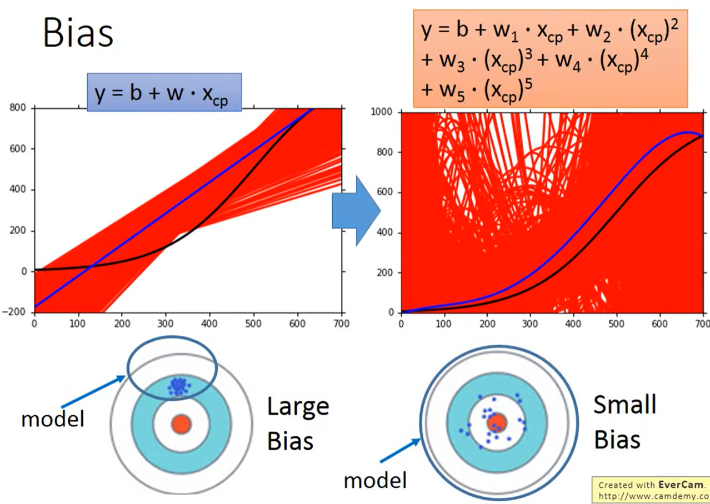

    **结论：å•å±‚å‚数多ã€é线性的模å‹ï¼ˆå•ä¸ªå¤æ‚函数），最ç†æƒ³ä¼˜åŒ–结æœå’ŒçœŸå®æƒ…况间 Loss （å³Bias）更å°ï¼Œä½†å®é™…çš„ training 很难找到好的结æœï¼Œå› ä¸ºå‚数多æ„味ç€å‡½æ•°ç©ºé—´æ›´å¤§æ›´éš¾ä¼˜åŒ–，且é线性函数比线性函数难优化 。**

### 解决

**虽然直æ¥ä¼˜åŒ–目标是Losså°ï¼Œè€Œéåå·®ã€æ–¹å·®æ˜¯å¦æœ€ä½³å¹³è¡¡ï¼ˆè¿™ä¹Ÿå¾ˆéš¾ä½œä¸ºä¼˜åŒ–目标），**<u>但一般训练集Loss足够å°ä¸”测试集Lossä¸ä¸¥é‡é«˜äºè®­ç»ƒé›†ï¼Œå°±æ˜¯æ¯”较平衡的结æœ</u>。

一般是针对大方差åšæ”¹è¿›ï¼š

-   更多训练数æ®ï¼Œä»¥è®©æ¨¡å‹å­¦ä¹ æ›´ä¸°å¯Œçš„特å¾ï¼Œå…‹æœå¤§æ–¹å·®
-   å„ç§æ­£åˆ™åŒ–，æå‰æƒ©ç½šæ¨¡å‹ä»¥é˜²æ­¢ overfit（è§ä¸‹ä¸€èŠ‚）
-   **改进模å‹ï¼šä½¿ç”¨å¤šå±‚线性函数（深度ç¥ç»ç½‘络），而éå•å±‚é线性函数**，这样使用åå‘传播分别更新å„层（å„维度）的å‚数，就比å•å±‚的很多å‚数都在åŒä¸€ç»´åº¦æ›´å®¹æ˜“训练

### 深度ç¥ç»ç½‘络的问题

-   还是é—留了线性函数å差大的问题（**ç¥ç»ç½‘络退化**）

    ç†æƒ³ï¼šï¼ˆä½†å®é™…ä¸å¯èƒ½é—­åˆåµŒå¥—，因为都是线性函数）
    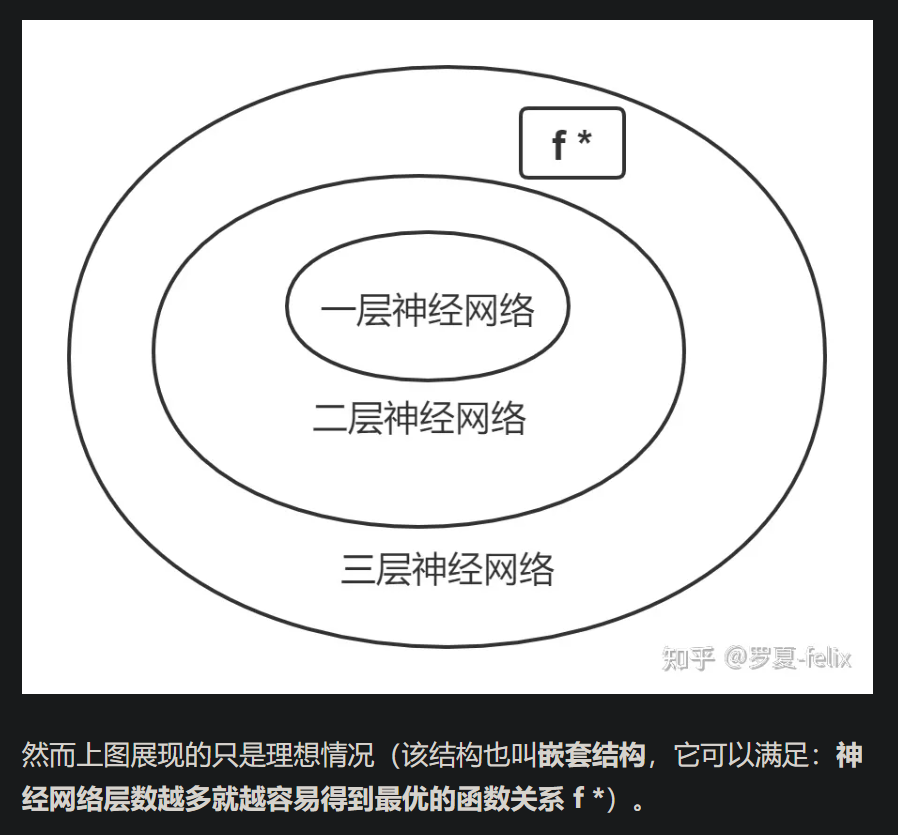å®é™…：

    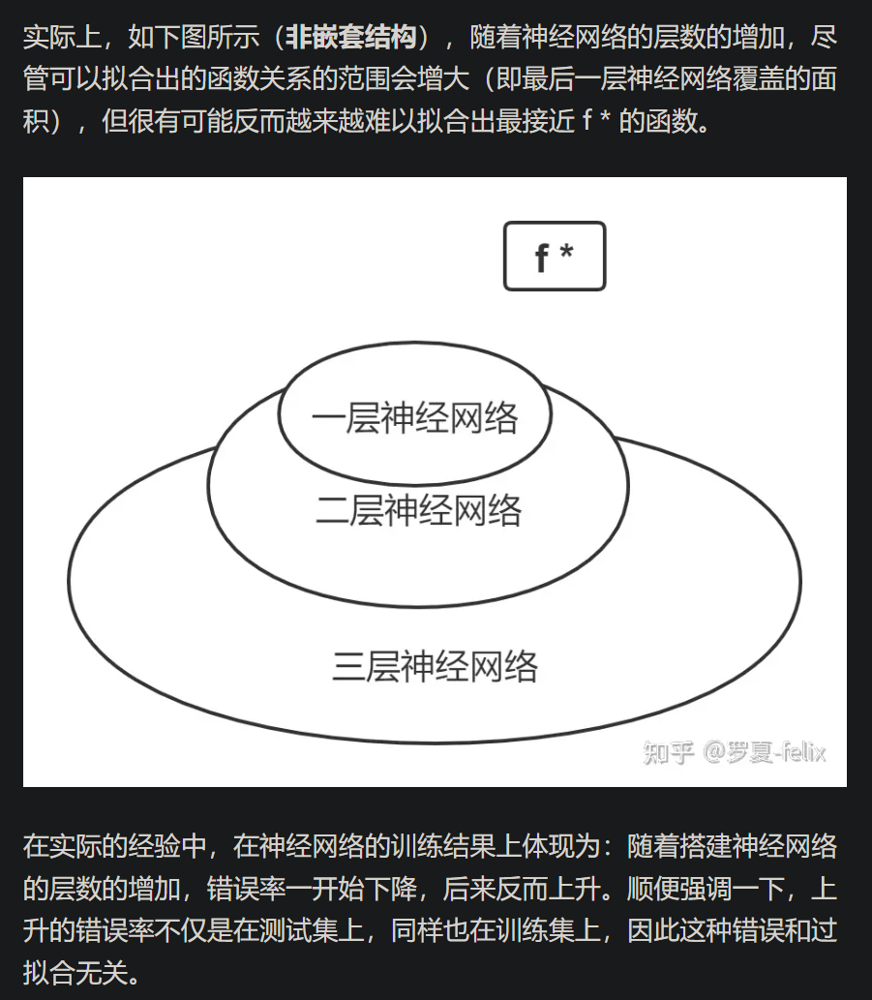 

-   此外还有网络太深梯度é™åˆ°0的问题（**梯度消失**）

### å†æ¬¡è§£å†³

***å¯åœ¨æ¨¡å‹æ¶æ„中添加 ResBlock ï¼ˆè§ [Modules](.\Modules.md)）解决 =》强制è¦æ±‚下层网络嵌套（完全覆盖）上层***（ä¾ç„¶ä¸æ˜¯é—­åˆåµŒå¥—，åªæ˜¯å¼ºè¡ŒåŠ ä¸Šè¾“入的空间作为自己的拖带空间） ，åŒæ—¶ä¹ŸæŠµå¾¡äº†æ¢¯åº¦æ¶ˆå¤±é—®é¢˜

### 总结


## Deal With Over-fitting

***预测结æœä¸å¥½ï¼ˆå‡†ç¡®åº¦/ æŸå¤±å€¼ï¼‰ä½†è®­ç»ƒç»“æœæ›´å¥½ —— 过拟åˆ***


### Early Stopping

准备验è¯é›†ï¼ˆä¸€èˆ¬æ˜¯æ‰€æœ‰å·²çŸ¥æ•°æ®**训练:验è¯=8:2**），一边训练以更新å‚数一边在æ¯ä¸ªepoch结æŸç”¨éªŒè¯é›†æ±‚误差（训练误差也求出æ¥ï¼Œç”¨äºæ¯”较观察是å¦è¿‡æ‹Ÿåˆï¼‰ï¼š

-   以验è¯é›†è¯¯å·®å°äºæŸé˜ˆå€¼æˆ–更新多少次åä¸å†å‡ºç°æ›´å°å€¼ä¸º early stopping 标志；
-   以验è¯é›†è¯¯å·®åœ¨å¤šå°‘次åä¸å†å°äºç­‰äºè®­ç»ƒé›†è¯¯å·®ä¸ºæ ‡å¿—。

期间ä¿ç•™<u>使验è¯é›†è¯¯å·®æœ€å°</u>çš„å‚数直到最å。

### Dropout

***detail see https://cs231n.github.io/neural-networks-2/#reg***

类似决策树的剪æ，但 Dropout 一般是按比例éšæœºå…³é—­ç¥ç»å…ƒï¼ˆæ¯ä¸ª$W$中的æŸäº›`input_dim`çš„å‘é‡\<一整列设为0>），剪æ是ç»æ³›åŒ–性能的比较åå‡å»å†³ç­–分支

>   **Dropout** is an extremely effective, simple and recently introduced regularization technique by Srivastava et al. in [Dropout: A Simple Way to Prevent Neural Networks from Overfitting](http://www.cs.toronto.edu/~rsalakhu/papers/srivastava14a.pdf) (pdf) that complements the other methods (L1, L2, maxnorm). While training, dropout is implemented by only keeping a neuron active with some probability $p$ (a hyperparameter), or setting it to zero otherwise.
>
>   --- *cs231n*


简å•åšæ³•ï¼šå•çº¯åœ¨è®­ç»ƒæ—¶ä»¥ $p$ 的概ç‡å…³é—­ç¥ç»å…ƒè®­ç»ƒï¼Œä½†ç”±äºè¿™æ ·è®­ç»ƒåæ¯ä¸ªç¥ç»å…ƒçš„输出为 
$$
out'=p\cdot out+(1-p)\cdot0
$$
所以用完整网络验è¯/测试时，为了å‘挥出用 $Dropout$ 训练的模å‹çš„性能（达到输出为 $p\cdot out+(1-p)\cdot0$ 的效æœï¼‰ï¼Œ**需è¦æŠŠåŸå§‹è¾“出层全部缩å°åˆ° $p$ å€ï¼š**

```python
""" Vanilla Dropout: Not recommended implementation """

p = 0.5 # probability of keeping a unit active. higher = less dropout

def train_step(X):
  """ X contains the data """
  
  # forward pass for example 3-layer neural network
  H1 = np.maximum(0, np.dot(W1, X) + b1)
  U1 = np.random.rand(*H1.shape) < p # first dropout mask
  H1 *= U1 # drop!
  H2 = np.maximum(0, np.dot(W2, H1) + b2)
  U2 = np.random.rand(*H2.shape) < p # second dropout mask
  H2 *= U2 # drop!
  out = np.dot(W3, H2) + b3
  
  # backward pass: compute gradients... (not shown)
  # perform parameter update... (not shown)
  
def predict(X):
  # ensembled forward pass
  H1 = np.maximum(0, np.dot(W1, X) + b1) * p # NOTE: scale the activations
  H2 = np.maximum(0, np.dot(W2, H1) + b2) * p # NOTE: scale the activations
  out = np.dot(W3, H2) + b3
```

✨ 优解：直æ¥åœ¨è®­ç»ƒä½¿ç”¨ $Dropout$ çš„åŒæ—¶**将输出层扩大到 $1/p$ å€**，验è¯/测试时无需任何改动，更方便：

```python
""" 
Inverted Dropout: Recommended implementation example.
We drop and scale at train time and don't do anything at test time.
"""

p = 0.5 # probability of keeping a unit active. higher = less dropout

def train_step(X):
  # forward pass for example 3-layer neural network
  H1 = np.maximum(0, np.dot(W1, X) + b1)
  U1 = (np.random.rand(*H1.shape) < p) / p # first dropout mask. Notice /p!
  H1 *= U1 # drop!
  H2 = np.maximum(0, np.dot(W2, H1) + b2)
  U2 = (np.random.rand(*H2.shape) < p) / p # second dropout mask. Notice /p!
  H2 *= U2 # drop!
  out = np.dot(W3, H2) + b3
  
  # backward pass: compute gradients... (not shown)
  # perform parameter update... (not shown)
  
def predict(X):
  # ensembled forward pass
  H1 = np.maximum(0, np.dot(W1, X) + b1) # no scaling necessary
  H2 = np.maximum(0, np.dot(W2, H1) + b2)
  out = np.dot(W3, H2) + b3
```

### Shuffle

æ¯ä¸ªepoch开始å‰å¯¹batches洗牌（在 `DataLoader` 处设置，训练集开å¯ï¼ŒéªŒè¯é›†å’Œæµ‹è¯•é›†å…³é—­ï¼‰

### Maximize the Margin + Soft Margin

在分类问题中，最大化有训练集学得的划分超平é¢ä¸¤ä¾§çš„间隔（å‚考《机器学习》支æŒå‘é‡æœºï¼‰ï¼Œå¹¶ä¸”å…许部分训练数æ®å‡ºé”™ï¼Œå³è½å…¥é—´éš”内而ä¸åœ¨ç¡¬é—´éš”外部的严格分类区域（软化间隔）。

### Max norm constraints 

>   Another form of regularization is to enforce an absolute upper bound on the magnitude of the weight vector for every neuron and use projected gradient descent to enforce the constraint. In practice, this corresponds to performing the parameter update as normal, and then **enforcing the constraint by clamping the weight vector $\vec W$ of every neuron to satisfy $||\vec W||_2<c$. Typical values of $c$ are on orders of 3 or 4.** Some people report improvements when using this form of regularization. One of its appealing properties is that **network cannot “explode†even when the learning rates are set too high because the updates are always bounded.**
>
>   --- *cs231n*

### Support Vector Regression (SVR)

在å›å½’问题中，容å¿è½åœ¨é—´éš”带内的出错数æ®ï¼Œä¸è®¡ç®—其误差到 Loss ，å³ç»™ Loss Function 添加一个ä¸æ•æ„ŸæŸå¤±å‡½æ•°é¡¹ï¼Œç±»ä¼¼æ­£åˆ™åŒ–（å‚考《机器学习》支æŒå‘é‡æœºï¼‰ã€‚

### L2 Regularization (Weight-decay)

See [Loss Function](D:\CAMPUS\AI\MachineLearning\LossFunction.md)

***正则项本质上是支æŒå‘é‡æœºçš„最大化间隔法产生的，其表示的其å®æ˜¯åˆ’分超平é¢ä¸¤ä¾§å®‰å…¨é—´éš”的总大å°ï¼ˆå¾…最大化），å‚考《机器学习》p122（侧æ ç¬”记有æ¨å¯¼ï¼‰,123,133*** 

### L1 Regularization

比 $L2$ 更鼓励 $W$ 为稀ç–矩阵，正则项为 $W$ çš„ $L1$ è·ç¦»

图åƒç”Ÿæˆç”¨L2会æ•æ‰åˆ°æ›´å¤šè¿‡æ‹Ÿåˆï¼ˆé泛化）的细节（如由åŸå›¾ç”ŸæˆåŸå›¾ä¸å­˜åœ¨çš„æ¥è‡ªå…¶ä»–åŸå›¾çš„事物ã€ç”Ÿæˆæ— æ„义肌ç†ç­‰ï¼‰ï¼Œå之L1åªä¼šæ•æ‰æ›´æ³›åŒ–的特å¾ä½†å›¾åƒè½®å»“会较模糊

### (In Classification) Weaken Features of a Each Class

估计å„类别的分布时（建模时），**使它们拥有相åŒçš„æŸå‚æ•°**，该å‚æ•°<u>ç”±å„类别分别用对应训练集估计出的å‚æ•°å†å¯¹æ ·æœ¬æ•°**加æƒå¹³å‡**得到</u>

### Simplify Network Structure to Cut Down Sensitivity of  Features' Alternation

See **<u>CNN</u>**

### Batch Normalization

See  [DataProcessing](D:\CAMPUS\AI\MachineLearning\ML_MDnotes\DataProcessing.md)---**<u>Batch Normalization</u>*

### KL Regularization, VQ Regularization

See [VAE & VQVAE](https://zhouyifan.net/2024/01/23/20230707-SD1/)


## Stable Training

```python
# Clip the gradient norms for stable training.
        grad_norm = nn.utils.clip_grad_norm_(model.parameters(), max_norm=10)
```

`nn.utils.clip_grad_norm_(model.parameters(), max_norm=10)`这一行代ç ç”¨äºæ¢¯åº¦è£å‰ªï¼Œå…¶ç›®çš„是为了防止在ç¥ç»ç½‘络训练过程中出ç°"梯度爆炸"的问题。

梯度爆炸是指在训练过程中，模å‹çš„å‚数的梯度å˜å¾—é常大，以至äºæ›´æ–°æ­¥é•¿è¿‡å¤§ï¼Œå¯¼è‡´æ¨¡å‹æ— æ³•æ”¶æ•›ï¼Œç”šè‡³ç»“æœæº¢å‡ºã€‚当计算出的梯度大äºæŸä¸ªè®¾å®šçš„最大值（在这里是10）时，这个函数将会按比例缩å°æ¢¯åº¦ï¼Œä½¿å¾—å…¶ä¸è¶…过这个最大值，ä»è€Œé¿å…梯度爆炸。

`grad_norm = nn.utils.clip_grad_norm_(model.parameters(), max_norm=10)`这行代ç ä¼šè¿”å›æ‰€æœ‰æ¨¡å‹å‚数梯度的L2范数。

梯度è£å‰ªæ˜¯å¾ˆå¸¸è§çš„在训练深度学习模å‹ï¼Œç‰¹åˆ«æ˜¯åœ¨è®­ç»ƒæ·±åº¦ç¥ç»ç½‘络和循ç¯ç¥ç»ç½‘络（RNN）时，用äºä¿æŒæ¨¡å‹çš„稳定性。


## Ensemble

***（详è§ã€Šæœºå™¨å­¦ä¹ ã€‹ç¬¬8章）***

**"Ensemble"（集æˆï¼‰**是一ç§æœºå™¨å­¦ä¹ ç­–略，它结åˆäº†å¤šä¸ªæ¨¡å‹çš„预测，以产生一个最终的预测结æœã€‚è¿™ç§æ–¹æ³•çš„主è¦ç›®æ ‡æ˜¯é€šè¿‡ç»„åˆå¤šä¸ªæ¨¡å‹æ¥å‡å°å•ä¸€æ¨¡å‹çš„预测误差。

主è¦çš„集æˆæ–¹æ³•æœ‰ï¼š

1.  Bagging（Bootstrap Aggregating）：通过ä»è®­ç»ƒæ•°æ®ä¸­<u>**有放å›åœ°éšæœºæŠ½æ ·ï¼ˆè‡ªåŠ©é‡‡æ ·æ³•ï¼‰**æ¥ç”Ÿæˆä¸åŒçš„训练集，然å在æ¯ä¸ªè®­ç»ƒé›†ä¸Šè®­ç»ƒä¸€ä¸ªæ¨¡å‹</u>。最å，所有模å‹çš„预测结æœ**通过投票**（多数胜出；分类问题）或**å¹³å‡**（å›å½’问题）æ¥äº§ç”Ÿæœ€ç»ˆé¢„测。**éšæœºæ£®æ—（Random Forest）**就是一个典å‹çš„Bagging的例å­ã€‚

2.  **Boosting**：一ç§è¿­ä»£çš„策略，其中新模å‹çš„训练ä¾èµ–äºä¹‹å‰æ¨¡å‹çš„性能。æ¯ä¸ªæ–°æ¨¡å‹éƒ½è¯•å›¾ä¿®æ­£ä¹‹å‰æ¨¡å‹çš„错误。最著åçš„Boosting算法有AdaBoost和梯度æå‡ã€‚

    >   *å…ˆä»åˆå§‹è®­ç»ƒé›†è®­ç»ƒå‡ºä¸€ä¸ªåŸºå­¦ä¹ å™¨ï¼Œå†æ ¹æ®åŸºå­¦ä¹ å™¨çš„表ç°å¯¹è®­ç»ƒæ ·æœ¬åˆ†å¸ƒè¿›è¡Œè°ƒæ•´ï¼Œä½¿å¾—å…ˆå‰åŸºå­¦ä¹ å™¨åšé”™çš„训练样本在åç»­å—到更多关注，然å基äºè°ƒæ•´å的样本分布æ¥è®­ç»ƒä¸‹ä¸€ä¸ªåŸºå­¦ä¹ å™¨ï¼›å¦‚æ­¤é‡å¤è¿›è¡Œï¼Œç›´è‡³åŸºå­¦ä¹ å™¨æ•°ç›®è¾¾åˆ°äº‹å…ˆæŒ‡å®šçš„值 $T$，最终将这 $T$ 个基学习器进行加æƒç»“åˆã€‚*
    >
    >   *—— 《机器学习》P173*
    >
    >   ***调整样本分布包括<u>é‡èµ‹æƒæ³•ï¼ˆé€‚用äºæ ·æœ¬å¯å¸¦æƒå­¦ä¹ ç®—法ã€å­¦ä¹ è¿‡ç¨‹æœªå› é‡åˆ°ä¸æ»¡è¶³åŸºæœ¬æ¡ä»¶çš„基学习器而æå‰åœæ­¢çš„情况）</u>å’Œ<u>é‡é‡‡æ ·æ³•ï¼ˆé€‚用äºä¸å¯å¸¦æƒå­¦ä¹ ç®—法ã€å­¦ä¹ è¿‡ç¨‹å› é‡åˆ°ä¸æ»¡è¶³åŸºæœ¬æ¡ä»¶çš„基学习器而æå‰åœæ­¢çš„情况）</u>***

3.  Stacking：使用多个模å‹æ¥è®­ç»ƒæ•°æ®ï¼Œç„¶åå†ç”¨ä¸€ä¸ªæ–°çš„模å‹ï¼ˆå«åšå…ƒæ¨¡å‹æˆ–者二级模å‹ï¼‰æ¥é¢„测这些模å‹çš„预测结æœã€‚

在许多机器学习ç«èµ›ä¸­ï¼Œé›†æˆå­¦ä¹ è¢«è¯æ˜æ˜¯ä¸€ç§é常有效的方法，因为它å¯ä»¥**å‡å°‘过拟åˆï¼Œå¢åŠ æ¨¡å‹çš„泛化能力，ä»è€Œæ高预测性能**。

>   In practice, one reliable approach to improving the performance of Neural Networks by a few percent is to train multiple independent models, and at test time average their predictions. As the number of models in the ensemble increases, the performance typically monotonically improves (though with diminishing returns). Moreover, the improvements are more dramatic with higher model variety in the ensemble. There are a few approaches to forming an ensemble:
>
>   -   **Same model, different initializations**. Use cross-validation to determine the best hyperparameters, then train multiple models with the best set of hyperparameters but with different random initialization. The danger with this approach is that the variety is only due to initialization.
>   -   **Top models discovered during cross-validation**. Use cross-validation to determine the best hyperparameters, then pick the top few (e.g. 10) models to form the ensemble. This improves the variety of the ensemble but has the danger of including suboptimal models. In practice, this can be easier to perform since it doesn’t require additional retraining of models after cross-validation
>   -   **Different checkpoints of a single model**. If training is very expensive, some people have had limited success in taking different checkpoints of a single network over time (for example after every epoch) and using those to form an ensemble. Clearly, this suffers from some lack of variety, but can still work reasonably well in practice. The advantage of this approach is that is very cheap.
>   -   **Running average of parameters during training**. Related to the last point, a cheap way of almost always getting an extra percent or two of performance is to maintain a second copy of the network’s weights in memory that maintains an exponentially decaying sum of previous weights during training. This way you’re averaging the state of the network over last several iterations. You will find that this “smoothed†version of the weights over last few steps almost always achieves better validation error. The rough intuition to have in mind is that the objective is bowl-shaped and your network is jumping around the mode, so the average has a higher chance of being somewhere nearer the mode.
>
>   One disadvantage of model ensembles is that they take longer to evaluate on test example. An interested reader may find the recent work from Geoff Hinton on [“Dark Knowledgeâ€](https://www.youtube.com/watch?v=EK61htlw8hY) inspiring, where the idea is to “distill†a good ensemble back to a single model by incorporating the ensemble log likelihoods into a modified objective.
>
>   --- *cs231n*


## Why Deep?????????

-   在比浅层模å‹çš„å„层å‚数个数少的情况下，通过å¢åŠ æ·±åº¦æ¥å¢åŠ æ¨¡å‹å¤æ‚度以å‡å°å差，且最终整体å‚数个数也少äºæµ…层但å„层å‚数更多的模å‹ã€å¤æ‚化过程对å‚数的利用ç‡æ›´é«˜ã€‘，这样训练需è¦çš„æ•°æ®ä¹Ÿæ›´å°‘（在真å®æƒ…况å¤æ‚åˆæœ‰æ½œåœ¨è§„律\<比如语音ã€å›¾åƒçš„模å‹>时效æœæ›´çªå‡ºï¼ï¼ï¼ï¼‰
-   利用多层激活函数é€å±‚引入é线性逼近å¤æ‚的函数

## Basic Classifiers

### Linear Classifier （å³æŠŠ Linear Regression 的模å‹ç”¨æ¥åˆ†ç±»ï¼ŒæŠŠåˆ†ç±»å½“线性å›å½’åšï¼‰

$$
\vec S_i = W\cdot \vec x_i\ +\ \vec b
$$

$\vec S_i$ 是第 i 个样本在å„个类别中è·å¾—的分数组æˆçš„å‘é‡**（Unnormalized probabilities of Classes）**，$W$ 待学习的矩阵，$\vec b$ 是待学习的åå·®å‘é‡ï¼Œä¸å…·ä½“训练集中ä¸åŒç±»åˆ«çš„样本的数é‡å·®å¼‚有关（学习时将平衡这样的差异）。

优化目标：使得真å®label对应的类别è·å¾—的分数最高

<u>**SVM** 使用的模å‹å°±æ˜¯çº¿æ€§æ¨¡å‹ï¼ˆå¯»æ‰¾åˆ’分超平é¢ï¼‰</u>

****

### Logistic Regression (Discriminative Model; Softmax Classifier)

***（ä¸éœ€è¦è‡ªå·±å‡è®¾åˆ†å¸ƒï¼ï¼ï¼ï¼‰***


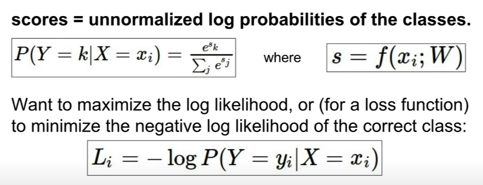

å’Œ Linear Regression 的区别仅在<u>**最终**输出时**多加一层 Softmax**</u>（这是 Softmax 作为生æˆæ¦‚ç‡åˆ†å¸ƒçš„用途时的用法，<u>若是别的用途则在éšè—层也会加</u>ï¼ï¼ï¼ï¼sigmoid是特殊的Softmax，二分类时直æ¥ç”¨sigmoidï¼›**Logit \<对数几ç‡ï¼Œlog odds>** 狭义å³æŒ‡ sigmoid çš„å函数，广义指<u>æœªç» Softmax 的输出</u>），用 Linear Classification è¾“å‡ºçš„åˆ†æ•°ç”Ÿæˆ **Normalized probabilities of Classes**（å±äº (0, 1)，å–ä¸åˆ°è¾¹ç•Œï¼‰

添加 Softmax å因为有了 (0, 1) 的上下界，高分数（å‘1挤å‹ï¼‰ä¼šç›¸è¾ƒä½åˆ†æ•°ï¼ˆå‘0挤å‹ï¼‰å˜å¾—更高

优化目标：使得真å®label对应的类别è·å¾—的分数最高 => **å³æ¥è¿‘一（因为已ç»è½¬åŒ–为概ç‡åˆ†å¸ƒäº†ï¼‰**

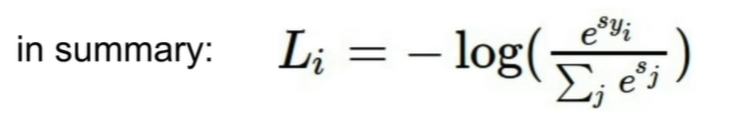

其中“1â€å¯¹åº”交å‰ç†µæŸå¤±ä¸­çš„å®é™…分布中概ç‡ï¼Œâ€œlog(...)â€å¯¹åº”交å‰ç†µæŸå¤±ä¸­çš„估计分布中概ç‡

```python
class My_Model(nn.Module):
    def __init__(self, input_dim, output_dim):
        super().__init__()
        self.layers = nn.Linear(input_dim, output_dim)

    def forward(self, x):
        out = torch.sigmoid(self.linear(x))
        return out
```

**è‹¥åé¢ Loss 用 CrossEntropy 则 Model 就直æ¥ç”¨ Linear Regression ï¼ï¼ï¼å› ä¸º CrossEntropy å·²åŒ…å« Softmaxï¼ï¼ï¼ï¼ˆè¿™å°±æ˜¯ä¸ºä»€ä¹ˆpytorch没有专门的 Logistic Regression 函数）**

>   **Softmax** 的用途：
>
>   -   在网络末端由线性函数的输出生æˆæ¦‚ç‡åˆ†å¸ƒï¼ˆæ˜ å°„到 [0,1]）
>   -   在网络末端由线性函数的输出生æˆæ¦‚ç‡åˆ†å¸ƒä¹‹å‰ï¼Œå¯¹<u>æ¯ä¸ªç‰¹å¾</u>分别å®ç°ç‰¹å¾å˜æ¢ä½¿å¾—线性å¯åˆ†ï¼ˆLogistic Regression 网络中用）ã€ä¹Ÿå¯åŠ å¤šå±‚å˜æ¢ã€‘
>   -   在网络内部æ¯å±‚输出å用作激活函数引入é线性使得模å‹å¯ä»¥æ›´å¥½åœ°é€¼è¿‘å¤æ‚的函数（但一般用ReLU）

#### SVM vs SOFTMAX


## Basic Architectures

### Fully connected NN (FCN/ multi-layer feedforward NN) 

```python
class My_Model(nn.Module):  # derived from build-in class "nn.Model"
    def __init__(self, input_dim):
        super().__init__() 
        # structure of the DNN
        self.layers = nn.Sequential(  
            nn.Linear(input_dim, <s1>),
            nn.ReLU(), # activator
            nn.Linear(<s1>, <s2>),
            nn.ReLU(),
            nn.Linear(<s2>, <s3>),
            nn.ReLU(),
            <...>
            nn.Linear(<sn>, output_dim)
        )

    def forward(self, x):  
        x = self.layers(x)  # input a batch of Features (x) to the DNN (in-place)
       #  x = x.squeeze(1)  # (B, 1) -> (B) [simplify the shape of tensor]
        return x
```

****

### CNN ( Convolutional NN)

https://cs231n.github.io/convolutional-networks/#conv

 

#### Basic Form

==***INPUT -> [[CONV -> RELU]\*N -> POOL?]\*M -> [FC -> RELU]\*K -> FC**==  

>   We use three main types of layers to build ConvNet architectures: **Convolutional Layer**, **Pooling Layer**, and **Fully-Connected Layer** (exactly as seen in regular Neural Networks). We will stack these layers to form a full ConvNet **architecture**.
>
>   *A ConvNet is made up of Layers. Every Layer has a simple API: It transforms an input 3D volume to an output 3D volume with some differentiable function that **may or may not have parameters (e.g. CONV/FC do, RELU/POOL don’t)** and also **may or may not have additional hyperparameters (e.g. CONV/FC/POOL do, RELU doesn’t)**.*  
>
>   --- *cs231n*


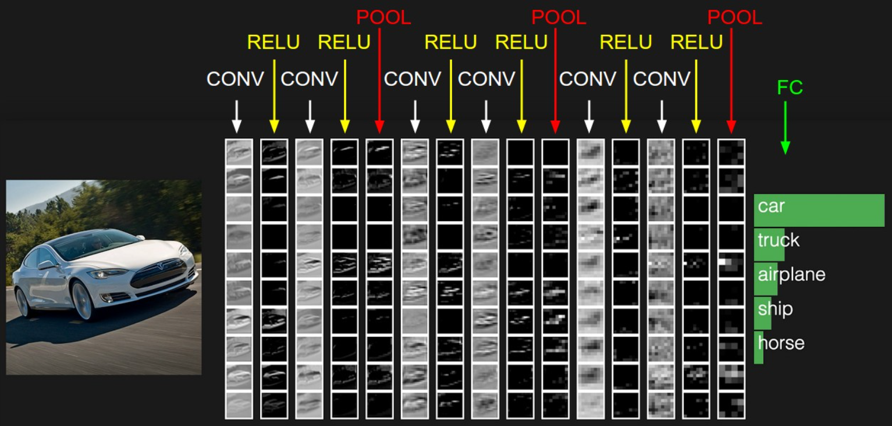

**图åƒåˆ†ç±»å™¨ï¼š **

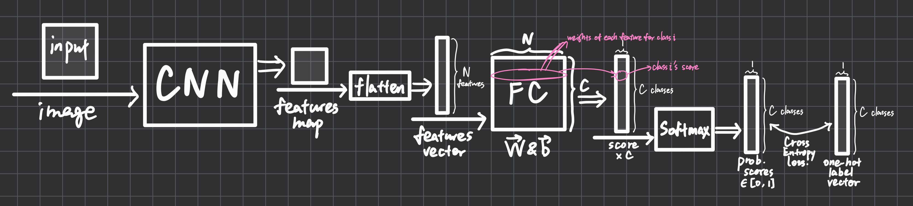

**å˜ä½“：**图åƒæ•°æ®é€šå¸¸å…ˆå‰ç½®ä¸€å±‚å•ç‹¬çš„ CONV ，然åå†ä»¥ **RELU-CONV-NORM** 为å•ä½é‡å 

#### Usage Overview

-   ***ä»ç½‘络内部结æ„改å˜æ¨¡å‹æ€§èƒ½***

-   专用äºå›¾åƒæ•°æ®ï¼ˆ3维矩阵），<u>网络内部ä¿æŒ3维的矩阵格å¼</u>

-   如è¦æ”¯æŒä»»æ„大å°çš„图åƒè¾“入而ä¸æ”¹å˜æ¨¡å‹è¶…å‚数，需è¦å‰ç½® **Spatial Transformer Network** 

-   æ®å…·ä½“问题考虑是å¦ä½¿ç”¨ **Pooling**（ä¸æ˜¯æ‰€æœ‰æ•°æ®éƒ½èƒ½ç”¨ï¼ï¼ä¸€èˆ¬å›¾åƒå¯ä»¥ï¼‰

-   å¯ä»¥æ·»åŠ  **Residual Block：** ***ã€RNN也å¯ä»¥ç”¨ã€‘通过将输入 x ç›´æ¥åŠ åˆ°è¾“出 F(x) 添加梯度æ·å¾„***

    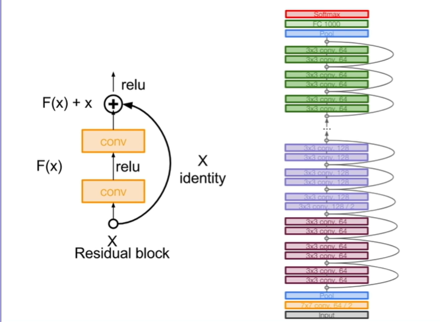

    **作用：① 当æƒé‡æ¶ˆå¤±æ—¶è¾“出ä»æœ‰ x ，因此若æŸå±‚网络是冗余的，å³å½“æŸå¤±å€¼å¾ˆå¤§æ—¶ï¼ˆå°¤å…¶åŠ å…¥æ­£åˆ™é¡¹å），在学习过程中æƒé‡ä¼šå˜å°ä½†ä»ä¿ç•™å…ˆå‰è¾“出，ä¸ä¼šç»™æ•´ä¸ªæ¨¡å‹å¸¦æ¥å¤šä½™è´Ÿé¢å½±å“（相当äºå…³é—­ä¸éœ€è¦çš„网络层åŸå°ä¸åŠ¨è¾“出其输入）；② åå‘ä¼ æ’­æ—¶æ供了更通畅的å导支路（类似高速公路的作用），加速网络 converge v 速度**

-   其他CNN结æ„：

    

事å®ä¸Šä¹Ÿå¯ä»¥ç”¨CNN指å‘Fully-Connected Layerå‰é¢çš„部分（åªåŒ…括Convolutional Layerå’ŒPooling Layer）

**IMPORTANT TIPS:**

-   ***Prefer a stack of small filter CONV to one large receptive field CONV layer***

    >   Suppose that you stack three 3x3 CONV layers on top of each other (with non-linearities in between, of course). In this arrangement, each neuron on the first CONV layer has a 3x3 view of the input volume. A neuron on the second CONV layer has a 3x3 view of the first CONV layer, and hence by extension a 5x5 view of the input volume. Similarly, a neuron on the third CONV layer has a 3x3 view of the 2nd CONV layer, and hence a 7x7 view of the input volume. Suppose that instead of these three layers of 3x3 CONV, we only wanted to use a single CONV layer with 7x7 receptive fields. These neurons would have a receptive field size of the input volume that is identical in spatial extent (7x7), but with several disadvantages. First, the neurons would be computing a linear function over the input, while the three stacks of CONV layers contain non-linearities that make their features more expressive. Second, if we suppose that all the volumes have $C$ channels, then it can be seen that the single 7x7 CONV layer would contain $C×(7×7×C)=49C^2$ parameters, while the three 3x3 CONV layers would only contain $3×(C×(3×3×C))=27C^2$ parameters. Intuitively, stacking CONV layers with tiny filters as opposed to having one CONV layer with big filters allows us to express more powerful features of the input, and with fewer parameters. <u>As a practical disadvantage, we might need more memory to hold all the intermediate CONV layer results if we plan to do backpropagation.</u>
    >
    >   

-   ***Use Pretrained CNN from ImageNet for work!!!!!!!*** 

    >   **Recent departures.** It should be noted that the conventional paradigm of a linear list of layers has recently been challenged, in Google’s Inception architectures and also in current (state of the art) Residual Networks from Microsoft Research Asia. Both of these (see details below in case studies section) feature more intricate and different connectivity structures.
    >
    >   **In practice: use whatever works best on ImageNet**. If you’re feeling a bit of a fatigue in thinking about the architectural decisions, you’ll be pleased to know that in 90% or more of applications you should not have to worry about these. I like to summarize this point as “*don’t be a hero*â€: Instead of rolling your own architecture for a problem, you should look at whatever architecture currently works best on ImageNet, download a pretrained model and finetune it on your data. You should rarely ever have to train a ConvNet from scratch or design one from scratch. I also made this point at the [Deep Learning school](https://www.youtube.com/watch?v=u6aEYuemt0M).
    >
    >   --- *cs231n*

-   ***Input Size:***

    >   The **input layer** (that contains the image) should be divisible by 2 many times. Common numbers include 32 (e.g. CIFAR-10), 64, 96 (e.g. STL-10), or 224 (e.g. common ImageNet ConvNets), 384, and 512.
    >
    >   --- *cs231n*

-   ***Conv Layer Size:***

    >   The **conv layers** should be using small filters (e.g. 3x3 or at most 5x5), using a stride of S=1, and crucially, padding the input volume with zeros in such way that the conv layer does not alter the spatial dimensions of the input. That is, when F=3, then using P=1 will retain the original size of the input. When F=5, P=2. For a general F, it can be seen that P=(F−1)/2 preserves the input size. If you must use bigger filter sizes (such as 7x7 or so), it is only common to see this on the very first conv layer that is looking at the input image.
    >
    >   --- *cs231n*

-   ***Pool Layer Size:***

    >   The **pool layers** are in charge of downsampling the spatial dimensions of the input. The most common setting is to use max-pooling with 2x2 receptive fields (i.e. F=2), and with a stride of 2 (i.e. S=2). Note that this discards exactly 75% of the activations in an input volume (due to downsampling by 2 in both width and height). Another slightly less common setting is to use 3x3 receptive fields with a stride of 2, but this makes “fitting†more complicated (e.g., a 32x32x3 layer would require zero padding to be used with a max-pooling layer with 3x3 receptive field and stride 2). It is very uncommon to see receptive field sizes for max pooling that are larger than 3 because the pooling is then too lossy and aggressive. This usually leads to worse performance.
    >
    >   --- *cs231n*

-   ***Reducing sizing headaches:*** 

    >   The scheme presented above is pleasing because all the CONV layers preserve the spatial size of their input, while the POOL layers alone are in charge of down-sampling the volumes spatially. In an alternative scheme where we use strides greater than 1 or don’t zero-pad the input in CONV layers, we would have to very carefully keep track of the input volumes throughout the CNN architecture and make sure that all strides and filters “work outâ€, and that the ConvNet architecture is nicely and symmetrically wired.
    >
    >   --- *cs231n*

-   ***Why use stride of 1 in CONV?*** 

    >   Smaller strides work better in practice. Additionally, as already mentioned stride 1 allows us to leave all spatial down-sampling to the POOL layers, with the CONV layers only transforming the input volume depth-wise.
    >
    >   --- *cs231n*

-   ***Why use padding?***

    >   In addition to the aforementioned benefit of keeping the spatial sizes constant after CONV, doing this actually improves performance. <u>If the CONV layers were to not zero-pad the inputs and only perform valid convolutions, then the size of the volumes would reduce by a small amount after each CONV, and the information at the borders would be “washed away†too quickly.</u>
    >
    >   --- *cs231n*

    ***虽然padding补的是0，但是这样å¯ä»¥ä½¿è¾“入图åƒçš„边缘也有机会充分æ¥è§¦ Filter çš„å„处æƒé‡***

-    ***Compromising based on <u>memory constraints</u>:***

    >   In some cases (especially early in the ConvNet architectures), the amount of memory can build up very quickly with the rules of thumb presented above. For example, filtering a 224x224x3 image with three 3x3 CONV layers with 64 filters each and padding 1 would create three activation volumes of size [224x224x64]. This amounts to a total of about 10 million activations, or 72MB of memory (per image, for both activations and gradients). Since GPUs are often bottlenecked by memory, it may be necessary to compromise. In practice, people prefer to make the compromise at only the first CONV layer of the network. For example, one compromise might be to use a first CONV layer with filter sizes of 7x7 and stride of 2 (as seen in a ZF net). As another example, an AlexNet uses filter sizes of 11x11 and stride of 4.
    >
    >   --- *cs231n*

-   ***Computational Considerations:***

    >   The largest bottleneck to be aware of when constructing ConvNet architectures is the memory bottleneck. Many modern GPUs have a limit of 3/4/6GB memory, with the best GPUs having about 12GB of memory. There are three major sources of memory to keep track of:
    >
    >   -   From the intermediate volume sizes: These are the raw number of **activations** at every layer of the ConvNet, and also their gradients (of equal size). Usually, most of the activations are on the earlier layers of a ConvNet (i.e. first Conv Layers). These are kept around because they are needed for backpropagation, but a clever implementation that runs a ConvNet only at test time could in principle reduce this by a huge amount, by only storing the current activations at any layer and discarding the previous activations on layers below.
    >   -   From the parameter sizes: These are the numbers that hold the network **parameters**, their gradients during backpropagation, and commonly also a step cache if the optimization is using momentum, Adagrad, or RMSProp. Therefore, the memory to store the parameter vector alone must usually be multiplied by a factor of at least 3 or so.
    >   -   Every ConvNet implementation has to maintain **miscellaneous** memory, such as the image data batches, perhaps their augmented versions, etc.
    >
    >   Once you have a rough estimate of the total number of values (for activations, gradients, and misc), the number should be converted to size in GB. Take the number of values, multiply by 4 to get the raw number of bytes (since every floating point is 4 bytes, or maybe by 8 for double precision), and then divide by 1024 multiple times to get the amount of memory in KB, MB, and finally GB. If your network doesn’t fit, a common heuristic to “make it fit†is to decrease the batch size, since most of the memory is usually consumed by the activations.
    >
    >   --- *cs231n*

#### Advantage

**简化网络使得éå…¨è¿æ¥ï¼Œä»¥å‡å°‘网络层æƒé‡ï¼ˆå‚数）数，进而削弱网络的特å¾æ•æ„Ÿåº¦ï¼Œé˜²æ­¢è¿‡æ‹Ÿåˆ**

#### A Constraint Rule to Hyper-params

设输入2D维数为$N^2$，RFçš„2D维数为$F^2$（$Hyper$），Padding宽度为$P$（$Hyper$），å·ç§¯æ­¥é•¿ä¸º$S$（$Hyper$），输出2D维数为$N'^2$，å„ç»´æ•°å‡é¡»ä¸ºæ­£æ•´æ•°ï¼Œåˆ™æ’有：
$$
N'=\frac{N-F+2P}{S}+1
$$


#### Special Normalizations for CNN


#### Coding

**`torch.nn.Conv2d`** 是 PyTorch æ供的二维å·ç§¯æ“作。å·ç§¯åœ¨å›¾åƒå¤„ç†å’Œè®¡ç®—机视觉中é常é‡è¦ï¼Œç‰¹åˆ«æ˜¯åœ¨å·ç§¯ç¥ç»ç½‘络中。

**å‚æ•°**：

-   `in_channels`: 输入数æ®çš„通é“数。例如，对äºå½©è‰²å›¾åƒï¼Œ`in_channels` 为3（分别对应红ã€ç»¿ã€è“三ç§é¢œè‰²ï¼‰ï¼›å¯¹äºç°åº¦å›¾åƒï¼Œ`in_channels` 为1。
-   `out_channels`: å·ç§¯äº§ç”Ÿçš„特å¾å›¾ï¼ˆFeature Maps）的数é‡ã€‚这个å‚æ•°å¯ä»¥è¢«è§†ä¸ºå­¦ä¹ ç‰¹å¾çš„æ•°é‡ã€‚
-   `kernel_size`: å·ç§¯æ ¸çš„尺寸，å¯ä»¥æ˜¯å•ä¸ªæ•´æ•°æˆ–一个包å«ä¸¤ä¸ªæ•´æ•°çš„元组（分别表示高和宽）。å·ç§¯æ ¸æ˜¯ç”¨äºæ‰«æ图åƒçš„滑动窗å£ã€‚
-   `stride`: å·ç§¯æ ¸ç§»åŠ¨çš„步长，å¯ä»¥æ˜¯å•ä¸ªæ•´æ•°æˆ–一个包å«ä¸¤ä¸ªæ•´æ•°çš„元组。步长æ§åˆ¶äº†å·ç§¯æ ¸åœ¨è¾“入图åƒä¸Šæ»‘动的速度。
-   `padding`: 在输入数æ®çš„周围添加的零的层数。å¯ä»¥æ˜¯å•ä¸ªæ•´æ•°æˆ–一个包å«ä¸¤ä¸ªæ•´æ•°çš„元组。补零å¯ä»¥ä¿è¯è¾“出特å¾å›¾çš„尺寸ä¸å˜æˆ–者æ§åˆ¶è¾“出特å¾å›¾çš„尺寸。
-   `dilation`: å·ç§¯æ ¸å…ƒç´ ä¹‹é—´çš„é—´è·ã€‚它å¯ä»¥è¢«ç”¨äºæ§åˆ¶å·ç§¯æ ¸è¦†ç›–的空间尺寸，而ä¸æ”¹å˜å·ç§¯æ ¸ä¸­çš„元素数é‡ã€‚
-   `groups`: æ§åˆ¶è¾“入和输出之间的è¿æ¥ã€‚默认情况下，groups=1，æ„味ç€æ¯ä¸ªè¾“入通é“ä¸æ¯ä¸ªè¾“出通é“都è¿æ¥ã€‚如æœgroups=2，那么å‰ä¸€åŠçš„输入通é“ä¸å‰ä¸€åŠçš„输出通é“è¿æ¥ï¼Œå一åŠåŒç†ã€‚当`groups=in_channels`å’Œ`out_channels`时，å·ç§¯æ“作就å˜æˆäº†æ·±åº¦å·ç§¯ã€‚
-   `bias`: 如æœè®¾ç½®ä¸ºTrue，那么å‘å·ç§¯æ·»åŠ å置。默认为True。

```python
class My_Model(nn.Module):
    def __init__(self):
        super().__init__()
        # torch.nn.Conv2d(in_channels, out_channels, kernel_size, stride, padding)
        # torch.nn.MaxPool2d(kernel_size, stride, padding)
        # input_size: [3, 128, 128]
        self.cnn_pool = nn.Sequential(  # CNN
            nn.Conv2d(3, 64, 3, 1, 1),  # output_size: [64, 128, 128]
            nn.BatchNorm2d(64),  
            nn.ReLU(),
            nn.MaxPool2d(2, 2, 0),  # Pooling to: [64, 64, 64]

            nn.Conv2d(64, 128, 3, 1, 1),  # output_size: [128, 64, 64]
            nn.BatchNorm2d(128),
            nn.ReLU(),
            nn.MaxPool2d(2, 2, 0),  # Pooling to: [128, 32, 32]

            nn.Conv2d(128, 256, 3, 1, 1),  # output_size: [256, 32, 32]
            nn.BatchNorm2d(256),
            nn.ReLU(),
            nn.MaxPool2d(2, 2, 0),  # Pooling to: [256, 16, 16]

            nn.Conv2d(256, 512, 3, 1, 1),  # output_size: [512, 16, 16]
            nn.BatchNorm2d(512),
            nn.ReLU(),
            nn.MaxPool2d(2, 2, 0),  # Pooling to: [512, 8, 8]

            nn.Conv2d(512, 512, 3, 1, 1),  # output_size: [512, 8, 8]
            nn.BatchNorm2d(512),
            nn.ReLU(),
            nn.MaxPool2d(2, 2, 0),  # Pooling to: [512, 4, 4]
        ) 
        self.fullc = nn.Sequential(  # Fully-connected NN
            nn.Linear(512 * 4 * 4, 1024),
            nn.ReLU(),
            nn.Linear(1024, 512),
            nn.ReLU(),
            nn.Linear(512, 11)
        )

    def forward(self, x):
        out = self.cnn_pool(x)
        out = out.view(out.size()[0], -1)  # 展平æ“作（Flatten）：常常在å·ç§¯å±‚和全è¿æ¥å±‚之间进行，因为全è¿æ¥å±‚需è¦çš„输入是一维的
        return self.fullc(out)
```

****

### RNN (Recurrent Neural Network)

**==å·²ç»å¯ä»¥è¢«Self-attentionå–代ï¼ï¼ï¼è§ <u>Self-attention in [Modules](./Modules.md)</u>==**

**[PARAMETERS of nn.RNN](https://pytorch.org/docs/stable/generated/torch.nn.RNN.html?highlight=rnn#torch.nn.RNN)**  

#### Application

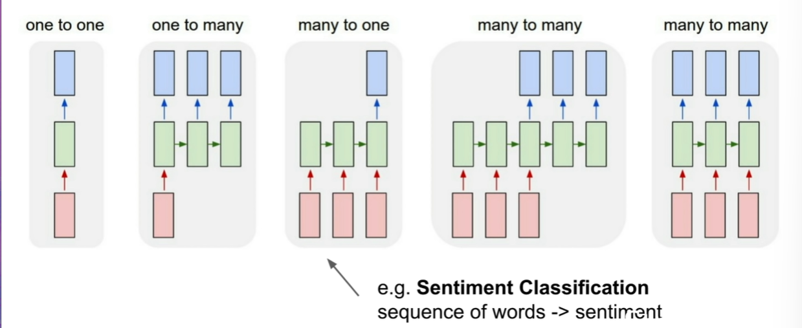

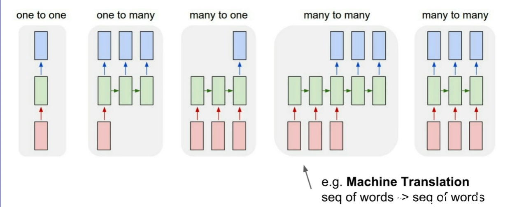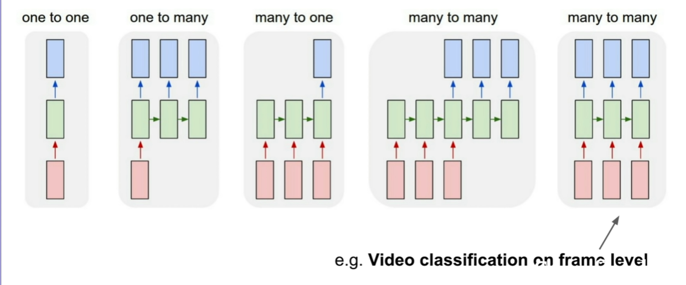

**循ç¯ç¥ç»ç½‘络（Recurrent Neural Network，RNN）**是一ç§ä¸“门处ç†**åºåˆ—æ•°æ®**（例如，时间åºåˆ—æ•°æ®\<音频>或文本）的ç¥ç»ç½‘络（å¯ä»¥å¯¹è¯­éŸ³åˆ†ç±»ï¼Œä¸ç”¨ä¸€èˆ¬çš„分类模å‹ï¼‰ã€‚RNNä¸æ™®é€šçš„å…¨è¿æ¥ç¥ç»ç½‘络和å·ç§¯ç¥ç»ç½‘络ä¸åŒï¼Œå®ƒèƒ½å¤Ÿ**处ç†åºåˆ—长度å¯å˜çš„æ•°æ®**，<u>在处ç†æ¯ä¸ªå…ƒç´ æ—¶ï¼Œå®ƒéƒ½ä¼šè®°ä½å‰é¢å…ƒç´ çš„ä¿¡æ¯</u>。

**训练时所有输入都给出，并行输入：**

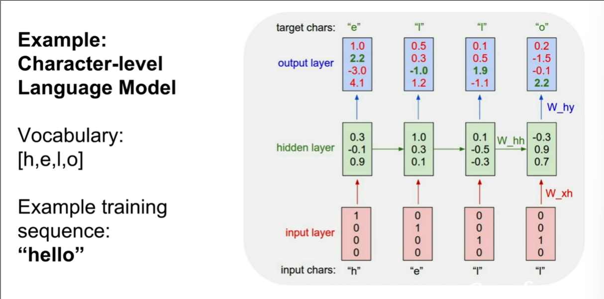

**测试时åªæ供第一步输入，在上一步输出的概ç‡åˆ†å¸ƒä¸­æŠ½æ ·ä½œä¸ºå…¶çŠ¶æ€çš„最终输出，并作为下一步的输入（改为one-hot），串行输入：**


***此外也å¯ä»¥æŠŠéåºåˆ—æ•°æ®æ‹†è§£æˆåºåˆ—ä¿¡æ¯å­¦ä¹ ï¼Œè¿›è€Œä¼˜åŒ–学习效æœï¼š***


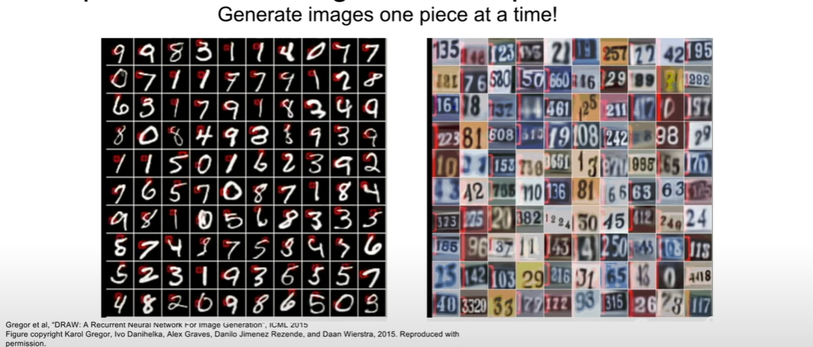

#### Layers & Structure

RNN的基本æ€æƒ³æ˜¯åœ¨ç¥ç»ç½‘络的**éšè—层之间建立循ç¯è¿æ¥**。**æ¯ä¸€æ­¥éƒ½ä¼šæœ‰ä¸¤ä¸ªè¾“入：当å‰æ­¥çš„输入数æ®å’Œä¸Šä¸€æ­¥çš„éšè—状æ€ï¼ˆäºæ˜¯æ¯æ¬¡model会有两个输出值，训练过程注æ„左值设为`output, _`）。**然å，这两个输入会被é€å…¥ç½‘络（通常是一个全è¿æ¥å±‚或者一些更å¤æ‚的结æ„，如LSTM或GRUå•å…ƒï¼‰ï¼Œç„¶å产生一个输出和新的éšè—状æ€ã€‚这个新的éšè—状æ€å°†è¢«ç”¨äºä¸‹ä¸€æ­¥çš„计算。

这个过程å¯ä»¥å†™ä½œå¦‚下形å¼çš„**状æ€è½¬ç§»æ–¹ç¨‹**：
$$
h_t = f(h_{t-1}, x_t) = h_{t-1}\cdot W_h + x_t\cdot W_x+bias
$$
其中，**$h_t$ 是在时间tçš„éšè—状æ€ï¼ˆHå…ƒå‘é‡ï¼‰**，$x_t$ 是在时间t的输入（Då…ƒå‘é‡ï¼‰ï¼Œ$f$ 是一个线性函数，它定义了<u>如何用å‰ä¸€æ­¥çš„éšè—状æ€å’Œå½“å‰çš„输入计算得到当å‰çš„éšè—状æ€</u>，其中状æ€æƒé‡ $W_h$ （H*H矩阵）ã€è¾“å…¥æƒé‡ $W_x$ （D*H矩阵）和åå·® $bias$ （Hå…ƒå‘é‡ï¼‰åœ¨å„时刻（timestep）的**状æ€è½¬ç§»æ–¹ç¨‹**中ä¿æŒä¸å˜ã€‚

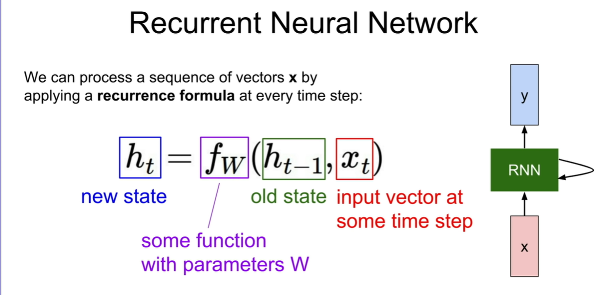

通常还需è¦ä¸€å±‚**é线性激活函数** —— $\tanh$：
$$
h_t = \tanh\ (h_{t-1}\cdot W_h + x_t\cdot W_x+bias)
$$
此时仅得到了新时刻的状æ€ï¼ˆé€šå¸¸å…ˆæ±‚出å‰å‘传播求出所有状æ€å­˜åœ¨æ•°ç»„，å†å¦å¤–计算所有输出），**å„状æ€ä¸‹ï¼ˆæ—¶åˆ»ï¼‰çš„输出**还需å¦å¤–æ ¹æ®è¯¥çŠ¶æ€ç”¨å¾—分æƒé‡ $W_y$ 计算，输出å³ä¸åŒå¯èƒ½å–值的å¯èƒ½æ€§å¾—分（此å还需用 $softmax$ 转化为概ç‡åˆ†å¸ƒå€¼ï¼‰ï¼š
$$
y_t=W_y\cdot h_t
$$
***å„ç§ç»“æ„çš„RNN都满足以上公å¼ï¼ŒåŒºåˆ«ä»…在äºæ¯ä¸€æ­¥çš„输入 $x$ 是å¦æœ‰ã€æ˜¯å¦æ¥è‡ªä¸Šæ¬¡è¾“出：***

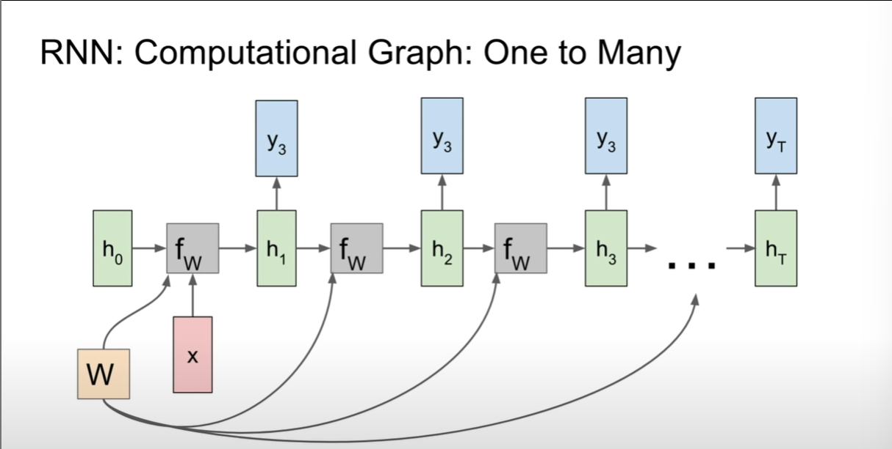

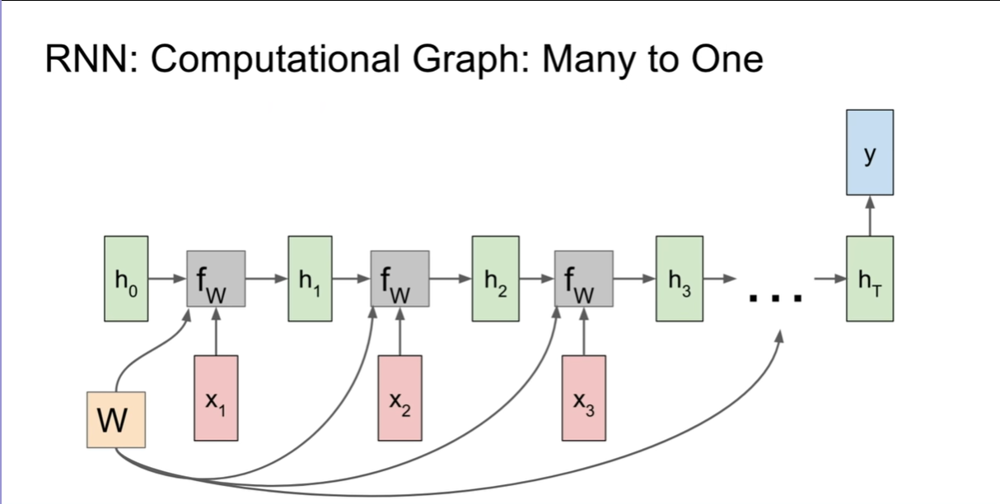

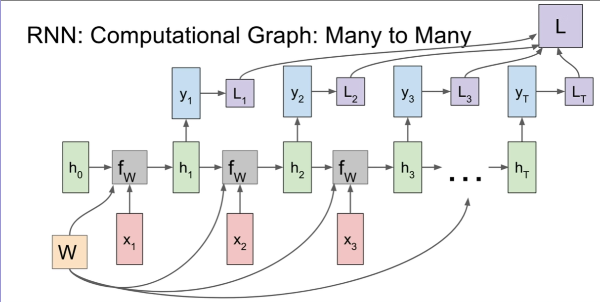

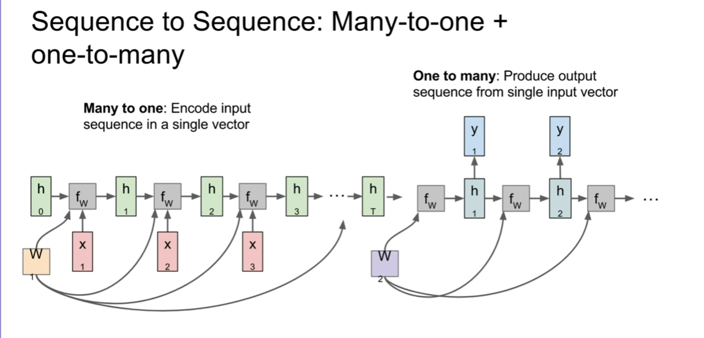

**$f_W$是循ç¯ä½¿ç”¨çš„ï¼ï¼ï¼ï¼æ‰€ä»¥ç§°ä¸ºå¾ªç¯ç¥ç»ç½‘络**

#### Backprop

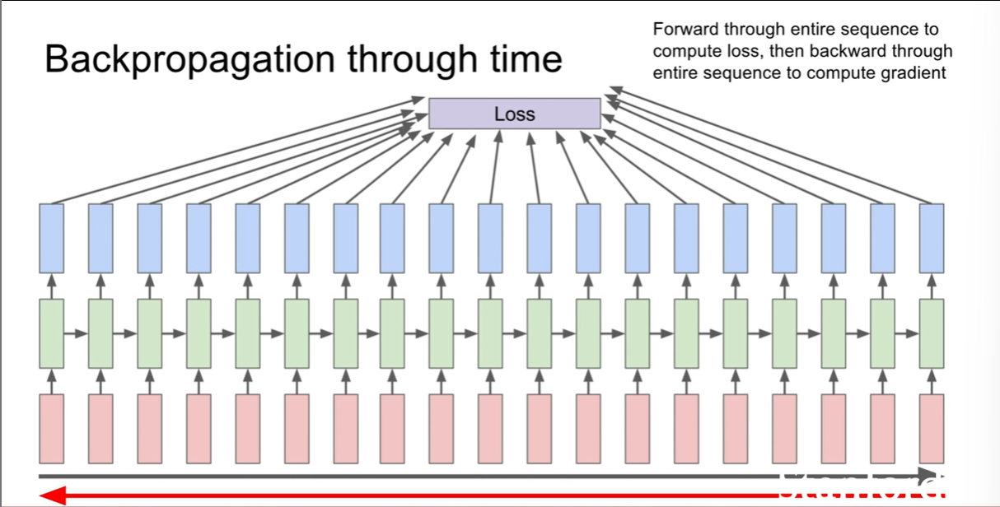

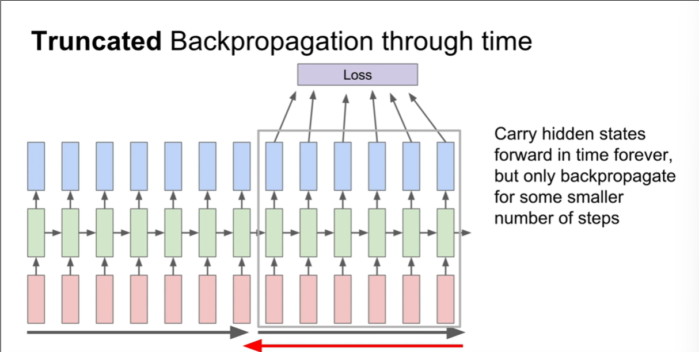

#### Problems


处ç†é•¿åºåˆ—时，它们往往会é‡åˆ°æ‰€è°“的梯度消失和梯度爆炸问题。这些问题已ç»æœ‰ä¸€äº›è§£å†³æ–¹æ¡ˆï¼Œä¾‹å¦‚**长短期记忆（Long Short-Term Memory，LSTM）网络**å’Œ**é—¨æ§å¾ªç¯å•å…ƒï¼ˆGated Recurrent Unit，GRU）**。

```python
class My_Model(nn.Module):
    def __init__(self, input_size, hidden_size):
        super().__init__()
        self.layers = nn.RNN(input_size, hidden_size, batch_first=True) 
        # or "nn.LSTM"/ "nn.GRU"

    def forward(self, x):  # 2 outputs !!!!!
        # x => (batch_size, sequence_length, input_size)
        # hidden => (num_layers, batch_size, hidden_size)
        x, hidden = self.layers(x)
        # (LSTM: x, (hidden, cell_state) = ...)
        return x, hidden
```

如æœ`batch_first=True`，那么输入和输出张é‡çš„形状应该为`(batch, seq, feature)`，å³æ‰¹é‡å¤§å°ï¼ˆbatch size）是张é‡çš„第一维度。如æœ`batch_first=False`（这是默认设置），那么输入和输出张é‡çš„形状应该为`(seq, batch, feature)`，å³åºåˆ—长度（sequence length）是张é‡çš„第一维度。在大多数情况下，`batch_first=True`å¯èƒ½æ›´ç›´è§‚，因为我们通常会将批é‡å¤§å°ä½œä¸ºç¬¬ä¸€ç»´åº¦ã€‚但有时，出äºæ€§èƒ½ä¼˜åŒ–或ä¸ç‰¹å®šåº“的兼容性考虑，å¯èƒ½ä¼šéœ€è¦`batch_first=False`。

****

### CNN & RNN

==**CNN常用作图åƒåˆ†ç±»ï¼ŒRNN常用作文本生æˆï¼Œä¸¤è€…结åˆå¯ä»¥åš Image Captioning：**==


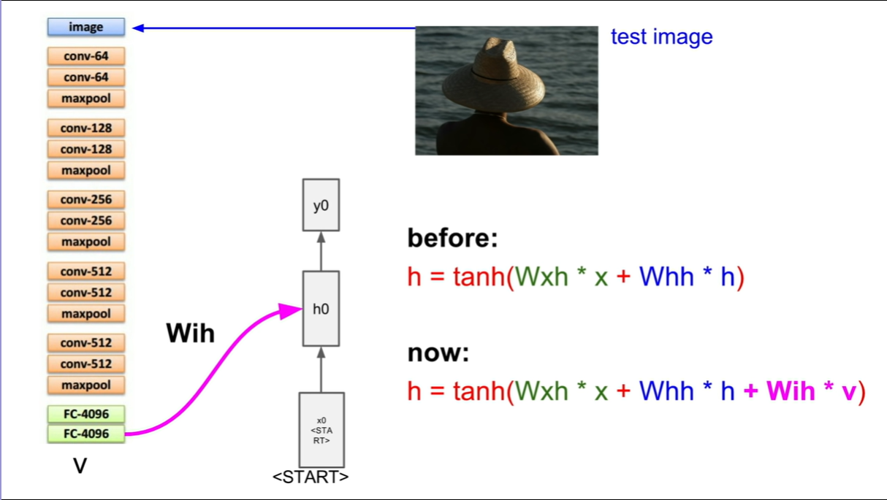


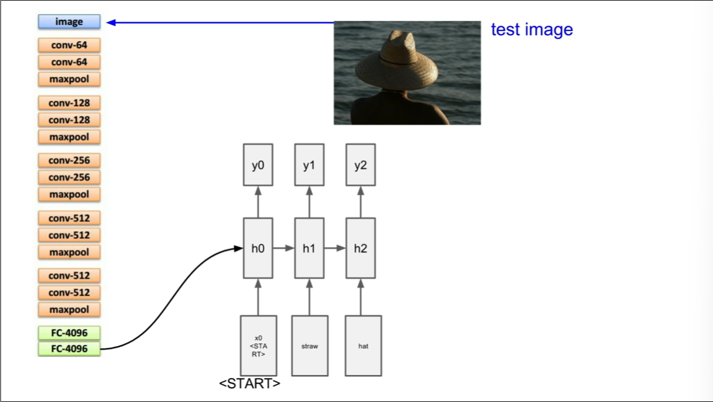


****

### GNN (Graph Neural Networks)

图ç¥ç»ç½‘络（Graph Neural Networks，简称GNN）是一ç§å¼ºå¤§çš„用äºå¤„ç†å›¾å½¢æ•°æ®çš„深度学习æ¶æ„。它们已ç»åœ¨å„ç§é¢†åŸŸï¼ˆåŒ…括社交网络分æã€æ¨è系统ã€ç”Ÿç‰©ä¿¡æ¯å­¦ç­‰ï¼‰æ˜¾ç¤ºå‡ºä¼˜å¼‚的性能。在计算机视觉领域，GNN也找到了一些有趣且有用的应用。

虽然一般的计算机视觉任务（例如图åƒåˆ†ç±»æˆ–目标检测）通常å¯ä»¥ç›´æ¥ä½¿ç”¨å·ç§¯ç¥ç»ç½‘络（CNN）æ¥å¤„ç†ï¼Œä½†æ˜¯ä¸€äº›æ›´å¤æ‚的问题（例如对场景ç†è§£çš„需求，包括对象的关系或上下文信æ¯ï¼‰å¯èƒ½ä¼šå—益äºGNN。例如，一张图片å¯ä»¥è¢«çœ‹ä½œæ˜¯ä¸€ä¸ªå›¾ï¼Œå…¶ä¸­èŠ‚点表示物体，边表示物体间的关系，GNNå°±å¯ä»¥ç”¨æ¥å¤„ç†è¿™æ ·çš„问题。

此外，GNN在视频ç†è§£å’Œ3Dæ•°æ®å¤„ç†ä¸­ä¹Ÿæœ‰å¾ˆå¤šåº”用，因为这些数æ®å½¢å¼çš„时间和空间关系å¯ä»¥è‡ªç„¶åœ°è¢«å»ºæ¨¡ä¸ºå›¾ã€‚例如，在视频分æ中，GNNå¯ä»¥å¸®åŠ©æ•æ‰ä¸åŒå¸§ä¹‹é—´çš„关系；在3D点云分æ中，GNNå¯ä»¥æ›´å¥½åœ°æ•æ‰ç©ºé—´ç‚¹ä¹‹é—´çš„å¤æ‚关系。

总的æ¥è¯´ï¼ŒGNN为计算机视觉æ供了一ç§å¼ºå¤§çš„工具，尤其是在需è¦ç†è§£å¯¹è±¡é—´å¤æ‚关系和上下文信æ¯çš„场景中。然而，它并é适åˆæ‰€æœ‰çš„视觉任务，而是作为一个补充工具，和CNN等其他视觉处ç†æ¨¡å‹å…±åŒä½¿ç”¨ã€‚

****


## 2 Modes of Model (nn.Module) & ` with torch.no_grad()`:

****

|                                                              |     训练时`.train()`      |            验è¯/ 测试时`.eval()`             |
| :----------------------------------------------------------: | :-----------------------: | :------------------------------------------: |
| 添加**`with torch.no_grad():`**ç¦æ­¢åœ¨`.forward()`时存储åå‘ä¼ æ’­è¦ç”¨çš„值（`.forward()`默认内置这一æ“作） |             ⌠            |       ✔ï¸ï¼ˆèŠ‚çœå­˜å‚¨ä¸”加速`.forward()`）        |
|      自动调整学习ç‡ï¼ˆå¦‚æœå¯ä»¥ï¼‰ã€**`.eval()`**å·²ä¿è¯ã€‘       |             âœ”ï¸             |                      ⌠                      |
| æ®æ¦‚ç‡ï¼ˆç»™å®šå‚数）éšæœºå…³é—­ç¥ç»å…ƒï¼ˆdropout）ã€**`.eval()`**å·²ä¿è¯ã€‘ |             âœ”ï¸             |                      ⌠                      |
|  `.BatchNorm2d`（如æœæ¨¡å‹ä¸­è®¾ç½®äº†ï¼‰ã€**`.eval()`**å·²ä¿è¯ã€‘   | 计算æ¯ä¸ªbatchçš„å‡å€¼å’Œæ–¹å·® | 使用在训练过程中计算得到的移动平å‡å‡å€¼å’Œæ–¹å·® |

