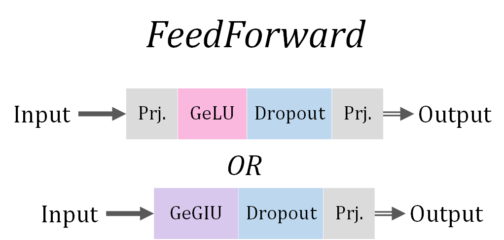
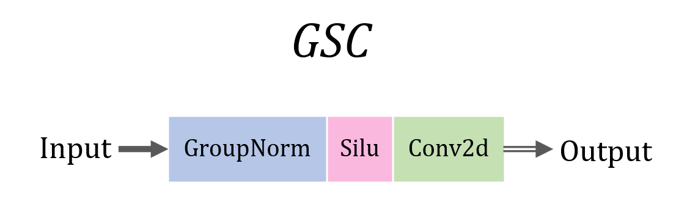
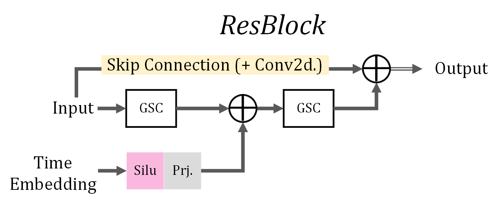
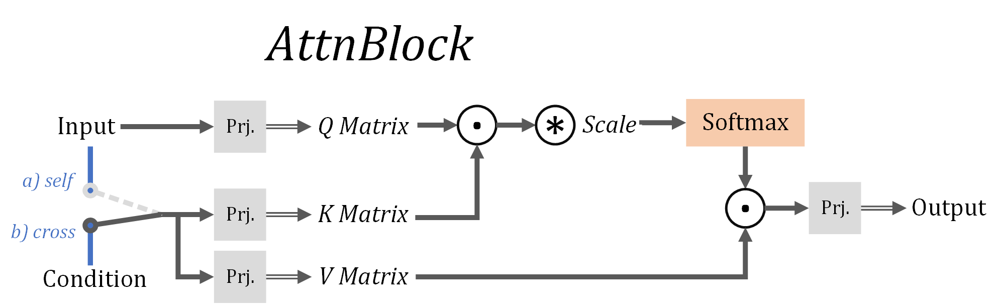

# Modules (Blocks)

****


## FC/ MLP (Multilayer Perception)/ Feed Forward

input ➡️ **\[** ***Prj. (Linear; Affine)*** + ***Activate*** **\]** \* N + ***Prj. (Linear; Affine)*** ➡️ output

**用于分类** 

-    **\[** ***Prj. (Linear; Affine)*** + ***Activate*** **\]** -- *Hidden Layer*

***e.g. Stable Diffusion 的 Unet 中 `BasicTransformerBlock` 中的 `FeedForward`***



```python
class FeedForward(nn.Module):
    def __init__(self, dim, dim_out=None, mult=4, glu=False, dropout=0.):
        super().__init__()
        inner_dim = int(dim * mult)
        dim_out = default(dim_out, dim)
        project_in = nn.Sequential(
            nn.Linear(dim, inner_dim),
            nn.GELU()
        ) if not glu else GEGLU(dim, inner_dim)

        self.net = nn.Sequential(
            project_in,
            nn.Dropout(dropout),
            nn.Linear(inner_dim, dim_out)
        )

    def forward(self, x):
        return self.net(x)
```


## CNN

input ➡️ ***Norm.*** + ***Activate*** + (Dropout) + ***Conv.*** ➡️ output

**用于对图片进行特征抽象/ 特征提取**

***输入图片到整个模型后一般会先单独加一个 Conv. （叠起来后是和先线性再激活的模式能对上的）*** 

***e.g. Diffusion (GSC_block)***



```python
""" conv input X (GSC block)"""
self.block['conv1'] = nn.Sequential(
			nn.GroupNorm(self.groups, self.in_chan),
			nn.SiLU(),
			nn.Conv2d(self.in_chan, self.out_chan, self.F1, self.S1, self.P1))

""" conv (X + t) """
		self.block['conv2'] = nn.Sequential(
			nn.GroupNorm(self.groups, self.out_chan),
			nn.SiLU(),
			nn.Dropout(self.drop_rate),
			nn.Conv2d(self.out_chan, self.out_chan, self.F1, self.S1, self.P1))
```


## Residual

**前层的输入按元素相加（各维度大小必须相同）到后层的输出再进行激活**（基础形式是每 n 层与n+1层间都有连接）

 

 **⭐可保证后层网络函数空间一定覆盖前层网络函数空间，以减小模型方差，防止神经网络退化，允许网络深度大幅增加（但也更耗时）；附带好处：防止梯度消失** 

***e.g. Diffusion (with time embedding)***




## Self-attention & Cross-attention

**从数据（一张图片 | 一句文本）中提取查询矩阵 Q （一个数据分片一个向量 q ，每个 q 维度为 $d_k$ ），以及键矩阵 K （一个数据分片一个向量 k ，每个 k 维度为 $d_k$ ），还有值矩阵 V （一个数据分片一个向量 v ，每个 v 维度为 $d_v$ ），进行注意力机制计算，输出 K/ V 来源数据的各数据分片对于单个 q 查询的贡献度（ SoftMax权重 \* v ）之和排列成的矩阵**

==**Attention （注意力度）即 SoftMax 权重**==  

-   **Self_Attn ： Q 、 K 、 V 来自同一数据，求解数据内部各数据分片对整个数据的整体内容的贡献度**
-   **Cross_Attn ： Q 、 K 、 V 来自不同数据，求解一个数据内部各数据分片对另一个数据的整体内容的贡献度**

***e.g. Stable Diffusion 的 Unet 中在引入条件用的 `BasicTransformerBlock` 中的 `CrossAttention` ，实际封装在 `BasicTransformerBlock` 中使用*** 



```python
class CrossAttention(nn.Module):
    def __init__(self, query_dim, context_dim=None, heads=8, dim_head=64, dropout=0.):
        super().__init__()
        inner_dim = dim_head * heads
        context_dim = default(context_dim, query_dim)

        self.scale = dim_head ** -0.5
        self.heads = heads

        self.to_q = nn.Linear(query_dim, inner_dim, bias=False)
        self.to_k = nn.Linear(context_dim, inner_dim, bias=False)
        self.to_v = nn.Linear(context_dim, inner_dim, bias=False)

        self.to_out = nn.Sequential(
            nn.Linear(inner_dim, query_dim),
            nn.Dropout(dropout)
        )

    def forward(self, x, context=None, mask=None):  # context=None => SelfAttn
        h = self.heads

        q = self.to_q(x)
        context = default(context, x)  # context==None => context=x (self attention)
        k = self.to_k(context)
        v = self.to_v(context)

        q, k, v = map(lambda t: rearrange(t, 'b n (h d) -> (b h) n d', h=h), (q, k, v))

        sim = einsum('b i d, b j d -> b i j', q, k) * self.scale

        if exists(mask):
            mask = rearrange(mask, 'b ... -> b (...)')
            max_neg_value = -torch.finfo(sim.dtype).max
            mask = repeat(mask, 'b j -> (b h) () j', h=h)
            sim.masked_fill_(~mask, max_neg_value)

        # attention, what we cannot get enough of
        attn = sim.softmax(dim=-1)

        out = einsum('b i j, b j d -> b i d', attn, v)
        out = rearrange(out, '(b h) n d -> b n (h d)', h=h)
        return self.to_out(out)
```


## Positional Encoder

参考https://zhuanlan.zhihu.com/p/621307748

用于给有物理位置联系的不同输入都各自嵌入一个位置信息的编码表示，让模型得知任何远、短程的依赖。使用正余弦编码公式（已知位置坐标）、多层全连接网络（难以获取位置坐标，直接让模型学习）等形式均可实现，只需要达到以下要求：

-   某个输入的编码能够同时包含其绝对位置&相对位置信息
-   绝对位置0的编码固定
-   相同物理位置间距对应的编码间相似度相同：DotProduct(PE(i), PE(i+k)) = DotProduct(PE(j), PE(j+k)) for any i,j,k
-   编码间相似度随物理位置间距的变换而单调变化
-   任意两个编码间可以通过线性变换互相得到（线性相关）

正余弦编码：

```python
def pe(p, d): # p为位置坐标，d为编码向量的长度，通常和位置信息主体（输入数据）的长度相同，方便嵌入
    e = [.0] * d
    for i in range(d//2):
        e[2 * i] = math.sin(p / 10000 ** (2 * i / d))
        e[2*i+1] = math.cos(p / 10000 ** (2 * i / d))
    return e
```


