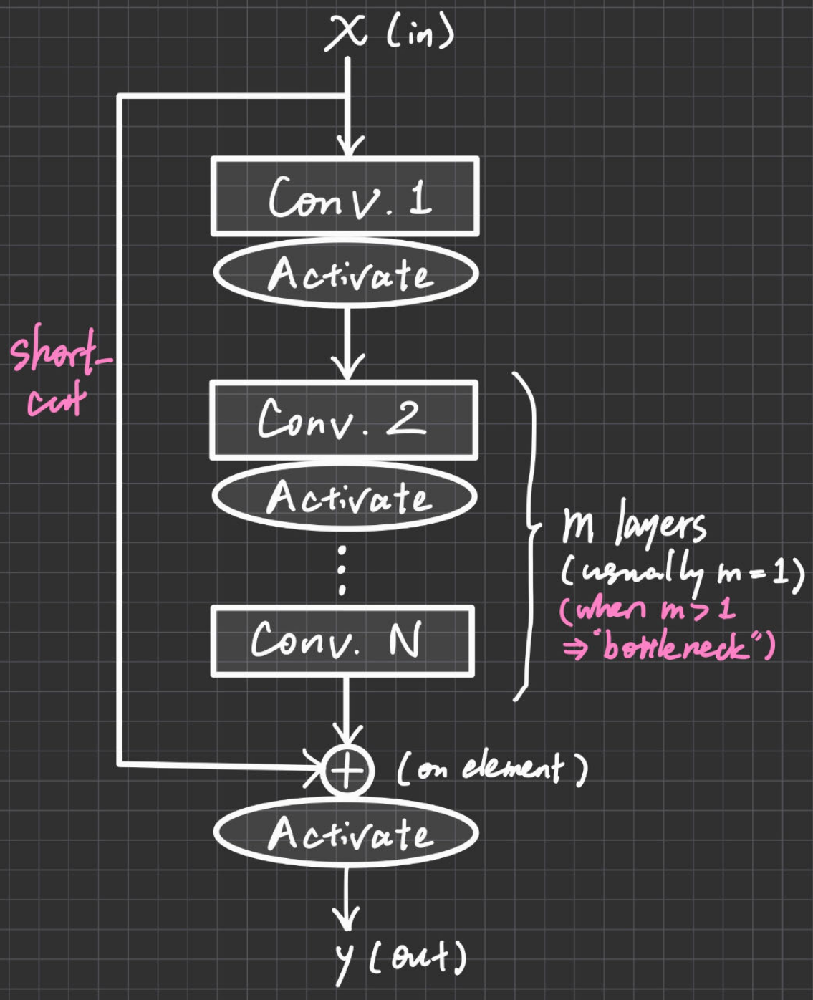

# Modules (Blocks)

****

## Residual

**前层的输入按元素相加（各维度大小必须相同）到后层的输出再进行激活**（基础形式是每 n 层与n+1层间都有连接）

 

 **⭐可保证后层网络函数空间一定覆盖前层网络函数空间，以减小模型方差，防止神经网络退化；附带好处：防止梯度消失**

## Self-attention

***CNN 是 Self-attention 的特例！！！！！！！！！！***

**Self-attention是transformer的特例！！！！！！！（input序列的元素各与一个output序列元素对应）**

自注意力机制（Self-Attention）原本在自然语言处理领域非常受欢迎，但也已经开始在计算机视觉领域发挥作用，具体的应用形式可能有所不同，但核心思想都是对输入的各个部分赋予不同的注意力权重。

试想我们正在观看一张图片，我们的视线并不是平均分布在整个图片上，而是会集中在一些我们认为更重要的地方，比如人物的脸部，或者是图片中的主要物体。这种行为实际上是一种自然而然的注意力机制，我们关注某些部分多于其他部分。自注意力机制就是试图模拟这种行为，让计算机模型也能“聚焦”于输入的关键部分。

在计算机视觉中，自注意力可以用于捕捉图像中长距离的依赖关系。比如在一张人物照片中，虽然眼睛和嘴巴在空间位置上可能相距较远，但它们之间存在很强的语义关联。传统的卷积神经网络（CNN）由于其局部感受野的特性，可能难以捕捉这种长距离的关系，而自注意力机制能有效解决这个问题。

一个具体的例子是"Vision Transformer"（ViT）模型，这个模型是基于Transformer（一种主要使用自注意力机制的模型结构）设计的，它将图像划分为一系列的小块，然后像处理文本那样处理这些小块。通过这种方式，ViT可以把注意力放在图像中最重要的部分，从而提高模型的预测性能。

总的来说，自注意力机制在计算机视觉中的应用是一种很有前景的研究方向，它能帮助模型关注到图像中最重要的部分，从而提高模型的性能。

**Self-attention下游应用：https://www.youtube.com/watch?v=yHoAq1IT_og （包括Transformer）**

**Full attention**通常指的是在自注意力（Self-Attention）机制中，序列的每个元素都与序列中的其他所有元素进行注意力计算的过程。尽管full attention机制在处理序列数据方面非常强大，但其在处理非常长的序列时面临计算和内存的挑战。为了解决这些问题，研究人员提出了多种优化方法，如Sparse Attention和Local Attention，以及近年来的Efficient Attention或Linear Attention等，旨在减少计算和内存成本，同时尽可能保持模型性能。

## Cross-attention

