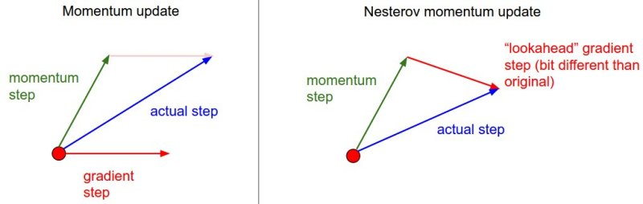

# Optimizer

****


## Basic Form

**根据 $grads$ 按一定规则（含超参数）更新各 $W$**


## Standard

除了直接判断 Loss Function 或 Cross Entropy 等等的值，还有很多其他判断泛化能力的指标（参考《机器学习》模型评估与选择）

-   E（一般的损失值）
-   acc（一般的精度/ 准确度）
-   P-R（评估混淆矩阵）
-   ROC（评估混淆矩阵）
-   CC（评估代价矩阵）


## How to Escape Local Minima????????

***【结论】常用优化器模式：SGD+Nesterov Momentum 或 Adam*** 

**Additional References:** 

>   -   [Unit Tests for Stochastic Optimization](http://arxiv.org/abs/1312.6055) proposes a series of tests as a standardized benchmark for stochastic optimization.
>
>    
>
>   Animations that may help your intuitions about the learning process dynamics. **Left:** Contours of a loss surface and time evolution of different optimization algorithms. Notice the "overshooting" behavior of momentum-based methods, which make the optimization look like a ball rolling down the hill. **Right:** A visualization of a saddle point in the optimization landscape, where the curvature along different dimension has different signs (one dimension curves up and another down). Notice that SGD has a very hard time breaking symmetry and gets stuck on the top. Conversely, algorithms such as RMSprop will see very low gradients in the saddle direction. Due to the denominator term in the RMSprop update, this will increase the effective learning rate along this direction, helping RMSProp proceed. Images credit: [Alec Radford](https://twitter.com/alecrad).
>
>   --- *cs231n*

### Momentum

**加入学习惯性（有时更像是动摩擦因数）**

>   ```python
>   # Momentum update
>   v = mu * v - learning_rate * dx # integrate velocity
>   W += v # move (update)
>   ```
>
>   Here we see an introduction of a `v` variable that is initialized at zero, and an additional hyperparameter (`mu`). As an unfortunate misnomer, this variable is in optimization referred to as *momentum* (its typical value is about 0.9), but **its physical meaning is more consistent with the coefficient of friction**. Effectively, this variable damps the velocity and reduces the kinetic energy of the system, or otherwise the particle would never come to a stop at the bottom of a hill. **When cross-validated, this parameter is usually set to values such as [0.5, 0.9, 0.95, 0.99]. Similar to annealing schedules for learning rates (discussed later, below)**, optimization can sometimes **benefit a little from momentum schedules, where the <u>momentum is increased in later stages of learning</u>**. ==**A typical setting is to start with momentum of about 0.5 and anneal it to 0.99 or so over multiple epochs.**==
>
>   **With Momentum update, the parameter vector will build up velocity in any direction that has consistent gradient.**
>
>   **Nesterov Momentum** is a slightly different version of the momentum update that has recently been gaining popularity. <u>It enjoys stronger theoretical converge guarantees for convex functions and in practice it also consistenly works slightly better than standard momentum.</u>
>
>   The core idea behind Nesterov momentum is that **when the current parameter vector is at some position `x`, then looking at the momentum update above, we know that the momentum term alone (i.e. ignoring the second term with the gradient) is about to nudge the parameter vector by `mu * v`.** Therefore, if we are about to compute the gradient, we can **treat the future approximate position `x + mu * v` as a “lookahead” - this is a point in the vicinity of where we are soon going to end up.** Hence, it makes sense to **compute the gradient at `x + mu * v` instead of at the “old/stale” position `x`.**
>
>   
>
>   Instead of evaluating gradient at the current position (red circle), we know that our momentum is about to carry us to the tip of the green arrow. With Nesterov momentum we therefore instead evaluate the gradient at this "looked-ahead" position.
>
>   That is, in a slightly awkward notation, we would like to do the following:
>
>   ```python
>   x_ahead = x + mu * v
>   # evaluate dx_ahead (the gradient at x_ahead instead of at x)
>   v = mu * v - learning_rate * dx_ahead
>   x += v
>   ```
>
>   However, in practice people prefer to express the update to look as similar to vanilla SGD or to the previous momentum update as possible. This is possible to achieve by manipulating the update above with a variable transform `x_ahead = x + mu * v`, and then expressing the update in terms of `x_ahead` instead of `x`. That is, the parameter vector we are actually storing is always the ahead version. The equations in terms of `x_ahead` (but renaming it back to `x`) then become:
>
>   ```python
>   v_prev = v # back this up
>   v = mu * v - learning_rate * dx # velocity update stays the same
>   x += -mu * v_prev + (1 + mu) * v # position update changes form
>   ```
>
>   We recommend this further reading to understand the source of these equations and the mathematical formulation of Nesterov’s Accelerated Momentum (NAG):
>
>   -   [Advances in optimizing Recurrent Networks](http://arxiv.org/pdf/1212.0901v2.pdf) by Yoshua Bengio, Section 3.5.
>   -   [Ilya Sutskever’s thesis](http://www.cs.utoronto.ca/~ilya/pubs/ilya_sutskever_phd_thesis.pdf) (pdf) contains a longer exposition of the topic in section 7.2
>
>   --- *cs231n*

### Start from Multiple Initials and Train Multiple times then pick the Finest

### Learing Rate Decay

**衰减学习率**

>   There are three common types of implementing the learning rate decay:
>
>   
>
>   In practice, we find that the step decay is slightly preferable because the hyperparameters it involves (the fraction of decay and the step timings in units of epochs) are more interpretable than the hyperparameter $k$. Lastly, if you can afford the computational budget, err on the side of slower decay and train for a longer time.
>
>   --- *cs231n*

### Per-parameter adaptive learning rate 

**不同参数（各坐标分量方向上）有自己的学习率**

>   All previous approaches we’ve discussed so far manipulated the learning rate globally and equally for all parameters. Tuning the learning rates is an expensive process, so much work has gone into devising methods that can adaptively tune the learning rates, and even do so per parameter. Many of these methods may still require other hyperparameter settings, but the argument is that they are well-behaved for a broader range of hyperparameter values than the raw learning rate. In this section we highlight some common adaptive methods you may encounter in practice:
>
>   **Adagrad** is an adaptive learning rate method originally proposed by [Duchi et al.](http://jmlr.org/papers/v12/duchi11a.html).
>
>   ```python
>   # Assume the gradient dx and parameter vector x
>   cache += dx**2
>   x += - learning_rate * dx / (np.sqrt(cache) + eps)
>   ```
>
>   Notice that the variable `cache` has size equal to the size of the gradient, and keeps track of per-parameter sum of squared gradients. This is then used to normalize the parameter update step, element-wise. Notice that the weights that receive high gradients will have their effective learning rate reduced, while weights that receive small or infrequent updates will have their effective learning rate increased. Amusingly, the square root operation turns out to be very important and without it the algorithm performs much worse. The smoothing term `eps` (usually set somewhere in range from 1e-4 to 1e-8) avoids division by zero. A downside of Adagrad is that in case of Deep Learning, the monotonic learning rate usually proves too aggressive and stops learning too early.
>
>   **RMSprop** is a very effective, but currently unpublished adaptive learning rate method. Amusingly, everyone who uses this method in their work currently cites [slide 29 of Lecture 6](http://www.cs.toronto.edu/~tijmen/csc321/slides/lecture_slides_lec6.pdf) of Geoff Hinton’s Coursera class. The RMSProp update adjusts the Adagrad method in a very simple way in an attempt to reduce its aggressive, monotonically decreasing learning rate. In particular, it uses a moving average of squared gradients instead, giving:
>
>   ```python
>   cache = decay_rate * cache + (1 - decay_rate) * dx**2
>   x += - learning_rate * dx / (np.sqrt(cache) + eps)
>   ```
>
>   Here, `decay_rate` is a hyperparameter and typical values are [0.9, 0.99, 0.999]. Notice that the `x+=` update is identical to Adagrad, but the `cache` variable is a “leaky”. Hence, RMSProp still modulates the learning rate of each weight based on the magnitudes of its gradients, which has a beneficial equalizing effect, but unlike Adagrad the updates do not get monotonically smaller.
>
>   **Adam.** [Adam](http://arxiv.org/abs/1412.6980) is a recently proposed update that looks a bit like RMSProp with momentum. The (simplified) update looks as follows:
>
>   ```python
>   m = beta1*m + (1-beta1)*dx  # first-order moment (moving average of gradients)
>   v = beta2*v + (1-beta2)*(dx**2)  # second-order moment (moving average of squared gradients)
>   x += - learning_rate * m / (np.sqrt(v) + eps)
>   ```
>
>   Notice that the update looks exactly as RMSProp update, except the “smooth” version of the gradient `m` is used instead of the raw (and perhaps noisy) gradient vector `dx`. **Recommended values in the paper are `learning_rate = 0.001`, `eps = 1e-8`, `beta1 = 0.9`, `beta2 = 0.999`. In practice `Adam `is currently recommended as the default algorithm to use, and often works slightly better than `RMSProp`.** However, it is often **also worth trying `SGD`+Nesterov Momentum as an alternative.** The full Adam update also includes a ***bias correction*** mechanism, which **compensates for the fact that in the first few time steps the vectors `m,v` are both initialized and therefore biased at zero, before they fully “warm up”**. **With the *bias correction* mechanism, the update looks as follows:**
>
>   
>
>   ```python
>   # t is your iteration counter going from 1 to infinity
>   m = beta1*m + (1-beta1)*dx
>   mt = m / (1-beta1**t)
>   v = beta2*v + (1-beta2)*(dx**2)
>   vt = v / (1-beta2**t)
>   x += - learning_rate * mt / (np.sqrt(vt) + eps)
>   ```
>
>   Note that the update is now a function of the iteration as well as the other parameters. We refer the reader to the paper for the details, or the course slides where this is expanded on.
>
>   --- **cs231n**

### Second order methods

>   A second, popular group of methods for optimization in context of deep learning is based on [Newton’s method](http://en.wikipedia.org/wiki/Newton's_method_in_optimization), which iterates the following update:
>
>   
>
>   Here, $Hf(x)$ is the [Hessian matrix](http://en.wikipedia.org/wiki/Hessian_matrix), which is a square matrix of second-order partial derivatives of the function. The term $∇f(x)$ is the gradient vector, as seen in Gradient Descent. Intuitively, the Hessian describes the local curvature of the loss function, which allows us to perform a more efficient update. In particular, multiplying by the inverse Hessian leads the optimization to take more aggressive steps in directions of shallow curvature and shorter steps in directions of steep curvature. Note, crucially, the absence of any learning rate hyperparameters in the update formula, which the proponents of these methods cite this as a large advantage over first-order methods.
>
>   However, the update above is impractical for most deep learning applications because computing (and inverting) the Hessian in its explicit form is a very costly process in both space and time. For instance, a Neural Network with one million parameters would have a Hessian matrix of size [1,000,000 x 1,000,000], occupying approximately 3725 gigabytes of RAM. Hence, a large variety of *quasi-Newton* methods have been developed that seek to approximate the inverse Hessian. Among these, the most popular is [L-BFGS](http://en.wikipedia.org/wiki/Limited-memory_BFGS), which uses the information in the gradients over time to form the approximation implicitly (i.e. the full matrix is never computed).
>
>   However, even after we eliminate the memory concerns, a large downside of a naive application of L-BFGS is that it must be computed over the entire training set, which could contain millions of examples. Unlike mini-batch SGD, getting L-BFGS to work on mini-batches is more tricky and an active area of research.
>
>   **In practice**, it is currently not common to see L-BFGS or similar second-order methods applied to large-scale Deep Learning and Convolutional Neural Networks. Instead, SGD variants based on (Nesterov’s) momentum are more standard because they are simpler and scale more easily.
>
>   Additional references:
>
>   -   [Large Scale Distributed Deep Networks](http://research.google.com/archive/large_deep_networks_nips2012.html) is a paper from the Google Brain team, comparing L-BFGS and SGD variants in large-scale distributed optimization.
>   -   [SFO](http://arxiv.org/abs/1311.2115) algorithm strives to combine the advantages of SGD with advantages of L-BFGS.
>
>   --- *cs231n*

### Simulated Annealing

**模拟退火：**以一定概率接受比当前匹配度值更低的解，以跳出局部最小

### Other Genetic Algorithms


## Least Square

这种方法是直接解析的，也就是说，它可以直接找到最小化损失函数（通常是均方误差）的参数值。在线性回归中，最小二乘法的解可以直接通过数学公式计算出来，这使得计算速度很快。然而，最小二乘法需要计算输入数据的协方差矩阵的逆矩阵，如果输入数据的维度很高，或者协方差矩阵是奇异矩阵（没有逆矩阵），那么最小二乘法就不能使用。此外，最小二乘法也不能直接应用于非线性模型或者有正则化的模型。


## Gradient Descent

这种方法是迭代的，它通过多次更新参数来逐渐最小化损失函数。在每次迭代中，它都会计算损失函数的梯度，然后沿着梯度的反方向更新参数。梯度下降法的优点是它可以应用于任何可微的损失函数和任何模型，包括线性模型、非线性模型、有正则化的模型等。而且，梯度下降法不需要计算协方差矩阵的逆矩阵，因此可以应用于高维数据。然而，梯度下降法的缺点是需要手动设置学习率参数，且收敛速度可能较慢，尤其在损失函数的形状不理想（如有很多局部最小值）时。


## Stochastic Gradient Descent

在标准的梯度下降法中，我们会计算整个数据集的平均梯度来更新参数。这需要对整个数据集进行一次完整的遍历，计算代价可能非常大。

而在SGD中，每次迭代只随机选择一个（或一小部分）样本来计算梯度并更新参数，**计算的 $Loss$ 是一部分样本（一个batch）的损失值的平均值（$grads$ 也都要注意除以batch大小）**。这样可以大大减少计算量，使得算法能够更快地进行。<u>但由于每次只使用部分数据，导致更新方向可能会有一些噪声，收敛路径可能会“摇摆”</u>。

因此，SGD在处理大规模数据集时，相对于传统的梯度下降法有明显优势。但需要仔细选择学习率和其他超参数，以保证算法的稳定性和收敛速度。


## Adam

<u>***（see also goodnotes）***</u>

Adam（Adaptive Moment Estimation）是一种常用的深度学习优化算法，由Diederik P. Kingma和Jimmy Lei Ba在2015年的论文"Adam: A Method for Stochastic Optimization"中提出。

Adam结合了两种其他的优化算法的优点：RMSProp（Root Mean Square Propagation）和Momentum。RMSProp算法为每个参数保持一个单独的学习率，该学习率是根据参数的最近梯度的平均值来调整的；而Momentum算法则是在更新参数时考虑上一次梯度的方向，从而加速学习过程并降低震荡。

Adam算法使用"一阶矩（梯度的均值）"和"二阶矩（梯度的未中心化方差）"的估计来自适应地调整每个参数的学习率。因此，Adam优化器能够适应复杂、非平稳和/或稀疏的优化问题，而**无需人为调整学习率**，对于深度学习任务特别有效。

Adam优化器和梯度下降（包括批量梯度下降，随机梯度下降，小批量梯度下降）都是用于优化模型参数的算法，但它们在实际应用中的效果和适用场景有所不同。

1.  **梯度下降**：

    **优点**：

    -   对于凸优化问题，梯度下降可以保证找到全局最优解。
    -   实现简单，容易理解。

    **缺点**：

    -   需要手动设定学习率，且对学习率非常敏感。太小的学习率可能导致收敛过慢，而太大的学习率可能导致震荡或者错过最优解。
    -   在处理非凸优化问题（如深度学习中的大部分问题）时，容易陷入局部最优解。
    -   对所有参数使用相同的学习率，无法自适应地调整不同参数的学习率。
    -   在处理稀疏数据或者梯度稀疏的问题时效果不佳。

2.  **Adam**：

    **优点**：

    -   结合了RMSProp和Momentum的优点，能够自适应地调整学习率，对学习率不敏感。
    -   对于非凸优化问题，能够找到相对较好的解。
    -   对于处理稀疏数据和梯度稀疏的问题效果较好。

    **缺点**：

    -   实现较复杂，计算量较大。
    -   尽管在实践中效果较好，但理论上并没有像梯度下降那样可以保证找到全局最优解的性质。

综上，当面对的问题较简单，或者你希望能够找到全局最优解时，可以考虑使用梯度下降。但在深度学习中，大多数优化问题都是非凸的，并且可能存在大量的参数和稀疏的梯度，此时使用Adam优化器通常会取得更好的效果。

`torch.optim.Adam`和`torch.optim.AdamW`都是一种基于梯度下降的优化算法，但是他们在**权重衰减上的处理不同**。

1.  `torch.optim.Adam`是原始的Adam优化器，它在计算梯度时，将权重衰减作为一部分包含在内。这意味着权重衰减是在梯度计算完成后应用的，这可能会导致学习率调整和权重衰减的相互干扰。
2.  `torch.optim.AdamW`是在ICLR 2019中提出的一种改进的Adam优化器，其将权重衰减与梯度计算分开处理。这可以**减少学习率调整和权重衰减之间的干扰**，从而提供更好的优化性能。

关于参数，`torch.optim.Adam`和`torch.optim.AdamW`的参数大部分相同，包括：

-   `params` (iterable): 待优化的参数或定义了参数组的dict
-   `lr` (float, optional): 初始学习率（默认值：1e-3）
-   `betas` (Tuple[float, float], optional): 用于计算梯度和平方梯度的运行平均值的系数（默认值：(0.9, 0.999)）
-   `eps` (float, optional): 为了增加数值计算的稳定性而加到分母里的项（默认值：1e-8）
-   `weight_decay` (float, optional): 权重衰减（L2正则化）（默认值：0）
-   `amsgrad` (boolean, optional): 是否使用AMSGrad变种（默认值：False）


## Q&A

**为什么要在每次训练的参数更新后马上用另一批数据验证？这样训练结果的损失值有什么用？**

在训练深度学习模型的过程中，经常需要对模型进行周期性的验证。验证的主要目的有以下几点：

1.  **模型性能监控**：通过观察模型在验证集上的性能，我们可以了解模型的学习情况，包括是否过拟合、欠拟合，以及是否在学习中产生了有效的特征表示等。在每个训练周期后进行验证，可以及时地获取这些信息。
2.  **早期停止（Early Stopping）**：当模型在验证集上的性能连续多个周期未见明显提升时，我们可能会选择提前结束训练，以节省计算资源和时间。这就是所谓的早期停止策略。
3.  **模型选择**：在每个训练周期后，我们都会在验证集上评估模型，根据模型的性能，可以保存当前最好的模型参数，这样即使在之后的训练中模型过拟合，我们仍然可以保留一个表现较好的模型。
4.  **超参数调整**：模型在验证集上的性能也可以作为超参数调整的依据。例如，如果模型在验证集上的损失值在逐渐增大，那么可能需要**调低学习率**或者**增大正则化项**等**（可以考虑一边训练-验证一边及时调整！！）**。

因此，虽然训练集的损失值是我们直接优化的目标，但是验证集的损失值在训练过程中也起着非常重要的作用，可以帮助我们了解模型的学习状况并进行相应的调整。

