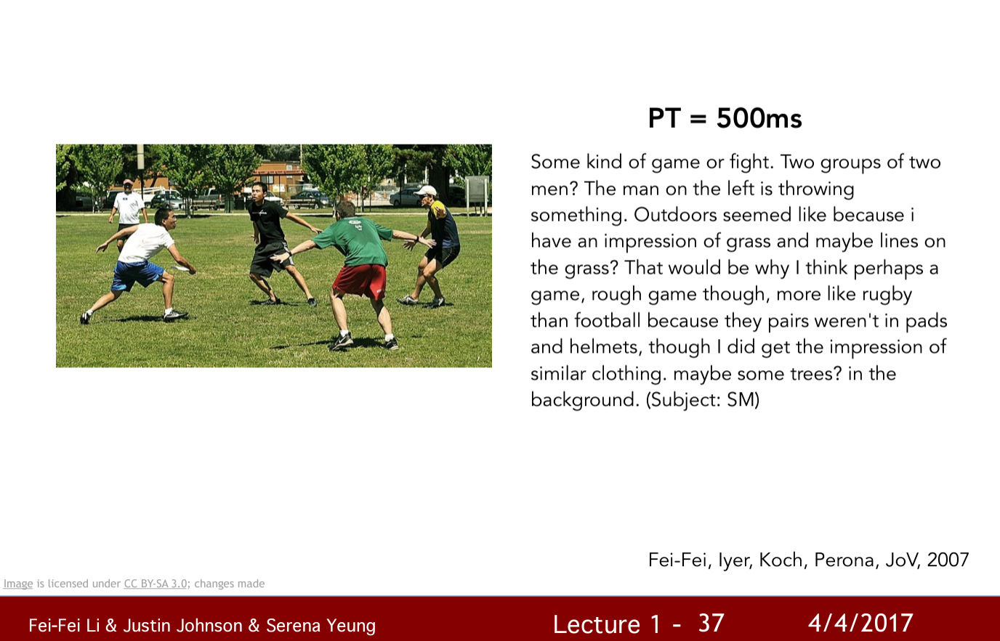

# Unsolved Problems

****

## Position Encoding in Self-Attention

How to generate the positional vectors?

cutting-edge paper: https://arxiv.org/abs/2003.09229

## Encoder in Transformer

Best structure?

cutting-edge paper: 

-   On Layer Normalization in the Transformer Architecture - https://arxiv.org/abs/2002.04745
-   PowerNorm: Rethinking Batch Normalization in Transformers - https://arxiv.org/abs/2003.07845

## BLEU of Transformer

How to optimize as Loss Function during Training without RL?

with RL: https://arxiv.org/abs/1511.06732

## 3D Understanding

Understand every pixel in an image, reconstructing the entire world.

(Semantic Segmentation, Perceptual Grouping)

## Write a Story Describing an Image

Make machine generate a reasonable story from an image based on its understanding. (visual genome)

## Stochasticity in `cGAN`

-   input random noise z => tend to ignore z
-   use dropout as randomness => better but still little stochasticity 

    

## DDPM Accelerate

>   在采样时，只有部分时刻才会被用到。那我们能不能顺着这个思路，干脆训练一个有效时刻更短（总时刻T不变）的DDPM，以加速训练呢？又或者保持有效训练时刻数不变，增大总时刻T呢？DDIM论文的作者提出了这些想法，认为这可以作为后续工作的研究方向。
>
>   --- https://zhouyifan.net/2023/07/07/20230702-DDIM/

